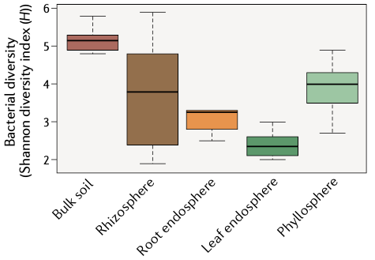
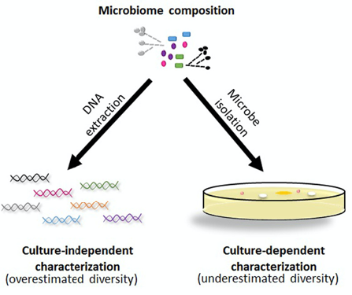
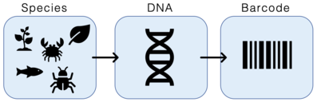
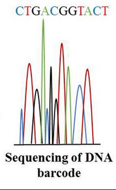
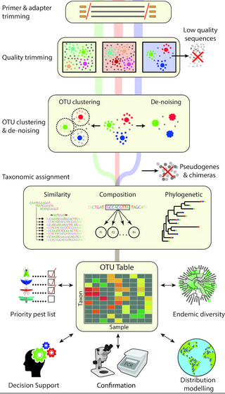
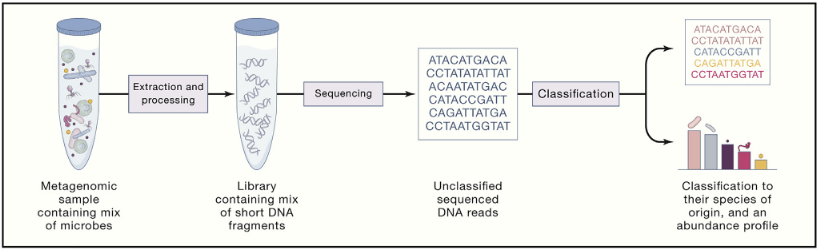
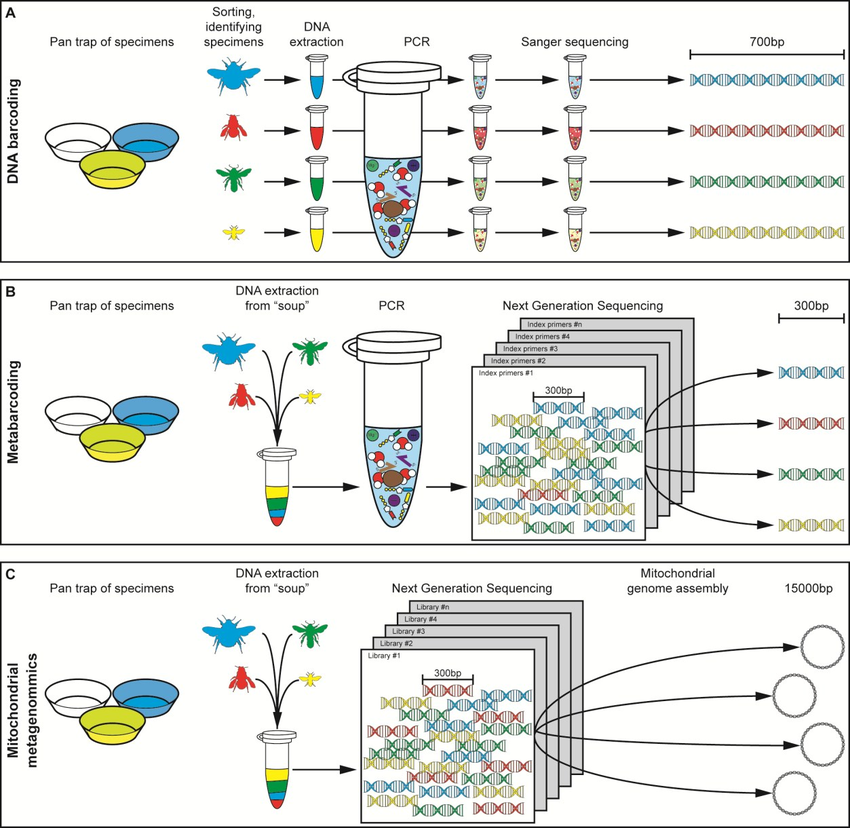
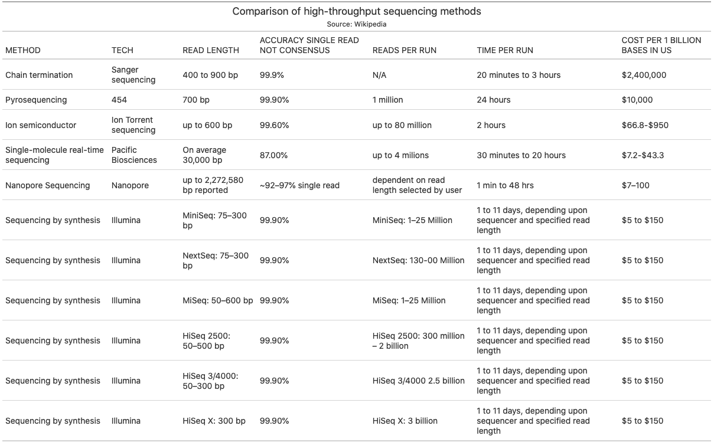
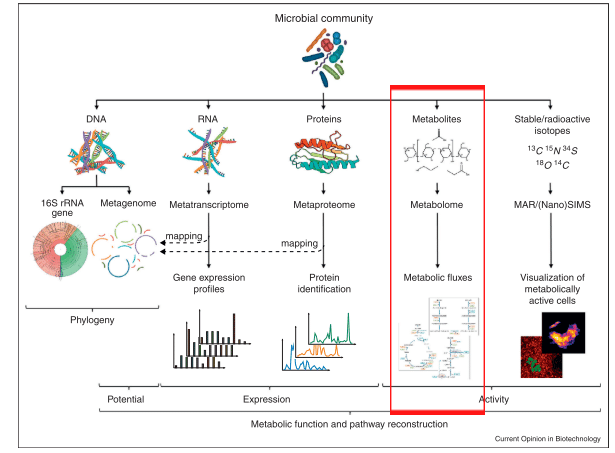

```{r setup, include=FALSE, cache=FALSE}
# TO render: rmarkdown::render('Lesson1.Rmd', 'xaringan::moon_reader')

# set working directory to docs folder
setwd(here::here("docs"))

# Set global R options
options(htmltools.dir.version = FALSE, servr.daemon = TRUE)

# Set global knitr chunk options
knitr::opts_chunk$set(
  fig.align = "center", 
  cache = TRUE,
  error = FALSE,
  message = FALSE, 
  warning = FALSE, 
  collapse = TRUE 
)

# This is good for getting the ggplot background consistent with
# the html background color
library(ggplot2)
thm <- theme_bw()
theme_set(thm)

library(RefManageR)
BibOptions(check.entries = FALSE,
           bib.style = "authoryear",
           cite.style = "authoryear",
           style = "markdown",
           hyperlink = FALSE,
           dashed = FALSE)
bib <- ReadBib("biblio/bib.bib", check = FALSE)
```

```{r xaringanExtra, echo=FALSE}
library(xaringanExtra)
use_tile_view() 
```

class: title-slide


# .font170[MICROBIOMA E MICROBIOTA]


<br><br><br><br>
.marco[
Marco Chiapello
<br>
2020-11-17
]


.marco[
.center[.font90[[[`r fontawesome::fa("slack", fill = "steelblue")`](https://join.slack.com/t/ipma-2020/shared_invite/zt-j9o8ig7k-LN1~U3d6QJztquYbC6iW7w) Slack (https://bit.ly/3eRDBRL) - `r fontawesome::fa("envelope", fill = "steelblue")`](mailto:marco.chiapello@unito.it) marco.chiapello@unito.it]
]
]

---
layout: true

# Last lesson check

---

```{r echo=FALSE, out.width="500px"}

```

.center[https://bit.ly/3np9ILA]

---

class: clear, middle, center

# .black[Il microbiota vegetale varia?]

.m0tbp[
```{r echo=FALSE, out.width="950px"}
# Load libraries
library(tidyverse)
library(googledrive)
library(googlesheets4)
library(patchwork)
library(gt)

# drive_auth()
# gs4_auth(token = drive_token())

# Either specify the user:
drive_auth(email = "mc983.cam@gmail.com")
# Or, if you don't use multiple Google identities, you can be more vague:
drive_auth(email = TRUE)
gs4_auth(token = drive_token())

# Read data
x <- read_sheet("https://docs.google.com/spreadsheets/d/1sdDGSWsAMKoohNJCBRrEwekarL_8xakCTmcHQFb_NnU/edit#gid=2067277305")

# Domanda 1
d1 <- x %>%
	select(3)
names(d1) <- "Opzioni"
d1 %>%
	group_by(Opzioni) %>%
    summarise(Risposte = sum(n())) %>%
	gt() %>%
    text_transform(
       locations = cells_body(
         columns = "Risposte",
         rows = Opzioni != "Si, varia nel tempo. In diversi momenti della vita della pianta la composizione del microbiota muta"),
       fn = function(x) paste(x, fontawesome::fa("times-circle", fill = "red"))
     )%>%
    text_transform(
       locations = cells_body(
         columns = "Risposte",
         rows = Opzioni == "Si, varia nel tempo. In diversi momenti della vita della pianta la composizione del microbiota muta"),
       fn = function(x) paste(x, fontawesome::fa("check-circle", fill = "green"))
     )
```
]

---

class: clear, middle, center

# .black[Qual è la forza selettiva maggiore che da forma al microbiota associato alle piante?]

.m0tbp[
```{r echo=FALSE, out.width="950px"}
# Domanda 1
d2 <- x %>%
	select(4)
names(d2) <- "Opzioni"
d2 %>%
	group_by(Opzioni) %>%
    summarise(Risposte = sum(n())) %>%
	gt() %>%
    text_transform(
       locations = cells_body(
         columns = "Risposte",
         rows = Opzioni != "La pianta"),
       fn = function(x) paste(x, fontawesome::fa("times-circle", fill = "red"))
     )%>%
    text_transform(
       locations = cells_body(
         columns = "Risposte",
         rows = Opzioni == "La pianta"),
       fn = function(x) paste(x, fontawesome::fa("check-circle", fill = "green"))
     )
```
]

---

class: clear, middle, center

# .black[Per olobiote si intende...]

.m0tbp[
```{r echo=FALSE, out.width="950px"}
# Domanda 1
d3 <- x %>%
	select(5)
names(d3) <- "Opzioni"
d3 %>%
	group_by(Opzioni) %>%
    summarise(Risposte = sum(n())) %>%
	gt() %>%
    text_transform(
       locations = cells_body(
         columns = "Risposte",
         rows = Opzioni != "Un organismo vivente alla luce della convivenza con il proprio microbiota"),
       fn = function(x) paste(x, fontawesome::fa("times-circle", fill = "red"))
     )%>%
    text_transform(
       locations = cells_body(
         columns = "Risposte",
         rows = Opzioni == "Un organismo vivente alla luce della convivenza con il proprio microbiota"),
       fn = function(x) paste(x, fontawesome::fa("check-circle", fill = "green"))
     )
```
]

---
layout: true

# Last lesson recap

---

.pull-left[
<br>
.m0p[
.h25o[
1. Plant microbiota changes spatially and temporally

1. Plant compartment is a major selective force that shapes the composition of plant-associated microbiota

1. Plants and their associated microorganisms form a holobiont

1. Core and Hub microbiota

]
]
]

---

.pull-left[
<br>
.m0p[
.h25o[
1. Plant microbiota change spatially and temporally

1. .opacity10[ Plant compartment is a major selective force that shapes the composition of plant-associated microbiota]

1. .opacity10[ Plants and their associated microorganisms form a holobiont]

1. .opacity10[ Core and Hub microbiota]

]
]
]

.pull-right[

.m0p[
```{r echo = FALSE, out.height="230px", out.width="230px"}
knitr::include_graphics("images/PlantMicrobiomeComposition.png")
```

```{r echo = FALSE, out.height="270px", out.width="300px"}
knitr::include_graphics("images/plantMicrobiotaTemporal.png")
```
]
]

---

.pull-left[
<br>
.m0p[
.h25o[
1. .opacity10[ Plant microbiota change spatially and temporally]

1. Plant compartment is a major selective force that shapes the composition of plant-associated microbiota

1. .opacity10[ Plants and their associated microorganisms form a holobiont]

1. .opacity10[ Core and Hub microbiota]

]
]
]

.pull-right[

```{r echo=FALSE, out.width="350px"}

```

```{r echo=FALSE, out.width="350px"}
knitr::include_graphics("images/fungalDiv.png")
```
]

---

.pull-left[
<br>
.m0p[
.h25o[
1. .opacity10[ Plant microbiota change spatially and temporally]

1. .opacity10[ Plant compartment is a major selective force that shapes the composition of plant-associated microbiota]

1. Plants and their associated microorganisms form a holobiont

1. .opacity10[ Core and Hub microbiota]

]
]
]

.pull-right[
<br>
```{r echo=FALSE, out.width="800px"}
knitr::include_graphics("images/holobiont1.png")
```

]

---

.pull-left[
<br>
.m0p[
.h25o[
1. .opacity10[ Plant microbiota change spatially and temporally]

1. .opacity10[ Plant compartment is a major selective force that shapes the composition of plant-associated microbiota]

1. .opacity10[Plants and their associated microorganisms form a holobiont]

1. Core and Hub microbiota

]
]
]

.pull-right[
<br>
```{r echo=FALSE, out.width="200px"}
knitr::include_graphics("images/core1.png")
```

```{r echo=FALSE, out.width="200px"}

```

]

---
layout: false
class: clear 

.pull-left-wide[
.font180[.bold[Agenda]]


- .font140[How do you study the microbiota composition?]

- .font140[What can the microbiota potentially do?]

- .font140[What are they doing?]
]

???

.n[
- Questa lezione prevede dei capitoli che riguardano la **pratica** dello studio del microbiota

- Nel primo capitolo vedremo come si rispone alla domanda: "Chi è presente?"

- Nel secondo capitolo risponderemo alla domanda: "Quali funzioni possono avere i microorganismi che compongono il microbiota?"

- Ed infine risponderemo alla domanda, forse, più importante: "Che cosa STANNO facendo i microorganismi presenti nel microbiota"
]


---
layout: true

# How do you study the microbiota composition?


---
class: inverse, middle, center

----

???

.n[
- Inziamo a vedere come si studia la composizione del microbiota

- Rispondiamo quindi alla domanda: "Chi è presente?"
]

---

.center[**There are two major approaches to assess the microbiota composition**]

.h20[
```{r echo=FALSE, out.width="520px"}

```

.right[.font60[`r Cite(bib, key = "Lebeis_2014")`]]
]

???

.n30[
- Le 2 metodologie di studio del microbiota si basano su 2 principi diametralmente opposti:
  - Da una parta vedremo un approccio indipendete dalla coltura in vitro ma basato sul materiale genetico     
  - Dall'altra un approccio esclusivamente incentrato sulla coltura in vitro
]

---

.pull-left[
```{r echo=FALSE, out.width="520px"}

```
]

.pull-right[
**Culture dependent**

- `r fontawesome::fa("plus-circle", fill = "green")` This approach isolates individual microbes 

- `r fontawesome::fa("times-circle", fill = "red")` The community diversity estimate is limited

]

???

.n[

- **Easy Poll**

- Focalizziamo la nostra attenzione sul sistema coltura dipendente

- Questo approccio ha un grande punto di forza: Permette di isolare i microbi in coltura pura (ovviamente tutti quelli coltivabili in vitro - esclusi i simbioti obbligati)

- Il problema di questo approccio è sicuramente la sottostima della diversità all'interno del microbiota
]
---

.pull-left[
**Culture independent**

- `r fontawesome::fa("plus-circle", fill = "green")`  The ability to identify and quantify community members, even down to extremely rare taxa

- `r fontawesome::fa("plus-circle", fill = "green")`  Insights beyond the information provided by individual microbes

- `r fontawesome::fa("times-circle", fill = "red")` This approach does not isolate individual microbes 

]


.pull-right[
```{r echo=FALSE, out.width="520px"}

```
]

???

.n30[
- Il metodo indipendente dalla coltura, che approfondiremo meglio nelle prossime slides, ha 2 indiscutibili vantaggi: 
  - L'abilità non solo di identificare ma anche di quantificare l'abbondanza dei microorganismi presenti. Permettendo di identificare anche organismi estremamente poco abbondanti     
  - Utilizzando approcci bioinformatici è possibile ricavare importati informazioni sul funzionamento dell'intera comunità e non solo sui singoli individui
  
- Questo approccio, però, non permette di isolare i singoli microrganismi

- Isolare i singoli microorganismi può essere importante per la riscostruzione delle Comunità Sintetiche che permettono lo studio in laboratorio o l'applicazione in agricoltura per migliorare la resa delle colture vegetali
]

---

.center[.font150[Microbial DNA metabarcoding]]

> **DNA metabarcoding** is a method of **DNA barcoding** that uses universal genetic markers to identify DNA of a mixture of organisms


???

.n30[

- Vediamo ora come studiare il microbiota con **tecniche coltura indipendenti**!
- Per studiare il microbiota e quindi identificare gli organismi lo compongono si utilizza una tecnica chiamata **DNA METABARCODING**

- Questa tecnica utilizza il **DNA barcoding** per studiare la composizione del microbiota

- **CHE COS'E' il DNA BARCODING"**
]

--

<br>
.content-box-grey[What is it the <br> **DNA barcoding**?]


---

.center[.font150[Microbial DNA metabarcoding]]

- **DNA barcoding** is a method of species identification using a short section of DNA from a specific gene 

- An individual sequence can be used to uniquely identify an organism by comparison with a reference library of classified DNA sequences


```{r echo=FALSE, out.width="520px"}

```

???

.n30[
- Il DNA Barcoding è una tecnica che permette di identificare l'organismo studiato basandosi su una sua specifica sequenza nucleotidica

- L'idea è utilizzare una sequenza di DNA per identificare un organismo in maniera univoca. 

- Dopo aver identificato la sequenza specifica, questa viene confrontata con un database di riferimento per essere classificata

- Un paragone potrebbe essere quello di utilizzare il vostro codica fiscale per identiifcarvi. La sequenza di lettere e numeri non mi da informazioni, ma cercandolo in un database potrei conosce il vostro nome e cognome  e identificarvi in modo univoco
]

---

.center[.font150[Microbial DNA metabarcoding]]

.pull-left[
**Marker selection**

.n30[
- Markers used for DNA barcoding are called barcodes and their selection is crucial

- Ideally, one gene sequence would be used for developing universal PCR primers for all taxonomic group
  
- However, no such gene region has been found yet!

- Different gene regions are used to identify the different organismal groups using barcoding
]
]

.pull-right[

```{r echo=FALSE, out.width="200px"}

```

.right[.font50[(Mosa et al., 2019)]]
]

???

.n30[
- Siccome i microrganismi non sono registrati all'anagrafe e non hanno un loro CF, cosa possiamo usare come sequenza univoca per identificarli?

- La selezione di queste sequenze marker (**chiamate barcode**) è cruciale per l'identificazione dei microorganismi

- In un modo perfetto esisterebbe un unico barcode, cioè un singolo marker che ci permeterebbe si identificare e distinguere tutti i gruppi tassonomici

- Ma ovviamente non viviamo in un mondo ideale! E questo marker non è ancora stato individuato e probabilmente non lo sarà mai

- Quindi, diversi gruppi tassonomici usano diversi tipi di barcodes

- Sulla destra della slide vedete un tipico cromatogramma di sequenziamento. Da quest'immagine è facile capire perchè i markers sono chiamati barcodes
]

---

.center[.font150[Sequencing]]

**Sanger Sequencing**

.pull-left-narrow[
.h25[
<br><br>
Sanger sequencing, also known as the “chain termination method”, is a method for determining the nucleotide sequence of DNA. The method was developed by two time Nobel Laureate Frederick Sanger and his colleagues in 1977, hence the name the Sanger Sequence
]
]

.pull-right-wide[
```{r echo=FALSE, out.width="820px"}

```
]

---

.center[.font150[Microbial DNA metabarcoding]]

**Marker selection**

| Organism | Region |
|----------|--------|
| animals  | cytochrome c oxidase I|
| fungi    |  internal transcribed spacer (ITS) rRNA |
| plants   | RuBisCO |
| prokaryotes | 16S rRNA |
| microbial eukaryotes | 18S rRNA |


.font80[When barcoding is used to identify organisms from a sample containing DNA from more than one organism, the term DNA metabarcoding is used]

???

.n30[
- Vedete qui una lista di barcodes per diversi organismi

- Questi geni sono stati scelti a causa della dell'evoluzione lenta 

- COX1 enzima chiave del metabolismo aerobico

- Internal transcribed spacer (ITS): sono regioni non codificanti di DNA situate tra geni. ITS in partcilare tra le subunità dellRNA ribosomiale

- ribulosio-1,5-bisfosfato carbossilasi/ossigenasi: tramite la fissazione del carbonio, è il principale produttore di materia organica nell'ecosistema terrestre

- RNA ribosomiale 16 S (o rRNA 16 S) è una componente della subunità 30S di un ribosoma procariotico

- Il 18S è l'omologo eucariota del 16S dei procariotu
]

---

.center[.font150[Microbial DNA metabarcoding]]

**Metabarcoding process**

```{r echo=FALSE, out.width="920px"}

```

???

.n[
- **Easy Poll**
]

---

.center[.font150[Microbial DNA metabarcoding]]

.pull-left[
.m0p[
**Bioinformatic analysis**
]
.n30[
- After sequencing, raw data must be processed (**quality and cleaning step**)

- Samples are clustered in operational taxonomic unit based on identity threshold (**OTU formation**)

- Using "the Basic Local Alignment Search Tool (BLAST)" regions of similarity between sequences and reference databases are identified (**annotation step**)    

- Microbiota composition definition (**richness and diversity step**)

]
]

.pull-right[

.h20[
.m0p[
.right[.font50[(Jesse et al., 2018)]]     
]
```{r echo=FALSE, out.width="220px"}

```


]]


???

.n30[
- These databases contain the DNA barcodes assigned to previously identified taxa

- An operational taxonomic unit (OTU) is an operational definition used to classify groups of closely related individuals
]

---
layout: true

# What can the microbiota potentially do?

---

class: inverse, middle, center

----

???

.n[
- Prendiamo ora in considerazione quella tecnica che oltre a permetterci di identificare i componenti del microbiota ci permette anche di capire cosa "potenzialmente" possono fare!
]
---

.center[.font120[Metagenomics]]

```{r echo=FALSE, out.width="720px"}

```
.right[.font50[`r Cite(bib,  key = "YE2019779")`]]
.h25[
- **Metagenomics** is the study of genetic material recovered directly from environmental samples

- The collection of sequenced genes from the environment could be analyzed as a **single genome**
  
- Metagenomics **does not require the isolation** and lab cultivation of individual species

- Due to its random nature, metagenomics, allows that many **under-represented organisms will be detected**
]

???

.n30[
- La metagenomica studia il DNA isolato da un campione ambientale

- Questo campione può essere considerato come un singolo campione e quindi come tale analizzato

- La figura illustra la procedura di analisi di un campione di metagenomica. Come potete vedere 3 steps sono necessari:
  1. Estrazione
  1. Sequenziamento
  1. Classificazione
]

---

.center[Metagenomics vs Metabarcoding]
.pull-left[
.m0p[
```{r echo=FALSE, out.width="450px"}

```
.right[.font50[`r Cite(bib,  key = "gill2016")`]]
]]


 .pull-right[
.h21[

- Metagenomics does not need the marker selection step

- Metagenomics sequences all the genes present in the sample from each organism

- Metagenomics can help to reconstruct large fragments or even complete genomes from organisms in a community

- Metagenomics allows the characterization of a large number of coding and non-coding sequences that can be used to decipher the microbial diversity or to understand its metabolic potential
]
]

???

.n30[
- La differenza fondamentale tra Metagenomica e Metabarcoding è che per la Metagenomica non serve alcun barcode (marker)

- Questo perchè in metagenomica tutto il DNA presente nel campione viene sequenziato

- Il risultato del sequenziamento permette di ricostruire gran parte dei geni presenti nel microbiota, permettondo così di capire quali organismi sono presenti ma anche cosa potenzialmente questi geni possono esprimere
]

---

```{r echo=FALSE}
# # library(rvest)
# library(gt)
# library(tidyverse)
# library(janitor)
# # url <- "https://en.wikipedia.org/wiki/DNA_sequencing"
# # 
# # df <- url %>%
# #     read_html() %>%
# #     html_node(".wikitable") %>%
# #     html_table() %>%
# #     as_tibble()
# # 
# # df %>%
# #     filter(grepl("Sanger|Nanopore|Illumina|Pacific|Torrent|454", Method)) %>%
# #     write_csv("extra/MetagenomicsRAW.csv")
# read_csv("extra/MetagenomicsClean.csv") %>%
#     clean_names() %>%
#     arrange(order) %>%
#     select(-order) %>%
#     separate_rows(read_length, reads_per_run, sep = ";\n") %>% 
#     separate(method, into = c("method", "tech"), sep = "\\(") %>%
#     mutate(tech = str_remove(tech, "\\)")) %>%
#     rename_with(~toupper(gsub("_", " ", .))) %>%
#     gt() %>%
#     tab_header(
#     title = "Comparison of high-throughput sequencing methods",
#     subtitle = "Source: Wikipedia") %>%
#     tab_options(
#                 table.font.size = 14,
#                 table.width = 1200
#     )
# 
```

```{r echo=FALSE, out.width="920px"}

```

???

.n30[
- Consideriamo il range tra il sanger sequencing method e 
llumina HiSeq
]

---

.center[
.middle[
<iframe width="840" height="473" src="https://www.youtube.com/embed/fCd6B5HRaZ8" frameborder="0" allow="accelerometer; autoplay; clipboard-write; encrypted-media; gyroscope; picture-in-picture" allowfullscreen></iframe>
]
https://bit.ly/2IGGiJE
]
---

.center[.font120[Genomes assembly]]

.m0p[
```{r echo=FALSE, out.width="620px"}

```
]

???

.n[
- I frammenti generati dal sequenziamento devono poi essere **assemblati** per ricostruire il/i genomi presenti nel campione

- 2 tipi assembli a seconda che sia presente un genoma di riferimento

- Mappaggio per dire chi è più o meno abbondante
]

---
.font120[**Functional Metagenomics Analysis**]

.pull-left[
.m10ulp[
Workflow:

- Binning

- Metagenomic assembly

- Gene prediction

- Gene annotation 

- Reconstruction of metabolic pathways (achieved from enzyme-coding genes)
]]

.pull-right[
```{r echo=FALSE, out.width="380px"}

```
.right[.font50[`r Cite(bib,  key = "Roumpeka_2017")`]]
]

???

.n30[

- In questa slide vediamo come facciamo a definire quali sono i potenziali processi del microbiota analizzato

- In metagenomica, il binning è il processo di raggruppamento delle reads o contigs e di assegnarli a unità tassonomiche operative
]

---

.font120[**Functional Metagenomics Analysis**]

.pull-left[
.m10ulp[
Workflow:

- Binning

- Metagenomic assembly

- Gene prediction

- Gene annotation 

- Reconstruction of metabolic pathways (achieved from enzyme-coding genes)
]]

.pull-right[
```{r echo=FALSE, out.width="370px"}

```
.right[.font50[`r Cite(bib,  key = "Casta_eda_2017")`]]
]

---
layout: true

# What are they doing?

---

class: inverse, center, middle

----

???

.n[
- In fine vediamo come studiare le funzioni reali del microbiota
]
---

.white[Metatranscriptomics]

```{r echo=FALSE, out.width="620px"}
# library(magick)
# x <- image_read("images/quadratoRED.png")
# img <- image_read("images/Molecular-methods-for-determining-phylogeny-and-functional-diversity-of-microbial.ppm")
# y <- image_composite(img, image_scale(x, "135x330!"), offset = "+25+85")
# image_write(y, "images/Meta1.png")
# z <- image_composite(img, image_scale(x, "95x330!"), offset = "+160+85")
# image_write(z, "images/Meta2.png")
# a <- image_composite(img, image_scale(x, "95x330!"), offset = "+275+85")
# image_write(a, "images/Meta3.png")
# b <- image_composite(img, image_scale(x, "95x330!"), offset = "+390+85")
# image_write(b, "images/Meta4.png")
# d <- image_composite(img, image_scale(x, "95x330!"), offset = "+505+85")
# image_write(d, "images/Meta5.png")

knitr::include_graphics("images/Meta1.png")
```
.right[.font50[`r Cite(bib,  key = "VANWONTERGHEM201455")`]]

???

.n30[
- Fin'ora ci siamo occupati di DNA metabarcoding e Metagenomics

- Abbiamo visto come il DNA Metabercoding risponda alla domanda "Chi è presente?"

- Il Metagenoma risponde sia alla domanda "Chi è presente?" sia alla domanda "Cosa potenzialmente puà fare il microbiota"

- Vediamo ora quali tecniche ci permettono di studiare le funzioni del microbiota:

1. Metatranscriptomics
1. Metaproteomics
1. Metabolomics
1. SIP: Stable isotop probing
]

---

Metatranscriptomics

```{r echo=FALSE, out.width="620px"}

```
.right[.font50[`r Cite(bib,  key = "VANWONTERGHEM201455")`]]

---

Metatranscriptomics
.pull-left[
.h25[
- Metatranscriptomics is the science that studies gene expression of microbes within natural environments

- It allows to obtain whole gene expression profiling of complex microbial communities

- `r fontawesome::fa("plus-circle", fill = "green")` The advantage of metatranscriptomics, over metagenomics, is that it can provide information about differences in the active functions of microbial communities 

-  The overview of the gene expression in a given sample is obtained by capturing the total mRNA of the microbiome and by performing a whole metatranscriptomics shotgun sequencing.
]
]

.pull-right[
.m0p[
```{r echo=FALSE, out.width="380px"}

```
.right[.font50[`r Cite(bib,  key = "Perez-Pantoja:2015aa")`]]
]
]

???

.n30[
- La metatranscrittomica studia l'espressione genica dei microorganismi nell'ambiente ovvero studia l'**mRNA**

- Essendo una tecnica basata sul sequenziamento permette di ottenere tutti gi mRNA messaggeri presenti nel campione e quindi di avere il profili di espressione dell'ologenoma

- Guardando la figura salla dx vediamo come si sviluppa schematicamente un'analisi di metatrascrittomica

- [...]

- Mi permetto di farvi notate la diversa dimensione dei 2 riquadri e dell'importanza che riveste oggi la parte di bioinformatica
]
---

Metaproteomics

```{r echo=FALSE, out.width="620px"}

```
.right[.font50[`r Cite(bib,  key = "VANWONTERGHEM201455")`]]

---

Metaproteomics

.pull-left[
.h25[
- Metaproteomics is the study of all protein samples recovered directly from environmental sources

- Metaproteomics have rapidly increased in recent years due to many technological advances in mass spectrometry (MS)

- `r fontawesome::fa("plus-circle", fill = "green")` Metaproteomics assess the “expressed” metabolism and physiology of microbial community members, but also allows quantification of per-species biomass to determine community structure

- `r fontawesome::fa("plus-circle", fill = "green")` Proteomics quantifies the real proteins expression level, while mRNA may be degraded or translated inefficiently, resulting in a incorrect estimation of protein expression level
]
]

.pull.right[
```{r echo=FALSE, out.width="480px"}

```
.right[.font30[https://www.ecu.edu.au/schools/science/research-activity/research-support/proteomics/what-is-lc-ms-proteomics]]
]

???

,n30[
- La Metaproteomica studia le proteine espresse dalla comunità di microorganismi presa in esame

- La proteomics lavora sulle proteine espresse, cioè i veri attori del metabolismo. A differenza di quanto fa la trascrittomica

- Come funziona la proteomica
]

---

Metabolomics

```{r echo=FALSE, out.width="600px"}

```
.right[.font50[`r Cite(bib,  key = "VANWONTERGHEM201455")`]]

---

Metabolomics

.pull-left[
.m0p[
.h25[

- Metabolomics is the study of the complete set of metabolites composition (the metabolome) of a cell type, tissue, or biological fluid

- `r fontawesome::fa("plus-circle", fill = "green")` The metabolites (<1.5 kDa) are the intermediates or end products of multiple enzymatic reactions and therefore are the most informative proxies of the biochemical activity of an organism

- `r fontawesome::fa("times-circle", fill = "red")` The metabolome consists of multiple compounds. Determine the entire set of metabolites is extremely difficult, further complicating the analyses is the dynamic nature of these metabolites.
]
]]

.pull-rigth[
<br><br>
```{r echo=FALSE, out.width="550px"}

```
]
.right[.font70[`r Cite(bib,  key = "alonso2015")`]]


???

.n30[
- La metabolomica è lo studio dei metaboliti

- I metaboliti sono molecole di dimensione inferiore ai 1.5 KDa e rappresentano gli intermedi o i prodotti finali delle reazioni enzimatiche 

- Ci informano per tanto sulle reali attività biochimiche in atto!!

- Esempi di metaboliti sono: carboidrati idrofilici, alcool volatili, chetoni, metaboliti secondari come antibiotici e pigmenti

- Descrizione figura

- Spettroscopia di risonanza magnetica nucleare
]


---

Stable/radioactive isotopes

```{r echo=FALSE, out.width="600px"}

```
.right[.font50[`r Cite(bib,  key = "VANWONTERGHEM201455")`]]

---

Stable/radioactive isotopes

.pull-left[
.m0p[
.h25[

- Stable-isotope probing (SIP) is a technique in microbial ecology for tracing fluxes of nutrients in biogeochemical cycling by microorganisms using heavy stable isotopes

- `r fontawesome::fa("plus-circle", fill = "green")` SIP is an approach that can identify microbial populations with a defined function

- `r fontawesome::fa("plus-circle", fill = "green")` The use of either DNA-SIP, RNA-SIP or protein-SIP can enable both the phylogenetic identification and the key metabolic genes/proteins

- `r fontawesome::fa("times-circle", fill = "red")` A major challenge associated with SIP is a very limited availability and high cost of labeled substrates. SIP is also very labor-intensive and low-throughput using current techniques
]
]]

.pull-rigth[
```{r echo=FALSE, out.width="280px"}

```
]
.right[.font50[`r Cite(bib,  key = "UHLIK2013154")`]]

???

.n30[
- La Stable isotope probing è una tecnica che utilizzando isotopi radioattivi traccia il flusso dei nutrienti utilizzati dai microorganismi

- Tra i pro di questa tecnica c'è la possibilità di studiare in detttaglio specifiche funzioni della popolazione microbica

- Per contro questa tecnica è molto complessa a livello pratico e molto costaosa a livello economico
]

---

Stable/radioactive isotopes

.m0p[
```{r echo=FALSE, out.width="570px"}

```
.right[.font50[(el Zahar Haichar, Heulin, Guyonnet, et al., 2016)]]
]

---
layout: false
class: clear, middle, center

.m0p[
```{r echo=FALSE, out.width="850px"}

```
]

???
metafora della torta e dei suoi ingredienti

---
class: clear


.center[.font150[System biology]]

.pull-left[
.m0p[
.h25u[
- .font80[Systems biology studies biological systems by systematically perturbing them]    

- .font80[Monitoring the gene, protein, metabolite, and informational pathway responses]    

- .font80[Integrating these data]    

- .font80[Formulating mathematical models that describe the structure of the system]    

- .font80[Predict its response to individual perturbations]
  ]]]

.pull-right[
.m0p[
```{r echo=FALSE, out.width="670px"}

```

]
]

???

.n30[
- Qual è la tecnica per studiare al meglio il microbiota?

- La soluzione migliore è usarle tutte e combinarle insieme in quello che viene chiamato System biology

- Tutti questi dati integrati dovrebbero permetterci una migliore comprensione del sistema studiato, aiutarci a create dei modelli e grazie a questi modelli predirre le risposte del sistema
]

---

layout: true

# Questions about the lesson


---


.m0tbp[
.center[.font50px[`r fontawesome::fa("question-circle", fill = "black")`]]
]

.marco[
.center[.font90[[[`r fontawesome::fa("slack", fill = "steelblue")`](https://join.slack.com/t/ipma-2020/shared_invite/zt-j9o8ig7k-LN1~U3d6QJztquYbC6iW7w) Slack (https://bit.ly/3eRDBRL) - `r fontawesome::fa("envelope", fill = "steelblue")`](mailto:marco.chiapello@unito.it) marco.chiapello@unito.it]
]
]


