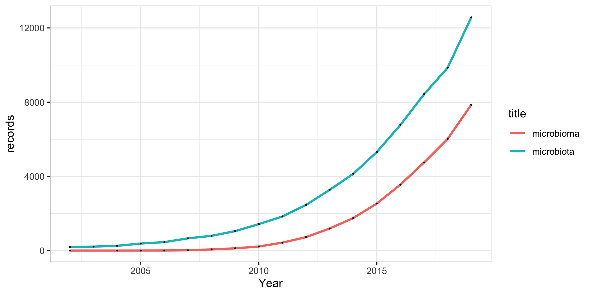

```{r setup, include=FALSE, cache=FALSE}
# set working directory to docs folder
setwd(here::here("docs"))

# Set global R options
options(htmltools.dir.version = FALSE, servr.daemon = TRUE)

# Set global knitr chunk options
knitr::opts_chunk$set(
  fig.align = "center", 
  cache = TRUE,
  error = FALSE,
  message = FALSE, 
  warning = FALSE, 
  collapse = TRUE 
)

# This is good for getting the ggplot background consistent with
# the html background color
library(ggplot2)
thm <- theme_bw()
theme_set(thm)

library(RefManageR)
BibOptions(check.entries = FALSE,
           bib.style = "authoryear",
           cite.style = "authoryear",
           style = "markdown",
           hyperlink = FALSE,
           dashed = FALSE)
bib <- ReadBib("biblio/bib.bib", check = FALSE)
```

class: title-slide

Corso di laurea in XXX
<br>
# .font200[MICROBIOMES]


<br><br>
.marco[
Marco Chiapello
<br>
`r Sys.Date()`
]

---
layout: true
class: clear

---
```{r echo = FALSE}
# library(magick)
# x <- image_read("docs/images/microbiota.jpg")
# y <- image_read("docs/images/micribioma.jpg")
# x <- image_scale(x, 300)
# y <- image_scale(y, 300)
# image_write(x, "docs/images/microbiota.jpg")
# image_write(y, "docs/images/microbioma.jpg")
```

.pull-left[.center[.font180[.bold[microBIOTA]]]
<br>
```{r echo=FALSE, out.width = "500px"}
knitr::include_graphics("images/microbiota.jpg")
```

]

.pull-right[.center[.font180[.bold[microBIOMA]]]
<br>
```{r echo=FALSE, out.width = "500px"}
knitr::include_graphics("images/microbioma.jpg")
```


]

???

la differenza che passa tra i due termini è la stessa che esiste tra popolazione umana e genoma umano
---


.pull-left[.center[.font180[.bold[microBIOTA]]]
> si riferisce a una popolazione di microrganismi che colonizza un determinato luogo

]

.pull-right[.center[.font180[.bold[microBIOMA]]]
> indica la totalità del patrimonio genetico posseduto dal microbiota, cioè i geni che quest’ultimo è in grado di esprimere

]

---


.pull-left[.center[.font180[.bold[microBIOTA]]]]

.pull-right[.center[.font180[.bold[microBIOMA]]]]

<br>
```{r echo=FALSE, out.width = "1000px"}
# library(tidyverse)
# # Read data
# mt <- read_delim("data/microbiotaPublications.txt", delim = "\t") %>% 
#   drop_na %>% 
#   mutate(Year = as.numeric(`Publication Years`),
#          title = "microbiota") %>% 
#   filter(Year > 2001, Year < 2020) %>% 
#   select(Year, records, title)
# mm <- read_delim("data/microbiomaPublications.txt", delim = "\t")%>% 
#   drop_na%>% 
#   mutate(Year = as.numeric(`Publication Years`),
#          title = "microbioma") %>% 
#   filter(Year > 2001, Year < 2020) %>% 
#   select(Year, records, title)
# 
# # Combine data for printing
# p <- mt %>% 
#   bind_rows(mm) %>% 
#   ggplot(aes(x = Year,
#              y = records)) +
#   geom_line(aes(color = title), size = 1) +
# #   geom_point(size = .2) +
#   scale_color_manual(values = c("#ef8a62", "#999999")) +
#   theme_classic() +
#   theme(legend.title = element_blank(),
#         legend.position = "bottom",
#         legend.text = element_text(size = 20),
#         panel.grid.major.y = element_line()) +
#   labs(x = "", y = "",
#        title = "Numero di pubblicazioni con parola chiave microbiota o micromioma",
#        caption = "ISI Web of Science",
#        subtitle = "Ricerca effettuata a Settembre 2020\nIntervallo tra 2002 e 2019")
# 
# ggsave("docs/images/microPublications.jpg", units = "cm", 
#        width = 20, height = 10, dpi = 300)

```

---
reference `r Cite(bib, author = "Bigeard")`

- item1

- .font60[.green[item2]]

.content-box-purple[MARCO]

.blur.content-box-title[FABIANA]

.rotate-left.content-box-red[MARCO]

---

Text text text

---
layout: false

.left-column[
# Sidebar text

- ~~Item1~~

- Item2
]

.right-column[
# Text on the right that spreads longer then the left one

## Subtitle

Normal text 
]

---
class: clear

.font200.center.orange.f500[TITLE]

.left-column50[
text on the left until middle of the page
]

.right-column50[
text on the right until middle of the page
]

---

```{r rmark2, echo=FALSE, out.width = "420px"}
knitr::include_graphics("images/RMarkdownOutputFormats.png")
```

Image `r emo::ji("grinning face")`

---
class: inverse

<br><br>
.center.font200.f400.white[
Reproducible research Tools
]

----
<br><br><br><br>
.right.white[pippo]

---


# References
```{r refs, echo=FALSE, results="asis"}
PrintBibliography(bib)
```

