```{r setup, include=FALSE, cache=FALSE}
# TO render: rmarkdown::render('Lesson1.Rmd', 'xaringan::moon_reader')

# set working directory to docs folder
setwd(here::here("docs"))

# Set global R options
options(htmltools.dir.version = FALSE, servr.daemon = TRUE)

# Set global knitr chunk options
knitr::opts_chunk$set(
  fig.align = "center", 
  cache = TRUE,
  error = FALSE,
  message = FALSE, 
  warning = FALSE, 
  collapse = TRUE 
)

# This is good for getting the ggplot background consistent with
# the html background color
library(ggplot2)
thm <- theme_bw()
theme_set(thm)

library(RefManageR)
BibOptions(check.entries = FALSE,
           bib.style = "authoryear",
           cite.style = "authoryear",
           style = "markdown",
           hyperlink = FALSE,
           dashed = FALSE)
bib <- ReadBib("biblio/bib.bib", check = FALSE)
```

class: title-slide


# .font170[MICROBIOMA E MICROBIOTA]


<br><br><br><br>
.marco[
Marco Chiapello
<br>
`r Sys.Date()`
]


.marco[
.font90[[`r fontawesome::fa("twitter", fill = "steelblue")`](https://twitter.com/marpello1980) @marpello1980 - [`r fontawesome::fa("envelope", fill = "steelblue")`](mailto:chiapello.m@gmail.com) chiapello.m@gmail.com - `r fontawesome::fa("skype", fill = "steelblue")` marpello]
]

???

.n30[

- Sarò uno dei vostri docenti per il corso "Interazioni tra piante, microrganismi e ambiente"
]
---
layout: true
class: clear

---

.font180[.bold[Agenda]]


.h35[
- .font140[Introduzione]

  - .font120[Il microbiota umano]
  
- .font140[Il microbiota delle piante]

  - .font120[Da chi è composto]
  
  - .font120[Che funzioni ha]
   
  - .font120[Come prende forma]
]

???

- .n[**Intro**: spiegazione dei concetti generali e dei termini]
---
```{r echo = FALSE}
# library(magick)
# x <- image_read("docs/images/microbiota.jpg")
# y <- image_read("docs/images/micribioma.jpg")
# x <- image_scale(x, 300)
# y <- image_scale(y, 300)
# image_write(x, "docs/images/microbiota.jpg")
# image_write(y, "docs/images/microbioma.jpg")
```

.pull-left[.center[.font180[.bold[microBIOTA]]]
<br>
```{r echo=FALSE, out.width = "400px"}
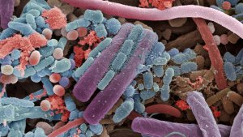
```

<br>
> .font80[si riferisce a una popolazione di microrganismi che colonizza un determinato luogo]

]

.pull-right[.center[.font180[.bold[microBIOMA]]]
<br>
```{r echo=FALSE, out.width = "400px"}
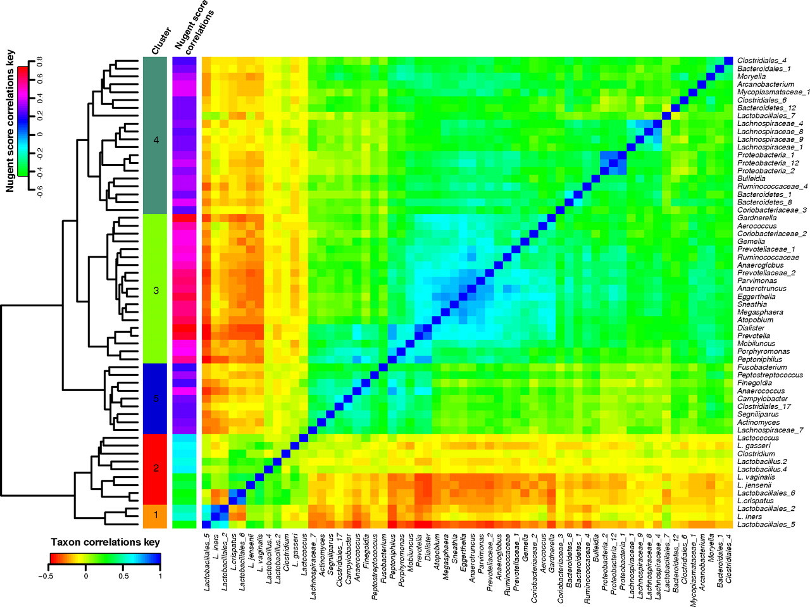
```

> .font80[indica la totalità del patrimonio genetico posseduto dal microbiota, cioè i geni che quest’ultimo è in grado di esprimere]

]

???

- .n[si riferisce a una popolazione di microrganismi che colonizza un determinato luogo]

- .n[batteri, funghi, protozoi, elminti, neamtodi, virus, ]
 
- .n[indica la totalità del patrimonio genetico posseduto dal microbiota, cioè i geni che quest’ultimo è in grado di esprimere]

- .n[la differenza che passa tra i due termini è la stessa che esiste tra popolazione umana e genoma umano]


---


.pull-left[.center[.font180[.bold[microBIOTA]]]]

.pull-right[.center[.font180[.bold[microBIOMA]]]]

<br>
```{r echo=FALSE, out.width = "550px"}
#  library(tidyverse)
#  library(gganimate)
# # Read data
#  mt <- read_delim("data/microbiotaPublications.txt", delim = "\t") %>%
#    drop_na %>%
#    mutate(Year = as.numeric(`Publication Years`),
#           title = "microbiota") %>%
#    filter(Year > 2003, Year < 2020) %>%
#    select(Year, records, title)
#  mm <- read_delim("data/microbiomaPublications.txt", delim = "\t")%>%
#    drop_na%>%
#    mutate(Year = as.numeric(`Publication Years`),
#           title = "microbioma") %>%
#    filter(Year > 2003, Year < 2020) %>%
#    select(Year, records, title)
# 
# # Combine data for printing
#  an <- mt %>%
#    bind_rows(mm) %>%
#    ggplot(aes(x = Year,
#               y = records)) +
#    geom_line(aes(color = title), size = 1) +
#     #geom_point(size = .2) +
#    scale_color_manual(values = c("#ef8a62", "#999999")) +
#    theme_classic() +
#    theme(legend.title = element_blank(),
#          legend.position = "bottom",
#          legend.text = element_text(size = 20),
#          panel.grid.major.y = element_line()) +
#    labs(x = "", y = "",
#         title = "Numero di pubblicazioni con parola chiave microbiota o microbioma",
#         caption = "Source: ISI Web of Science",
#         subtitle = "Ricerca effettuata a Settembre 2020\nAnno: Year: {round(frame_along, 0)}") +
#    transition_reveal(Year)
#  animate(an, nframes = 1000, fps = 25, end_pause = 900)
#  anim_save("images/microPublications.gif")

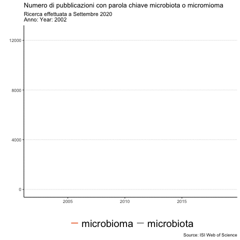
```

---
<br><br><br>
.center[.font600[.fontW7[HMP]]]
.center[.font140[Human Microbiome Project]]

---

Il **progetto microbioma umano** è una iniziativa dei National Institutes of Health statunitensi con il fine di **identificare e caratterizzare i microrganismi ed il loro rapporto con lo stato di salute e di malattia dell'uomo**. 

```{r echo=FALSE, out.width = "700px"}
#  df1 <- tibble(G = c(rep("numero totale di cellule", 2),
#                      rep("numero totale di geni", 2)),
#                S = c(rep(c("Human", "Microbes"), 2)),
#                N = c(1, 10, 1, 100))
#  df1 %>%
#   ggplot(aes(x = G, y = N, fill = S)) +
#    geom_col(position = position_dodge()) +
#    labs(x = "", y = "") +
#    theme_classic() +
#    theme(legend.title = element_blank(),
#          axis.text = element_text(size = 15),
#          legend.position = "top",
#          legend.text = element_text(size = 12)) +
# scale_fill_manual(values = c("#ef8a62", "#999999"))
#  ggsave("docs/images/microNubers.jpg", units = "cm",
#           width = 50/3, height = 30/3, dpi = 300)
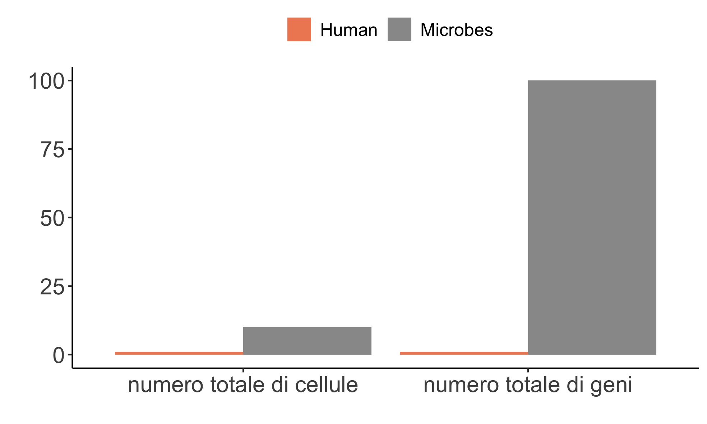
```

???


- .n[**RAPPORTO** cellule microbiche e cellule umane]

- .n[Il numero totale di cellule microbiche presenti in un organismo umano può superare di dieci volte il numero di cellule dell'organismo stesso]

- .n[i geni di origine microbica possono superare di cento volte il numero di geni presenti nel genoma umano (composto da circa 20.000 geni).]

---

<br><br><br>
.content-box-grey[.font180[.fontW7[L'essere umano va concepito come composto da cellule umane e microbiche]]]

???

- .n[Visto l'alto numero di cellule microbiche e della quantità del loro materiale genetico]

- .n[L'essere umano va concepito come composto da cellule umane e microbiche]

- .n[MA **quali** sono i micro-organismi]


---
.center[Temporal human microbiota]
```{r, echo=FALSE, out.width="780px", include=TRUE}
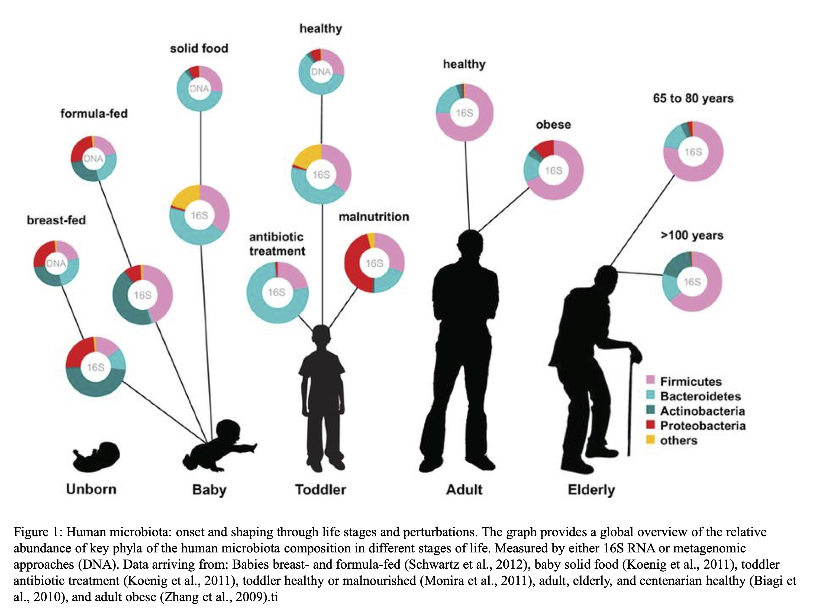
```

???

- .n[La figura mostra i phyla chiave della composizione del microbiota umano in diversi stadi della vita]

---

.center[Spatial human microbiota]
```{r, echo=FALSE, out.height="580px", out.width="750px", include=TRUE}
# library(magick)
# x <- image_read("docs/images/humanDiversity.pdf")
# x <- image_convert(x, "png")
# image_write(x, "docs/images/humanDiversity.png")
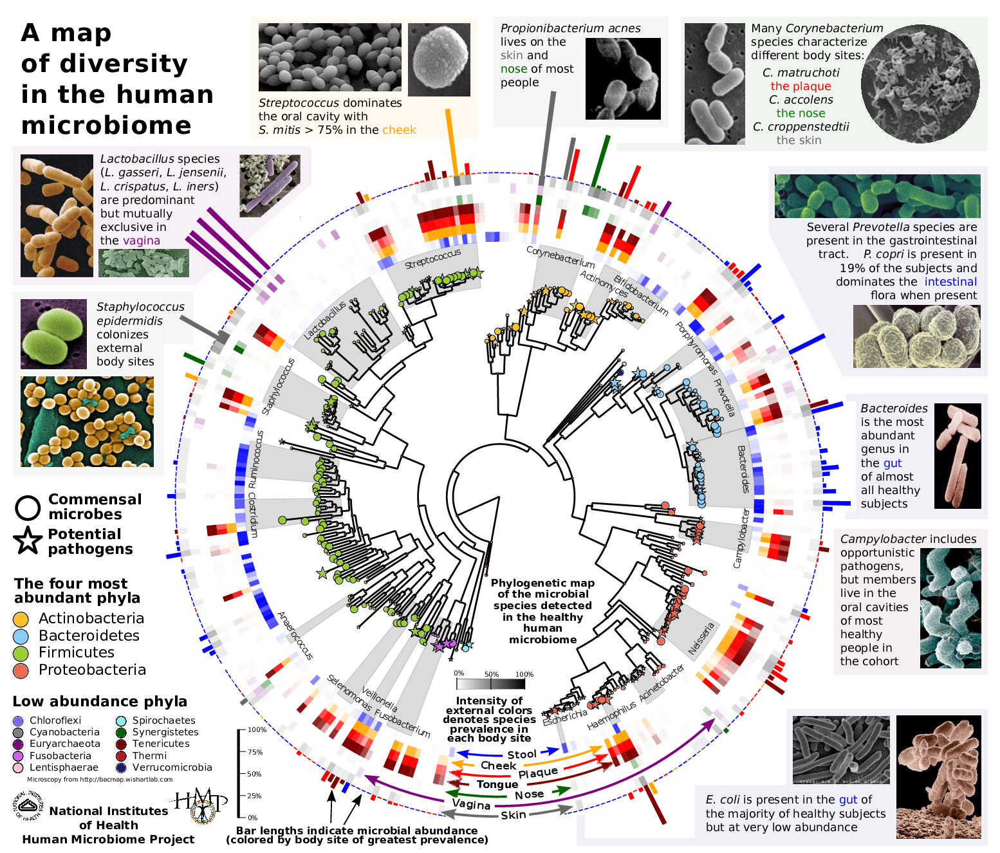
```

???

- .n[Vediamo ora **dove** sono distribuiti i batteri]

- .n[Partiamo dalla parte più interna della figura, dall'albero filigenetico]


---
layout: true
class: clear
.center[.font120[Human microbiota functions] .font80[(Kho and Lal, 2018)]]

---
```{r, echo=FALSE, out.height="520px", out.width="800px", include=TRUE}
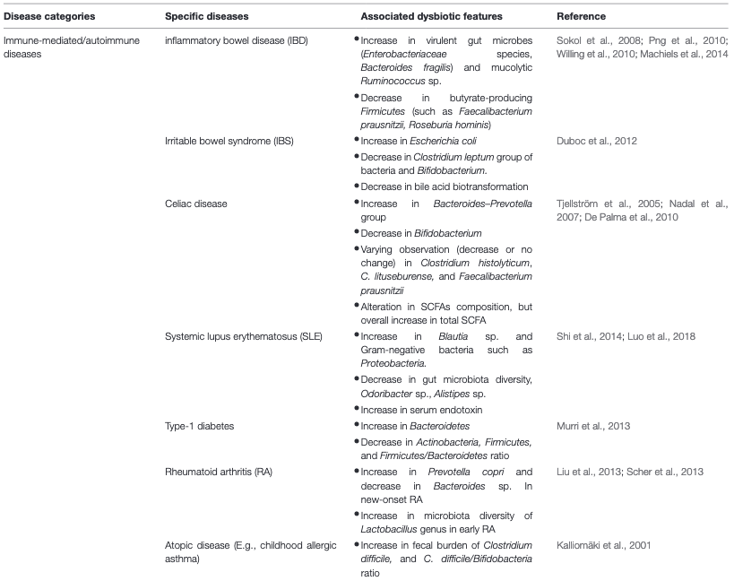

```

---
<br><br>
```{r, echo=FALSE, out.height="400px", out.width="900px", include=TRUE}
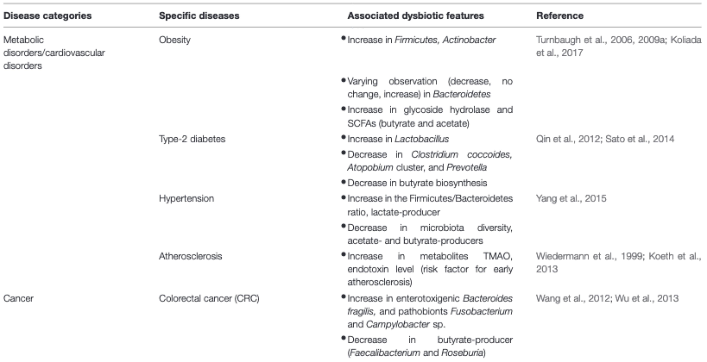
```
---
  
```{r, echo=FALSE, out.height="530px", out.width="900px", include=TRUE}
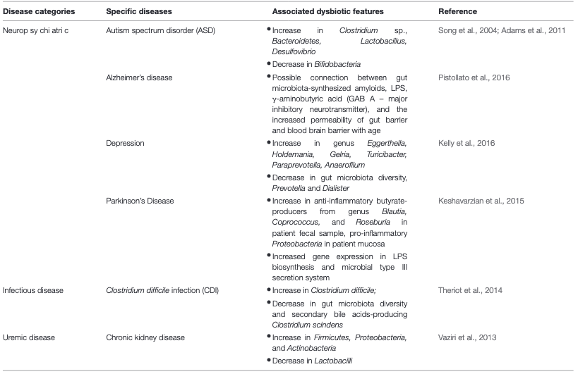
```

---
layout: false
class: inverse, middle, center

# Il microbiota delle piante

----


---
layout: true 
class: clear

---


```{r echo = FALSE, out.width = "630px"}
#  library(tidyverse)
#  library(gganimate)
# #  Read data
#  mt <- read_delim("data/PlantmicrobiotaPublications.txt", delim = "\t") %>%
#    drop_na %>%
#    mutate(Year = as.numeric(`Publication Years`),
#           title = "Plant microbiota") %>%
#    filter(Year > 2004, Year < 2020) %>%
#    select(Year, records, title)
#  mm <- read_delim("data/PlantmicrobiomaPublications.txt", delim = "\t")%>%
#    drop_na%>%
#    mutate(Year = as.numeric(`Publication Years`),
#           title = "Plant microbioma") %>%
#    filter(Year > 2004, Year < 2020) %>%
#    select(Year, records, title)
# 
# #  Combine data for printing
#  an <- mt %>%
#    bind_rows(mm) %>%
#    ggplot(aes(x = Year,
#               y = records)) +
#    geom_line(aes(color = title), size = 1) +
#    scale_color_manual(values = c("#ef8a62", "#999999")) +
#    theme_classic() +
#    theme(legend.title = element_blank(),
#          legend.position = "bottom",
#          legend.text = element_text(size = 20),
#          panel.grid.major.y = element_line()) +
#    labs(x = "", y = "",
#         title = "Numero di pubblicazioni con parola chiave microbiota e pianta o microbioma  e pianta ",
#         caption = "Source: ISI Web of Science",
#         subtitle = "Ricerca effettuata a Settembre 2020\nAnno: Year:  {round(frame_along, 0)}") +
#    transition_reveal(Year)
#  animate(an, nframes = 1000, fps = 25, end_pause = 900)
#  anim_save("images/PlantmicroPublications.gif")
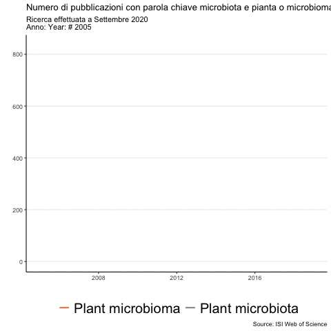
```

---
layout: true

# Composizione del microbiota

---
class: inverse, middle, center

----


---

## Glossario


- .font80[**Rhizosphere**: The region of soil in the vicinity of plant roots that is influenced by plant-derived nutrients and oxygen availability; it is not a region of definable size or shape, but instead consists of a gradient in chemical, biological and physical properties that change both radially and longitudinally along the root.]

--

- .font80[**Phyllosphere**: All the aboveground organs of plants, including the leaf, flower, stem and fruit.]

--

- .font80[**Endophytes**: The microorganisms residing within plant tissues (the endosphere), such as leaves, roots or stems.]

--

- .font80[**Bulk soil**:  is soil outside the rhizosphere. Bulk soil is not penetrated by plant roots]

---

layout: true
# Composizione del microbiota


---

.center[
.h20[
**Spatial plant microbiota**    
.font50[`r Cite(bib,  key = "SINGH2019100177")`]
]

```{r echo = FALSE, out.height="470px", out.width="470px"}
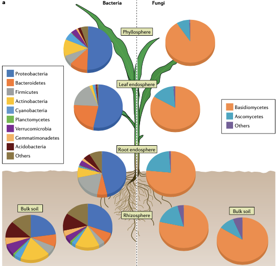
```

]

---

.center[
.h20[
**Temporal plant microbiota**    
.font50[`r Cite(bib, author = "Sapkota")`]
]

```{r echo = FALSE, out.height="470px", out.width="530px"}
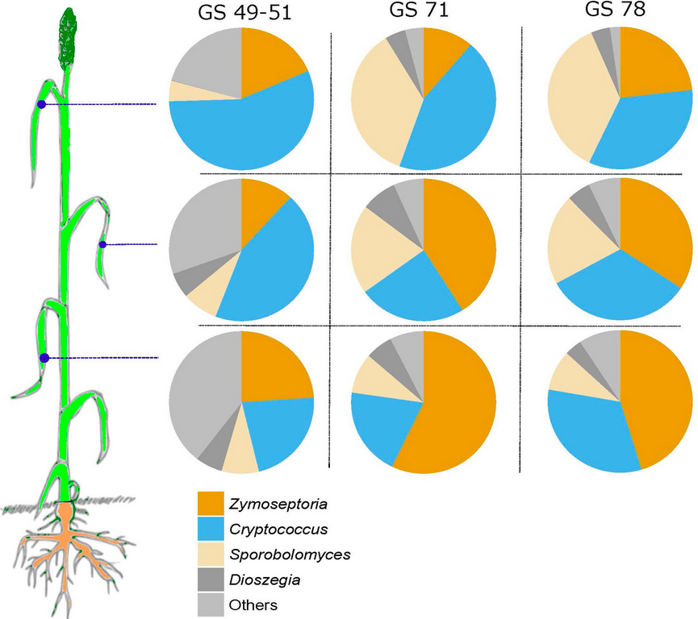
```

]

???

.n30[

- La composzione del microbiota vegetale è, come quella umana, dipendente dalla fase evolutiva della pianta e dal comparto che si sceglie di studiare.

- La figura sulla sinistra dello schermo cerca di schematizzare i recenti studi fatti sul microbiota delle piante

]

---


**Microbiota reservoir**    

.pull-left[
- .n[Although the assemblies of root-associated bacteria and fungi differ substantially from the above-ground communities, both represent a **subset of the microbiota derived from soil communities** and enriched in different plant-associated niches]

- .n[This suggests that **soil functions as a common reservoir** for both belowground and aboveground plant microbiota]
]

.pull-rigth[

.h20[
```{r echo = FALSE, out.height="450px", out.width="450px"}
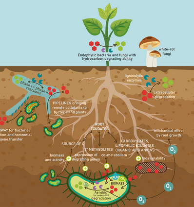
```
.right[.font50[`r Cite(bib, author = "Agnello")`]]
]
]

???

.n30[
- Un'importante considerazione da fare è che sebbene le comunità batteriche e fungine che sono associate alla piante siano molto diverse tra la parte ipogea e la parte epigea della pianta, entrambe rappresentano un sottogruppo del microbiota derivato dalle comunità del suolo

- Possiamo quindi dire che il suolo funziona come riserva comune per il microbiota della pianta epigeo e ipogeo
]

---

.pull-left[

```{r echo=FALSE, out.width="350px"}
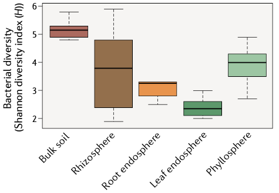
```

```{r echo=FALSE, out.width="350px"}
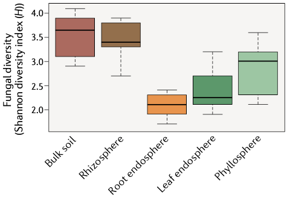
```
]

.pull-right[

- .n[There are clear differences among the microbial communities in different plant compartments, which indicates that the **plant compartment is a major selective force** that shapes the composition of plant-associated microbiota]

]

???

- .n[**Shannon diversity index**: combina ricchezza e diversità]

- .n[Misura sia il numero delle specie presenti e la differenza tra l'abbondanza delle diverse specie.]

- .n[Un valore grande significa che sono presenti molte specie con un'abbondanza simile. Il range del valore varia da 1 (una specie dominante) fino al numero totale di tutte le species (nel caso che tutte le specie abbiano la stessa abbondanza)]


---
layout: true

# How do you study the microbiota composition?


---
class: inverse, middle, center

----

---

.center[**There are two major approaches to assess the microbiota composition**]

.h20[
```{r echo=FALSE, out.width="520px"}
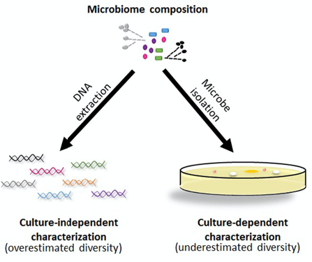
```

.right[.font60[`r Cite(bib, key = "Lebeis_2014")`]]
]

---

.pull-left[
```{r echo=FALSE, out.width="520px"}

```
]

.pull-right[
**Culture dependent**

- `r fontawesome::fa("plus-circle", fill = "green")` This approach isolates individual microbes 

- `r fontawesome::fa("times-circle", fill = "red")` The community diversity estimate is limited

]

---

.pull-left[
**Culture independent**

- `r fontawesome::fa("plus-circle", fill = "green")`  The ability to identify and quantify community members, even down to extremely rare taxa

- `r fontawesome::fa("plus-circle", fill = "green")`  Insights beyond the information provided by individual microbes

- `r fontawesome::fa("times-circle", fill = "red")` This approach does not isolate individual microbes 

]


.pull-right[
```{r echo=FALSE, out.width="520px"}

```
]

---

.center[.font150[Microbial DNA metabarcoding]]

> **DNA metabarcoding** is a method of **DNA barcoding** that uses universal genetic markers to identify DNA of a mixture of organisms

--

<br>
.content-box-grey[What is it the <br> **DNA barcoding**?]

---

.center[.font150[Microbial DNA metabarcoding]]

- **DNA barcoding** is a method of species identification using a short section of DNA from a specific gene 

- An individual sequence can be used to uniquely identify an organism by comparison with a reference library of classified DNA sequences


```{r echo=FALSE, out.width="520px"}
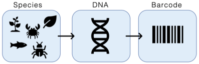
```

---

.center[.font150[Microbial DNA metabarcoding]]

.pull-left[
**Marker selection**

.n30[
- Markers used for DNA barcoding are called barcodes and their selection is crucial

- Ideally, one gene sequence would be used for developing universal PCR primers for all taxonomic group
  
- However, no such gene region has been found yet!

- Different gene regions are used to identify the different organismal groups using barcoding
]
]

.pull-right[

```{r echo=FALSE, out.width="200px"}
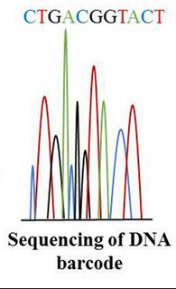
```

.right[.font50[(Mosa et al., 2019)]]
]

---

.center[.font150[Microbial DNA metabarcoding]]

**Marker selection**

| Organism | Region |
|----------|--------|
| animals  | cytochrome c oxidase I|
| fungi    |  internal transcribed spacer (ITS) rRNA |
| plants   | RuBisCO |
| prokaryotes | 16S rRNA |
| microbial eukaryotes | 18S rRNA |


.font80[When barcoding is used to identify organisms from a sample containing DNA from more than one organism, the term DNA metabarcoding is used]


---

.center[.font150[Microbial DNA metabarcoding]]

.pull-left[
**Bioinformatic analysis**

.n30[
- After sequencing, raw data must be processed (**quality and cleaning step**)

- Samples are clustered in operational taxonomic unit based on identity threshold (**OTU formation**)

- Using "the Basic Local Alignment Search Tool (BLAST)" regions of similarity between sequences and reference databases are identified (**annotation step**)    

- Microbiota composition definition (**richness and diversity step**)

]
]

.pull-right[

.h20[
.right[.font50[(Jesse et al., 2018)]]     
```{r echo=FALSE, out.width="220px"}
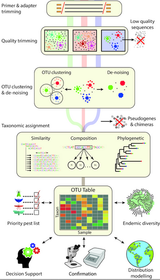
```


]]


???

.n30[
- These databases contain the DNA barcodes assigned to previously identified taxa

- An operational taxonomic unit (OTU) is an operational definition used to classify groups of closely related individuals
]

---
layout: true

# What can the microbiota potentially do?

---

class: inverse, middle, center

----

---

.center[.font120[Metagenomics]]

```{r echo=FALSE, out.width="720px"}
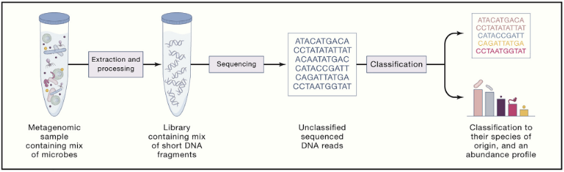
```
.right[.font50[`r Cite(bib,  key = "YE2019779")`]]
.h25[
- **Metagenomics** is the study of genetic material recovered directly from environmental samples

- The collection of sequenced genes from the environment could be analyzed as a **single genome**
  
- Metagenomics **does not require the isolation** and lab cultivation of individual species

- Due to its random nature, metagenomics, allows that many **under-represented organisms will be detected**
]

---

.pull-left-wide[
```{r echo=FALSE, out.width="550px"}
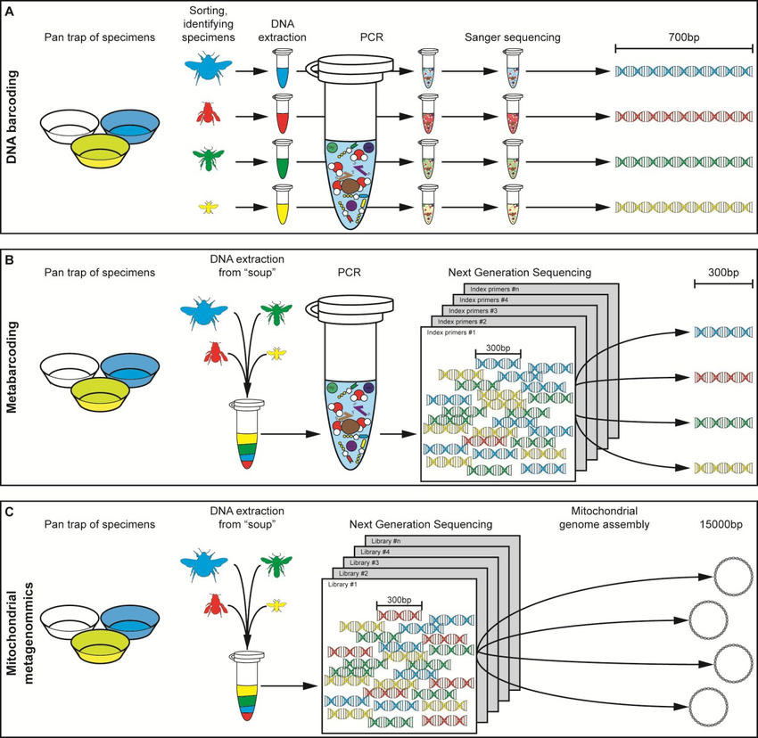
```
]

.right[.font60[`r Cite(bib,  key = "gill2016")`]]


---

```{r echo=FALSE}
# # library(rvest)
# library(gt)
# library(tidyverse)
# library(janitor)
# # url <- "https://en.wikipedia.org/wiki/DNA_sequencing"
# # 
# # df <- url %>%
# #     read_html() %>%
# #     html_node(".wikitable") %>%
# #     html_table() %>%
# #     as_tibble()
# # 
# # df %>%
# #     filter(grepl("Sanger|Nanopore|Illumina|Pacific|Torrent|454", Method)) %>%
# #     write_csv("extra/MetagenomicsRAW.csv")
# read_csv("extra/MetagenomicsClean.csv") %>%
#     clean_names() %>%
#     arrange(order) %>%
#     select(-order) %>%
#     separate_rows(read_length, reads_per_run, sep = ";\n") %>% 
#     separate(method, into = c("method", "tech"), sep = "\\(") %>%
#     mutate(tech = str_remove(tech, "\\)")) %>%
#     rename_with(~toupper(gsub("_", " ", .))) %>%
#     gt() %>%
#     tab_header(
#     title = "Comparison of high-throughput sequencing methods",
#     subtitle = "Source: Wikipedia") %>%
#     tab_options(
#                 table.font.size = 14,
#                 table.width = 1200
#     )
# 
```

```{r echo=FALSE, out.width="920px"}
knitr::include_graphics("images/CompareHTS.png")
```

---
