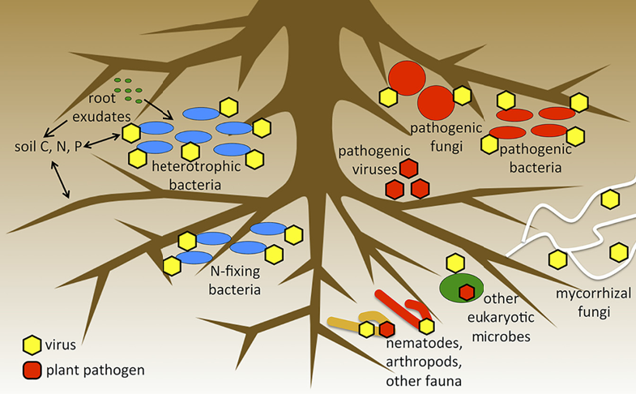
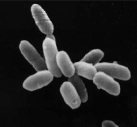
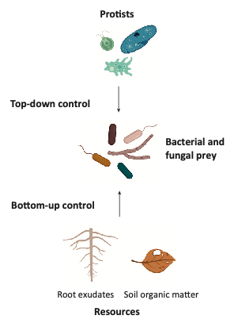

```{r setup, include=FALSE, cache=FALSE}
# set working directory to docs folder
setwd(here::here("docs"))

# Set global R options
options(htmltools.dir.version = FALSE, servr.daemon = TRUE)

# Set global knitr chunk options
knitr::opts_chunk$set(
  fig.align = "center", 
  cache = TRUE,
  error = FALSE,
  message = FALSE, 
  warning = FALSE, 
  collapse = TRUE 
)

# This is good for getting the ggplot background consistent with
# the html background color
library(ggplot2)
thm <- theme_bw()
theme_set(thm)

library(RefManageR)
BibOptions(check.entries = FALSE,
           bib.style = "authoryear",
           cite.style = "authoryear",
           style = "markdown",
           hyperlink = FALSE,
           dashed = FALSE)
bib <- ReadBib("biblio/bib.bib", check = FALSE)
```

class: title-slide


# .font170[MICROBIOMA E MICROBIOTA]


<br><br><br><br>
.marco[
Marco Chiapello
<br>
`r Sys.Date()`
]


.marco[
.font90[[`r fontawesome::fa("twitter", fill = "steelblue")`](https://twitter.com/marpello1980) @marpello1980 - [`r fontawesome::fa("envelope", fill = "steelblue")`](mailto:chiapello.m@gmail.com) chiapello.m@gmail.com - `r fontawesome::fa("skype", fill = "steelblue")` marpello]
]

???

.n30[

- Sarò uno dei vostri docenti per il corso "Interazioni tra piante, microrganismi e ambiente"
]
---
layout: true
class: clear

---

.font180[.bold[Agenda]]


- .font140[Introduzione]
  
- .font140[Il microbiota delle piante]

  - .font120[Da chi è composto]
  
  - .font120[Che funzioni ha]
   
  - .font120[Come prende forma]


???

- .n[**Intro**: spiegazione dei concetti generali e dei termini]
---
```{r echo = FALSE}
# library(magick)
# x <- image_read("docs/images/microbiota.jpg")
# y <- image_read("docs/images/micribioma.jpg")
# x <- image_scale(x, 300)
# y <- image_scale(y, 300)
# image_write(x, "docs/images/microbiota.jpg")
# image_write(y, "docs/images/microbioma.jpg")
```

.pull-left[.center[.font180[.bold[microBIOTA]]]
<br>
```{r echo=FALSE, out.width = "500px"}
knitr::include_graphics("images/microbiota.jpg")
```

]

.pull-right[.center[.font180[.bold[microBIOMA]]]
<br>
```{r echo=FALSE, out.width = "500px"}
knitr::include_graphics("images/microbioma.jpg")
```


]

???

- .n[si riferisce a una popolazione di microrganismi che colonizza un determinato luogo]

- .n[batteri, funghi, protozoi, elminti, neamtodi, virus, ]
 
- .n[indica la totalità del patrimonio genetico posseduto dal microbiota, cioè i geni che quest’ultimo è in grado di esprimere]

- .n[la differenza che passa tra i due termini è la stessa che esiste tra popolazione umana e genoma umano]
---


.pull-left[.center[.font180[.bold[microBIOTA]]]
> si riferisce a una popolazione di microrganismi che colonizza un determinato luogo

]

.pull-right[.center[.font180[.bold[microBIOMA]]]
> indica la totalità del patrimonio genetico posseduto dal microbiota, cioè i geni che quest’ultimo è in grado di esprimere

]

---


.pull-left[.center[.font180[.bold[microBIOTA]]]]

.pull-right[.center[.font180[.bold[microBIOMA]]]]

<br>
```{r echo=FALSE, out.width = "550px"}
# library(tidyverse)
# library(gganimate)
# Read data
mt <- read_delim("data/microbiotaPublications.txt", delim = "\t") %>%
  drop_na %>%
  mutate(Year = as.numeric(`Publication Years`),
         title = "microbiota") %>%
  filter(Year > 2001, Year < 2020) %>%
  select(Year, records, title)
mm <- read_delim("data/microbiomaPublications.txt", delim = "\t")%>%
  drop_na%>%
  mutate(Year = as.numeric(`Publication Years`),
         title = "microbioma") %>%
  filter(Year > 2001, Year < 2020) %>%
  select(Year, records, title)

# Combine data for printing
# mt %>%
#   bind_rows(mm) %>%
#   ggplot(aes(x = Year,
#              y = records)) +
#   geom_line(aes(color = title), size = 1) +
# #   geom_point(size = .2) +
#   scale_color_manual(values = c("#ef8a62", "#999999")) +
#   theme_classic() +
#   theme(legend.title = element_blank(),
#         legend.position = "bottom",
#         legend.text = element_text(size = 20),
#         panel.grid.major.y = element_line()) +
#   labs(x = "", y = "",
#        title = "Numero di pubblicazioni con parola chiave microbiota o microbioma",
#        caption = "Source: ISI Web of Science",
#        subtitle = "Ricerca effettuata a Settembre 2020\nAnno: Year: {round(frame_along, 0)}") +
#   transition_reveal(Year)
# anim_save("images/microPublications.gif")

# ggsave("docs/images/microPublications.jpg", units = "cm",
#        width = 20, height = 10, dpi = 300)
knitr::include_graphics("images/microPublications.gif")
```

---
<br><br><br>
.center[.font600[.fontW7[HMP]]]
.center[.font140[Human Microbiome Project]]

---

Il **progetto microbioma umano** è una iniziativa dei National Institutes of Health statunitensi con il fine di **identificare e caratterizzare i microrganismi ed il loro rapporto con lo stato di salute e di malattia dell'uomo**. 

```{r echo=FALSE, out.width = "700px"}
#  df1 <- tibble(G = c(rep("numero totale di cellule", 2),
#                      rep("numero totale di geni", 2)),
#                S = c(rep(c("Human", "Microbes"), 2)),
#                N = c(1, 10, 1, 100))
#  df1 %>%
#   ggplot(aes(x = G, y = N, fill = S)) +
#    geom_col(position = position_dodge()) +
#    labs(x = "", y = "") +
#    theme_classic() +
#    theme(legend.title = element_blank(),
#          axis.text = element_text(size = 15),
#          legend.position = "top",
#          legend.text = element_text(size = 12)) +
# scale_fill_manual(values = c("#ef8a62", "#999999"))
#  ggsave("docs/images/microNubers.jpg", units = "cm",
#           width = 50/3, height = 30/3, dpi = 300)
knitr::include_graphics("images/microNubers.jpg")
```

???


- .n[**RAPPORTO** cellule microbiche e cellule umane]

- .n[Il numero totale di cellule microbiche presenti in un organismo umano può superare di dieci volte il numero di cellule dell'organismo stesso]

- .n[i geni di origine microbica possono superare di cento volte il numero di geni presenti nel genoma umano (composto da circa 20.000 geni).]

---

<br><br><br>
.content-box-grey[.font180[.fontW7[L'essere umano va concepito come composto da cellule umane e microbiche]]]

???

- .n[Visto l'alto numero di cellule microbiche e della quantità del loro materiale genetico]

- .n[L'essere umano va concepito come composto da cellule umane e microbiche]

- .n[MA **quali** sono i micro-organismi]


---
.center[Temporal human microbiota]
```{r, echo=FALSE, out.width="780px", include=TRUE}
knitr::include_graphics("images/humanEvo.jpg")
```

???

- .n[La figura mostra i phyla chiave della composizione del microbiota umano in diversi stadi della vita]

---

.center[Spatial human microbiota]
```{r, echo=FALSE, out.height="580px", out.width="750px", include=TRUE}
# library(magick)
# x <- image_read("docs/images/humanDiversity.pdf")
# x <- image_convert(x, "png")
# image_write(x, "docs/images/humanDiversity.png")
knitr::include_graphics("images/humanDiversity.png")
```

???

- .n[Vediamo ora **dove** sono distribuiti i batteri]

- .n[Partiamo dalla parte più interna della figura, dall'albero filigenetico]


---
layout: true
class: clear
Focus on human **gut microbiome** `r Cite(bib, author = "Kho")`

---
```{r, echo=FALSE, out.height="530px", out.width="800px", include=TRUE}
knitr::include_graphics("images/KhoPaperT3-1.png")
```
---
<br><br>
```{r, echo=FALSE, out.height="400px", out.width="900px", include=TRUE}
knitr::include_graphics("images/KhoPaperT3-2.png")
```
---
  
```{r, echo=FALSE, out.height="530px", out.width="900px", include=TRUE}
knitr::include_graphics("images/KhoPaperT3-3.png")
```

---
layout: false
class: inverse, middle, center

# Il microbiota delle piante

----


---
layout: true 
class: clear

---


```{r echo = FALSE, out.width = "630px"}
# library(tidyverse)
# library(gganimate)
# # Read data
# mt <- read_delim("data/PlantmicrobiotaPublications.txt", delim = "\t") %>%
#   drop_na %>%
#   mutate(Year = as.numeric(`Publication Years`),
#          title = "Plant microbiota") %>%
#   filter(Year > 2004, Year < 2020) %>%
#   select(Year, records, title)
# mm <- read_delim("data/PlantmicrobiomaPublications.txt", delim = "\t")%>%
#   drop_na%>%
#   mutate(Year = as.numeric(`Publication Years`),
#          title = "Plant microbioma") %>%
#   filter(Year > 2004, Year < 2020) %>%
#   select(Year, records, title)

# # Combine data for printing
# mt %>%
#   bind_rows(mm) %>%
#   ggplot(aes(x = Year,
#              y = records)) +
#   geom_line(aes(color = title), size = 1) +
#   scale_color_manual(values = c("#ef8a62", "#999999")) +
#   theme_classic() +
#   theme(legend.title = element_blank(),
#         legend.position = "bottom",
#         legend.text = element_text(size = 20),
#         panel.grid.major.y = element_line()) +
#   labs(x = "", y = "",
#        title = "Numero di pubblicazioni con parola chiave microbiota e pianta o microbioma  e pianta ",
#        caption = "Source: ISI Web of Science",
#        subtitle = "Ricerca effettuata a Settembre 2020\nAnno: Year: # {round(frame_along, 0)}") +
#   transition_reveal(Year)
# anim_save("images/PlantmicroPublications.gif")
knitr::include_graphics("images/PlantmicroPublications.gif")
```

---
layout: true

# Composizione del microbiota

---
class: inverse, middle, center

----


---

## Glossario


- .font80[**Rhizosphere**: The region of soil in the vicinity of plant roots that is influenced by plant-derived nutrients and oxygen availability; it is not a region of definable size or shape, but instead consists of a gradient in chemical, biological and physical properties that change both radially and longitudinally along the root.]

--

- .font80[**Phyllosphere**: All the aboveground organs of plants, including the leaf, flower, stem and fruit.]

--

- .font80[**Endophytes**: The microorganisms residing within plant tissues (the endosphere), such as leaves, roots or stems.]

--

- .font80[**Bulk soil**:  is soil outside the rhizosphere. Bulk soil is not penetrated by plant roots]

---

layout: true
# Composizione del microbiota

.pull-left[
```{r echo = FALSE, out.height="510px", out.width="510px"}
knitr::include_graphics("images/PlantMicrobiomeComposition.png")
```
]

---

.pull-right[

<br><br><br><br><br><br><br><br><br><br>
.font60[`r Cite(bib, author = "Singh")`]
]

???

.n30[

- La composzione del microbiota vegetale è, come quella umana, dipendente dalla fase evolutiva della pianta e dal comparto che si sceglie di studiare.

- La figura sulla sinistra dello schermo cerca di schematizzare i recenti studi fatti sul microbiota delle piante

- Questa figura ci farà da riferimente mentre vi illustrero alcuni degli aspetti più significativi della composizione del microbiota
]
---

.pull-right[

Plant **endophytic communities**

- .n[They are frequently **enriched** in members of the **Proteobacteria and Firmicutes**]


- .n[They are **depleted** in members of the **Acidobacteria, Planctomycetes, Chloroflexi and Verrucomicrobia**]


]

???

.n30[

- Le **comunità batteriche endofitiche** sono spesso arricchite in membri dei Proteobacteria e Firmicutes => Mostrare sulla figura

- Anologamente sono impoverite in altri taxa come Acidobacteria => Mostrare sulla figura
]
---

.pull-right[

Plant **phyllosphere community**

- .n[It mainly comprises bacteria belonging to phylum Proteobacteria and to the Bacteroidetes, Firmicutes and Actinobacteria]

- .n[Members of phylum **Proteobacteria** constitute ~50% of the community composition]


]

???

-n30[

- La comunità batterica della fillosfera è costituita principalmente da 4 classi di batteri: Proteobacteria and to the Bacteroidetes, Firmicutes and Actinobacteria.

- Queste 4 classi rappresentano più del 75% del microbiota della fillosfera

- Di questo 50% i Protobatteri sono sicuramente il gruppo più abbondante rappresentandone il 50% 
]

---

.pull-right[

**Fungi** community

- .n[The vast diversity of fungi that colonize both aboveground and belowground plant tissues mainly belong to the phyla **Ascomycota and Basidiomycota**]

- .n[Although **arbuscular fungi** (phylum Glomeromycota) and **ectomycorrhizal fungi** are well-studied, these groups represent only **minor diversity among fungal communities from roots**]
]

???

.n30[
- I funghi che compongono i diversi microbiota associato alla pianta appartengo a due phyla: Ascomiceti e Basidiomiceti

- Classi di funghi come i funghi arbuscolari e i funghi ectomycorrizici rappresentano una miccola parte della diversità delle comunità fungine delle radici

- Nella figura sono state raggruppate sotto la categoria others
]

---

.pull-right[

**Microbiota reservoir**

- .n[Although the assemblies of root-associated bacteria and fungi differ substantially from the above-ground communities, both represent a **subset of the microbiota derived from soil communities** and enriched in different plant-associated niches]

- .n[This suggests that **soil functions as a common reservoir** for both belowground and aboveground plant microbiota]

]

???

.n30[
- Un'importante considerazione da fare è che sebbene le comunità batteriche e fungine che sono associate alla piante siano molto diverse tra la parte ipogea e la parte epigea della pianta, entrambe rappresentano un sottogruppo del microbiota derivato dalle comunità del suolo

- Possiamo quindi dire che il suolo funziona come riserva comune per il microbiota della pianta epigeo e ipogeo
]
---
layout: true

# Composizione del microbiota

---

.pull-left[
<br>
```{r echo = FALSE, out.width="450px"}

```
.font60[Emerson, 2019]
]

.pull-right[

**Viruses**

- .n[Viruses play a **critical part in bacterial community assembly and turnover** in the soil, but their function in plant-associated environments is not completely understood]

- .n[Viruses, in soil, affect both the **microbiome structure and function**]

]

???

.n30[
- La figura a lato riporta solo la composizione dei microbiota per funghi e batteri

- Ci sono altri organismi che compongono il microbiota e sebbene la loro abbondanza non sia a livello di quella batterica e fungina non rivestono un ruolo meno importante soprattutto a livello funzionale

- I virus per esempio posso giocare un ruolo fondamentale nella formazione e ricambio della comunità batterica

- Influenzando di conseguenza tutta la struttura e la funzionalità del microbiota
]
---

.pull-left[

```{r echo = FALSE, out.width="450px"}

```

]

.pull-right[

**Archea**

.h35[
- .n[Although they are **consistent members** of the plant-associated community, we have **little understanding of the contribution** of archaeal communities to host performance]

- .n[Metagenomic studies have identified functional genes involved in **stress tolerance and nutrient cycling** in plant-associated archaeal communities]

]
]


???

.n30[
- Alcuni studi hanno mostrato come gli archea possano influenzare le funzioni del microbioma in particolare sulla resistenza agli stress e ciclo dei nutrienti

- Purtroppo però, sebbene gli archea siano parte integrante del microbiota delle piante poco è noto della loro influenza sulla fitness della pianta
]
---

.pull-left[

```{r echo = FALSE, out.width="350px"}

```
.font60[Gao et al., 2019]
]

.pull-right[

**Protists**

.h35[
- .n[Protists may control bacterial and fungal community assembly by **modulating predator–prey relationships** at different trophic levels]

- .n[Within protists, non-pathogenic **oomycetes can have positive effects** on plant growth]

- .n[The phenotypic effects of oomycetes vary substantially in the **presence and absence of bacterial communities**]
]
]

???

.n30[
- I protisti possono controllare la composizione del microbiota modulando la relazione prepadatore - preda

- La relazione predatore preda consiste nell'interazione tra due specie e gli effetti che hanno una sull'altra

- Alcuni oomyceti non patogeni possono avere effetti positivi sulla crescita della pianta

- Ma questi effetti possono essere controllati presenza di comunità batteriche

]
- .n[The predator prey relationship consists of the interactions between two species and their consequent effects on each other ]

- .n[for example, Pythium, Phytophthora, Peronospora and Albugo species]

---

layout: true
# Composizione del microbiota
---

.pull-left[

```{r echo=FALSE, out.width="350px"}
knitr::include_graphics("images/bacterialDiv.png")
```

```{r echo=FALSE, out.width="350px"}
knitr::include_graphics("images/fungalDiv.png")
```
]

.pull-right[

- .n[There are clear differences among the microbial communities in different plant compartments, which indicates that the **plant compartment is a major selective force** that shapes the composition of plant-associated microbiota]

]

???

- .n[**Shannon diversity index**: combina ricchezza e diversità]

- .n[Misura sia il numero delle specie presenti e la differenza tra l'abbondanza delle diverse specie.]

- .n[Un valore grande significa che sono presenti molte specie con un'abbondanza simile. Il range del valore varia da 1 (una specie dominante) fino al numero totale di tutte le species (nel caso che tutte le specie abbiano la stessa abbondanza)]


---

.pull-left-45[.font150[.f400[Core microbiota]]]


.pull-right-45[.font150[.f400[Hub microorganisms]]]

---

.pull-left-45[.font150[.f400[Core microbiota]]

.h25[
- The plant core microbiota consists of members of the microbial community that are persistent and are ubiquitous in almost all the communities associated with a particular host

- The core microbiota contains key microbial taxa that carry genes with functions that are essential for host fitness

- Many members of the core microbiota of different plant species are common at the genus level

- The identification of a co-occurring core of plant-associated microorganisms also provides a useful starting point for studies of how to build SynComs to manipulate plant–microbiome interactions for increased growth and productivity

]
]

.pull-right-45[.font150[.f400[Hub microorganisms]]]

.h25[]

???

.h25[
- .n[Il **core microbiota** è composto da alcuni membri del microbiota che sono presenti in tutte, o quasi, le comunità associate ad una determinato ospite]

- .n[E i suoi membri esprimono geni le cui funzioni sono di primaria importanza per la salute del loro ospite]

- .n[Seppur diverse piante abbiamo microbiota diversi, un certo numero di membri è lo stesso]

- .n[L'identificazione di microorganismi che fanno parte di diversi **core microbiota** è di grande importanza per la produzione delle comunità sintetiche, da usare in agricoltura per aumentare la crescita e la produttività delle piante]
]

---

.pull-left-45[.font150[.f400[Core microbiota]]

.h25[
- The plant core microbiota consists of members of the microbial community that are persistent and are ubiquitous in almost all the communities associated with a particular host

- The core microbiota contains key microbial taxa that carry genes with functions that are essential for host fitness

- Many members of the core microbiota of different plant species are common at the genus level

- The identification of a co-occurring core of plant-associated microorganisms also provides a useful starting point for studies of how to build SynComs to manipulate plant–microbiome interactions for increased growth and productivity

]
]
.pull-right-45[.font150[.f400[Hub microorganisms]]

.h25[

- Within the core microbiota, a few members, such as ‘hub microorganisms’, can influence the community structure through strong biotic interactions with the host or with other microbial species, rather than simply by their own high abundance

- These hub species may represent keystone species that can exert strong direct and indirect effects on microbiome assembly and that function as mediators between the plant and its associated microbiome.

- For example, *Albugo laibachii* and *Dioszegia spp.* have been identified as highly interactive hubs in the phyllosphere of *A. thaliana* [Agler, et al. 2016]

]
]

???

.h35[

- .n[All'interno del core microbiota, alcuni membri possono influenzare la struttura dell'intera comunità, non per la loro abbondanza, ma per le loro interazione dirette od indirette con la pianta o gli altri microorganismi. Vengono definiti: **hub microorganism**]

- .n[**hub** letteralmente significa: centro, perno, fulcro]

- .n[Esempio di hubs identificati nella fillosfera di arabidopsis. Albugo è un oomicete obligato mentre Dioszegia è un basidiomicete]


]

---
class: inverse, middle, center

----

.white[Homework]


<br>
.white[.font70[D. S. Lundberg, S. et al. <br> **Defining the core arabidopsis thaliana root microbiome**. <br> Nature, 488(7409):86–90, aug 2012.]]
<br><br>
.white[[Download](https://drive.google.com/file/d/15qUUNeTxWE4zg84P52kdkj-4qNsR5viO/view?usp=sharing)]

???

- .n[Uno dei primi studi a profilare il microbiota associato alle piante usando l'high throughput sequencing]

---
class: clear

...nella prossima lezione

<br><br><br>

.center[.font200[.fontW4[Le funzioni del microbiota]]]
