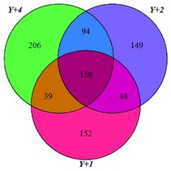
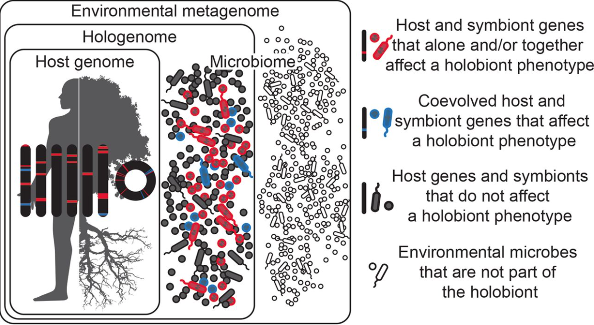

```{r setup, include=FALSE, cache=FALSE}
# TO render: rmarkdown::render('Lesson1.Rmd', 'xaringan::moon_reader')

# set working directory to docs folder
setwd(here::here("docs"))

# Set global R options
options(htmltools.dir.version = FALSE, servr.daemon = TRUE)

# Set global knitr chunk options
knitr::opts_chunk$set(
  fig.align = "center", 
  cache = TRUE,
  error = FALSE,
  message = FALSE, 
  warning = FALSE, 
  collapse = TRUE 
)

# This is good for getting the ggplot background consistent with
# the html background color
library(ggplot2)
thm <- theme_bw()
theme_set(thm)

library(RefManageR)
BibOptions(check.entries = FALSE,
           bib.style = "authoryear",
           cite.style = "authoryear",
           style = "markdown",
           hyperlink = FALSE,
           dashed = FALSE)
bib <- ReadBib("biblio/bib.bib", check = FALSE)
```

```{r xaringanExtra, echo=FALSE}
library(xaringanExtra)
use_tile_view() 
```

class: title-slide


# .font170[MICROBIOMA E MICROBIOTA]


<br><br><br><br>
.marco[
Marco Chiapello
<br>
2020-11-10
]


.marco[
.center[.font90[[[`r fontawesome::fa("slack", fill = "steelblue")`](https://join.slack.com/t/ipma-2020/shared_invite/zt-j9o8ig7k-LN1~U3d6QJztquYbC6iW7w) Slack (https://bit.ly/3eRDBRL) - `r fontawesome::fa("envelope", fill = "steelblue")`](mailto:marco.chiapello@unito.it) marco.chiapello@unito.it]
]
]

???

.n30[

- Sarò uno dei vostri docenti per il corso "Interazioni tra piante, microrganismi e ambiente"
]
---
layout: true
class: clear

---

.font180[.bold[General Introduction `r fontawesome::fa("compass", fill = "black")`]]

- .font120[Learning] 

- .font120[Motivate]

- .font120[Feedbacks]

- .font120[Silly questions]


???

.n30[
- Learning: L'apprendimento non e' qualcosa che si fa agli studenti, l'apprendimento e' un processo e non un prodotto

- Motivate: La motivazione degli studenti determina, orienta e sostiene cio' che essi fanno per imparare. Sta **anche** me riuscire a motivarvi e a creare l'effetto whoa

- Feedback: E' studiato e risaputo che l'atmosfera sociale, emotova ed intellettuale della classe influenzi l'apprendimento. Quindi interagiamo => sono disponibile a rispondere e chiarire ogni dubbio sia in classe che fuori

- Silly questions: esistono, ma non e' stupido chi le fa! Mi permettono di capire se devo approfondire qualche concetto
]

---

class: center, middle

.font180[.bold[Course overview]]

.font120[Lecture: Plant Microbiota `r fontawesome::fa("tree", fill = "green")`] 
<br>
.font120[Lecture: Ecological Significance of Viruses `r anicon::cia("images/virus-3128.png", anitype = "hover")`]

.font120[Practical: How to define a oomycete virome `r fontawesome::fa("laptop-code", fill = "grey")` ]

---

.font180[.bold[Agenda]]


.h35[
- .font140[Introduzione]

  - .font120[Il microbiota umano]
  
- .font140[Il microbiota delle piante]

  - .font120[Da chi è composto]
  
  - .font120[Che funzioni ha]
   
  - .font120[Come prende forma]
]

???

- .n[**Intro**: spiegazione dei concetti generali e dei termini]
---
```{r echo = FALSE}
# library(magick)
# x <- image_read("docs/images/microbiota.jpg")
# y <- image_read("docs/images/micribioma.jpg")
# x <- image_scale(x, 300)
# y <- image_scale(y, 300)
# image_write(x, "docs/images/microbiota.jpg")
# image_write(y, "docs/images/microbioma.jpg")
```

.pull-left[.center[.font180[.bold[microBIOTA]]]
<br>
```{r echo=FALSE, out.width = "400px"}
knitr::include_graphics("images/microbiota.jpg")
```

<br>
> .font80[si riferisce a una popolazione di microrganismi che colonizza un determinato luogo]

]

.pull-right[.center[.font180[.bold[microBIOMA]]]
<br>
```{r echo=FALSE, out.width = "400px"}
knitr::include_graphics("images/microbioma.jpg")
```

> .font80[indica la totalità del patrimonio genetico posseduto dal microbiota, cioè i geni che quest’ultimo è in grado di esprimere]

]

???

- .n[si riferisce a una popolazione di microrganismi che colonizza un determinato luogo]

- .n[batteri, funghi, protozoi, elminti, neamtodi, virus, ]
 
- .n[indica la totalità del patrimonio genetico posseduto dal microbiota, cioè i geni che quest’ultimo è in grado di esprimere]

- .n[la differenza che passa tra i due termini è la stessa che esiste tra popolazione umana e genoma umano]


---


.pull-left[.center[.font180[.bold[microBIOTA]]]]

.pull-right[.center[.font180[.bold[microBIOMA]]]]

<br>
```{r echo=FALSE, out.width = "550px"}
#  library(tidyverse)
# #  library(gganimate)
# # Read data
#  mt <- read_delim("data/microbiotaPublications.txt", delim = "\t") %>%
#    drop_na %>%
#    mutate(Year = as.numeric(`Publication Years`),
#           title = "microbiota") %>%
#    filter(Year > 2003, Year < 2020) %>%
#    select(Year, records, title)
#  mm <- read_delim("data/microbiomaPublications.txt", delim = "\t")%>%
#    drop_na%>%
#    mutate(Year = as.numeric(`Publication Years`),
#           title = "microbioma") %>%
#    filter(Year > 2003, Year < 2020) %>%
#    select(Year, records, title)
# 
# # Combine data for printing
#  an <- mt %>%
#    bind_rows(mm) %>%
#    ggplot(aes(x = Year,
#               y = records)) +
#    geom_line(aes(color = title), size = 1) +
#     #geom_point(size = .2) +
#    scale_color_manual(values = c("#ef8a62", "#999999")) +
#    theme_classic() +
#    theme(legend.title = element_blank(),
#          legend.position = "bottom",
#          legend.text = element_text(size = 20),
#          panel.grid.major.y = element_line()) +
#    labs(x = "", y = "",
#         title = "Numero di pubblicazioni con parola chiave microbiota o microbioma",
#         caption = "Source: ISI Web of Science",
#         subtitle = "Ricerca effettuata a Settembre 2020")
# 
# ggsave(an, file="images/microPublications.png", units = "cm", width = 20)
# #         subtitle = "Ricerca effettuata a Settembre 2020\nAnno: Year: {round(frame_along, 0)}") +
# #    transition_reveal(Year)
# #  animate(an, nframes = 1000, fps = 25, end_pause = 900)
# #  anim_save("images/microPublications.gif")


```

---
<br><br><br>
.center[.font600[.fontW7[HMP]]]
.center[.font140[Human Microbiome Project]]

---

Il **progetto microbioma umano** è una iniziativa dei National Institutes of Health statunitensi con il fine di **identificare e caratterizzare i microrganismi ed il loro rapporto con lo stato di salute e di malattia dell'uomo**. 

```{r echo=FALSE, out.width = "700px"}
#  df1 <- tibble(G = c(rep("numero totale di cellule", 2),
#                      rep("numero totale di geni", 2)),
#                S = c(rep(c("Human", "Microbes"), 2)),
#                N = c(1, 10, 1, 100))
#  df1 %>%
#   ggplot(aes(x = G, y = N, fill = S)) +
#    geom_col(position = position_dodge()) +
#    labs(x = "", y = "") +
#    theme_classic() +
#    theme(legend.title = element_blank(),
#          axis.text = element_text(size = 15),
#          legend.position = "top",
#          legend.text = element_text(size = 12)) +
# scale_fill_manual(values = c("#ef8a62", "#999999"))
#  ggsave("docs/images/microNubers.jpg", units = "cm",
#           width = 50/3, height = 30/3, dpi = 300)

```

???


- .n[**RAPPORTO** cellule microbiche e cellule umane]

- .n[Il numero totale di cellule microbiche presenti in un organismo umano può superare di dieci volte il numero di cellule dell'organismo stesso]

- .n[i geni di origine microbica possono superare di cento volte il numero di geni presenti nel genoma umano (composto da circa 20.000 geni).]

---

<br><br><br>
.content-box-grey[.font180[.fontW7[L'essere umano va concepito come composto da cellule umane e microbiche]]]

???

- .n[Visto l'alto numero di cellule microbiche e della quantità del loro materiale genetico]

- .n[L'essere umano va concepito come composto da cellule umane e microbiche]

- .n[MA **quali** sono i micro-organismi]


---
.center[Temporal human microbiota]
```{r, echo=FALSE, out.width="750px", include=TRUE}

```

???

- .n[La figura mostra i phyla chiave della composizione del microbiota umano in diversi stadi della vita]

---

.center[Spatial human microbiota]
```{r, echo=FALSE, out.height="580px", out.width="750px", include=TRUE}
# library(magick)
# x <- image_read("docs/images/humanDiversity.pdf")
# x <- image_convert(x, "png")
# image_write(x, "docs/images/humanDiversity.png")
knitr::include_graphics("images/humanDiversity.png")
```

???

- .n[Vediamo ora **dove** sono distribuiti i batteri]

- .n[Partiamo dalla parte più interna della figura, dall'albero filigenetico]


---
layout: true
class: clear
.center[.font120[Human microbiota functions] .font80[(Kho and Lal, 2018)]]

---
```{r, echo=FALSE, out.height="520px", out.width="800px", include=TRUE}
knitr::include_graphics("images/KhoPaperT3-1.png")

```

---
<br><br>
```{r, echo=FALSE, out.height="400px", out.width="900px", include=TRUE}
knitr::include_graphics("images/KhoPaperT3-2.png")
```
---
  
```{r, echo=FALSE, out.height="530px", out.width="900px", include=TRUE}
knitr::include_graphics("images/KhoPaperT3-3.png")
```

---
layout: false
class: inverse, middle, center

# Il microbiota delle piante

----


---
layout: true 
class: clear

---


```{r echo = FALSE, out.width = "630px"}
 library(tidyverse)
#  library(gganimate)
#  Read data
 mt <- read_delim("data/PlantmicrobiotaPublications.txt", delim = "\t") %>%
   drop_na %>%
   mutate(Year = as.numeric(`Publication Years`),
          title = "Plant microbiota") %>%
   filter(Year > 2004, Year < 2020) %>%
   select(Year, records, title)
 mm <- read_delim("data/PlantmicrobiomaPublications.txt", delim = "\t")%>%
   drop_na%>%
   mutate(Year = as.numeric(`Publication Years`),
          title = "Plant microbioma") %>%
   filter(Year > 2004, Year < 2020) %>%
   select(Year, records, title)

#  Combine data for printing
 an <- mt %>%
   bind_rows(mm) %>%
   ggplot(aes(x = Year,
              y = records)) +
   geom_line(aes(color = title), size = 1) +
   scale_color_manual(values = c("#ef8a62", "#999999")) +
   theme_classic() +
   theme(legend.title = element_blank(),
         legend.position = "bottom",
         legend.text = element_text(size = 20),
         panel.grid.major.y = element_line()) +
   labs(x = "", y = "",
        title = "Numero di pubblicazioni con parola chiave microbiota e pianta o microbioma  e pianta ",
        caption = "Source: ISI Web of Science",
        subtitle = "Ricerca effettuata a Settembre 2020")
ggsave(an, file="images/PlantmicroPublications.png", units = "cm", width = 20)
#    transition_reveal(Year)
#  animate(an, nframes = 1000, fps = 25, end_pause = 900)
#  anim_save("images/PlantmicroPublications.gif")
knitr::include_graphics("images/PlantmicroPublications.png")
```

---
layout: true

# Composizione del microbiota

---
class: inverse, middle, center

----


---

## Glossario


- .font80[**Rhizosphere**: The region of soil in the vicinity of plant roots that is influenced by plant-derived nutrients and oxygen availability; it is not a region of definable size or shape, but instead consists of a gradient in chemical, biological and physical properties that change both radially and longitudinally along the root.]

--

- .font80[**Phyllosphere**: All the aboveground organs of plants, including the leaf, flower, stem and fruit.]

--

- .font80[**Endophytes**: The microorganisms residing within plant tissues (the endosphere), such as leaves, roots or stems.]

--

- .font80[**Bulk soil**:  is soil outside the rhizosphere. Bulk soil is not penetrated by plant roots]

---

layout: true
# Composizione del microbiota


---

.center[
.h20[
**Spatial plant microbiota**    
.font50[`r Cite(bib,  key = "SINGH2019100177")`]
]

```{r echo = FALSE, out.height="470px", out.width="470px"}

```

]

---

.center[
.h20[
**Temporal plant microbiota**    
.font50[`r Cite(bib, author = "Sapkota")`]
]

```{r echo = FALSE, out.height="470px", out.width="530px"}
knitr::include_graphics("images/plantMicrobiotaTemporal.png")
```

]

???

.n30[

- La composzione del microbiota vegetale è, come quella umana, dipendente dalla fase evolutiva della pianta e dal comparto che si sceglie di studiare.

- La figura sulla sinistra dello schermo cerca di schematizzare i recenti studi fatti sul microbiota delle piante

]

---


**Microbiota reservoir**    

.pull-left[
- .n[Although the assemblies of root-associated bacteria and fungi differ substantially from the above-ground communities, both represent a **subset of the microbiota derived from soil communities** and enriched in different plant-associated niches]

- .n[This suggests that **soil functions as a common reservoir** for both belowground and aboveground plant microbiota]
]

.pull-rigth[

.h20[
```{r echo = FALSE, out.height="450px", out.width="450px"}

```
.right[.font50[`r Cite(bib, author = "Agnello")`]]
]
]

???

.n30[
- Un'importante considerazione da fare è che sebbene le comunità batteriche e fungine che sono associate alla piante siano molto diverse tra la parte ipogea e la parte epigea della pianta, entrambe rappresentano un sottogruppo del microbiota derivato dalle comunità del suolo

- Possiamo quindi dire che il suolo funziona come riserva comune per il microbiota della pianta epigeo e ipogeo
]

---

.pull-left[

```{r echo=FALSE, out.width="350px"}
knitr::include_graphics("images/bacterialDiv.png")
```

```{r echo=FALSE, out.width="350px"}

```
]

.pull-right[

- .n[There are clear differences among the microbial communities in different plant compartments, which indicates that the **plant compartment is a major selective force** that shapes the composition of plant-associated microbiota]

]

???

- .n[**Shannon diversity index**: combina ricchezza e diversità]

- .n[Misura sia il numero delle specie presenti e la differenza tra l'abbondanza delle diverse specie.]

- .n[Un valore grande significa che sono presenti molte specie con un'abbondanza simile. Il range del valore varia da 1 (una specie dominante) fino al numero totale di tutte le species (nel caso che tutte le specie abbiano la stessa abbondanza)]

---

.pull-left[

**CORE MICROBIOTA**

.h202[
.m0ul[

- The plant core microbiota consists of members of the microbial community that are **persistent and are ubiquitous in almost all the communities** associated with a particular host

- The core microbiota contains key microbial taxa that carry **genes with functions that are essential** for host fitness

- Many members of the core microbiota of different plant species are **common at the genus level**

- The identification of a co-occurring core of plant-associated microorganisms also provides a useful starting point for studies of how to build **SynComs** to manipulate plant–microbiome interactions for increased **growth and productivity**

]
]
]

.pull-right[
<br>
```{r echo=FALSE, out.width="400px"}

```
]

???
    
.h25[
    - .n[Il **core microbiota** è composto da alcuni membri del microbiota che sono presenti in tutte, o quasi, le comunità associate ad una determinato ospite]
    
    - .n[E i suoi membri esprimono geni le cui funzioni sono di primaria importanza per la salute del loro ospite]
    
    - .n[Seppur diverse piante abbiamo microbiota diversi, un certo numero di membri è lo stesso]
    
    - .n[L'identificazione di microorganismi che fanno parte di diversi **core microbiota** è di grande importanza per la produzione delle comunità sintetiche, da usare in agricoltura per aumentare la crescita e la produttività delle piante]
]
---

.pull-left[
<br>
```{r echo=FALSE, out.width="400px"}
knitr::include_graphics("images/core2.png")
```

]


.pull-right[
**HUB MICROBIOTA**
.h202[
- Within the core microbiota, a few members, such as ‘hub microorganisms’, can **influence the community structure** through strong biotic interactions with the host or with other microbial species, rather than simply by their own high abundance

- These hub species may represent **keystone species** that can exert strong direct and indirect effects on microbiome assembly and that **function as mediators** between the plant and its associated microbiome.

- For example, *Albugo laibachii* and *Dioszegia spp.* have been identified as highly interactive hubs in the phyllosphere of *A. thaliana* [Agler, et al. 2016]

]]

???

.h35[

- .n[All'interno del core microbiota, alcuni membri possono influenzare la struttura dell'intera comunità, non per la loro abbondanza, ma per le loro interazione dirette od indirette con la pianta o gli altri microorganismi. Vengono definiti: **hub microorganism**]

- .n[**hub** letteralmente significa: centro, perno, fulcro]

- .n[Esempio di hubs identificati nella fillosfera di arabidopsis. Albugo è un oomicete obligato mentre Dioszegia è un basidiomicete]


]


---
layout: true

# Plant Holobiont

---

class: inverse, middle, center

----

---

.m10bp[
```{r echo=FALSE, out.width="800px"}

```
.right[.font50[`r Cite(bib, key = "Berg_2017")`]]
]

.m0p[
.h20[
.font80[Plants and their associated microorganisms form a holobiont and have to be considered as co-evolved species assemblages consisting of bacterial, archaeal and diverse eukaryotic species]
]
]

???

.n30[
- olobionte definisce l'organismo vivente alla luce della convivenza con il proprio microbiota

- Se l'organismo e' un olobionte, il suo genoma sara' un ologenoma, ovvero l'insieme del genoma dell'organismo ospite e del genoma dei microrganismi che lo abitano

- Se davvero questi genomi si comportano come una cosa sola, l'ologenoma deve essere considerato un'unità di selezione, ovvero un unico bersaglio della selezione naturale, e in quanto tale evolve come un unico individuo
]

---

.pull-left[
### Holobiont functions
.m0p[
```{r echo=FALSE, out.width="500px"}
knitr::include_graphics("images/holobiont2.png")
```
.right[.font50[`r Cite(bib, key = "Theis_2016")`]]
]
]

.pull-right[
.m0p[
.h26[
- Microbial diversity and balance is a key for healthy plants

- Microbial species have the ability to contribute multiple aspects to the system    

    - seed germination and growth    
    - nutrient supply    
    - resistance against biotic stress factors    
    - resistance against abiotic factors    
    - physiology and production of bioactive metabolites

- The presence of microbes in plants became initially noticeable when diseases appeared. However, the vast majority of microbes in plants are not causal agents of damage in plants
]
]
]

???

.n30[
- La presenza dei microorganismi sulle piante e' di certo legata alla presenza di malattie. MA, la maggior parte dei microorganismi non causano alcuna malattia alla pianta.

- Anzi, questi microorganismi possono contribuire a diversi aspetti: 

]

---

layout: true

# Questions about the lesson


---


.m0tbp[
.center[.font50px[`r fontawesome::fa("question-circle", fill = "black")`]]
]

.marco[
.center[.font90[[[`r fontawesome::fa("slack", fill = "steelblue")`](https://join.slack.com/t/ipma-2020/shared_invite/zt-j9o8ig7k-LN1~U3d6QJztquYbC6iW7w) Slack (https://bit.ly/3eRDBRL) - `r fontawesome::fa("envelope", fill = "steelblue")`](mailto:marco.chiapello@unito.it) marco.chiapello@unito.it]
]
]

