```{r setup, include=FALSE, cache=FALSE}
# TO render: rmarkdown::render('Lesson2.Rmd', 'xaringan::moon_reader')

# set working directory to docs folder
setwd(here::here("docs"))

# Set global R options
options(htmltools.dir.version = FALSE, servr.daemon = TRUE)

# Set global knitr chunk options
knitr::opts_chunk$set(
  fig.align = "center", 
  cache = TRUE,
  error = FALSE,
  message = FALSE, 
  warning = FALSE, 
  collapse = TRUE 
)

# This is good for getting the ggplot background consistent with
# the html background color
library(ggplot2)
thm <- theme_bw()
theme_set(thm)

library(RefManageR)
BibOptions(check.entries = FALSE,
           bib.style = "authoryear",
           cite.style = "authoryear",
           style = "markdown",
           hyperlink = FALSE,
           dashed = FALSE)
bib <- ReadBib("biblio/bib.bib", check = FALSE)
```

```{r xaringanExtra, echo=FALSE}
library(xaringanExtra)
use_tile_view() 
use_share_again()
use_animate_css()
```

class: title-slide


# .font170[MICROBIOMA E MICROBIOTA]


<br><br><br><br>
.marco[
.tada[Marco Chiapello]
<br>
`r Sys.Date()`
]


.marco[
.font90[[`r fontawesome::fa("twitter", fill = "steelblue")`](https://twitter.com/marpello1980) @marpello1980 - [`r fontawesome::fa("envelope", fill = "steelblue")`](mailto:chiapello.m@gmail.com) chiapello.m@gmail.com - `r fontawesome::fa("skype", fill = "steelblue")` marpello]
]

???

.n30[

- Sarò uno dei vostri docenti per il corso "Interazioni tra piante, microrganismi e ambiente"
]
---
layout: true

# Last lesson recap

---

.pull-left[
.m0p[
.h25o[
1. Plant microbiota change spatially and temporally

1. Plant compartment is a major selective force that shapes the composition of plant-associated microbiota

1. Plants and their associated microorganisms form a holobiont

1. Several techniques can be employed to decipher the microbiota composition and functions

1. System biology is the discipline that integrates the -omics techniques to formulate models that describe the structure of the system
]
]
]

---
.pull-left[
.m0p[
.h25o[
1. Plant microbiota change spatially and temporally

1. .opacity10[ Plant compartment is a major selective force that shapes the composition of plant-associated microbiota]

1. .opacity10[ Plants and their associated microorganisms form a holobiont]

1. .opacity10[ Several techniques can be employed to decipher the microbiota composition and functions]

1. .opacity10[ System biology is the discipline that integrates the -omics techniques to formulate models that describe the structure of the system]
]
]
]

.pull-right[

.m0p[
```{r echo = FALSE, out.height="230px", out.width="230px"}
knitr::include_graphics("images/PlantMicrobiomeComposition.png")
```

```{r echo = FALSE, out.height="270px", out.width="300px"}
knitr::include_graphics("images/plantMicrobiotaTemporal.png")
```
]
]

---

.pull-left[
.m0p[
.h25o[
1. .opacity10[ Plant microbiota change spatially and temporally]

1. Plant compartment is a major selective force that shapes the composition of plant-associated microbiota

1. .opacity10[ Plants and their associated microorganisms form a holobiont]

1. .opacity10[ Several techniques can be employed to decipher the microbiota composition and functions]

1. .opacity10[ System biology is the discipline that integrates the -omics techniques to formulate models that describe the structure of the system]
]
]
]

.pull-right[

```{r echo=FALSE, out.width="350px"}
knitr::include_graphics("images/bacterialDiv.png")
```

```{r echo=FALSE, out.width="350px"}
knitr::include_graphics("images/fungalDiv.png")
```
]

---

.pull-left[
.m0p[
.h25o[
1. .opacity10[ Plant microbiota change spatially and temporally]

1. .opacity10[ Plant compartment is a major selective force that shapes the composition of plant-associated microbiota]

1. Plants and their associated microorganisms form a holobiont

1. .opacity10[ Several techniques can be employed to decipher the microbiota composition and functions]

1. .opacity10[ System biology is the discipline that integrates the -omics techniques to formulate models that describe the structure of the system]
]
]
]

.pull-right[
<br>
```{r echo=FALSE, out.width="800px"}
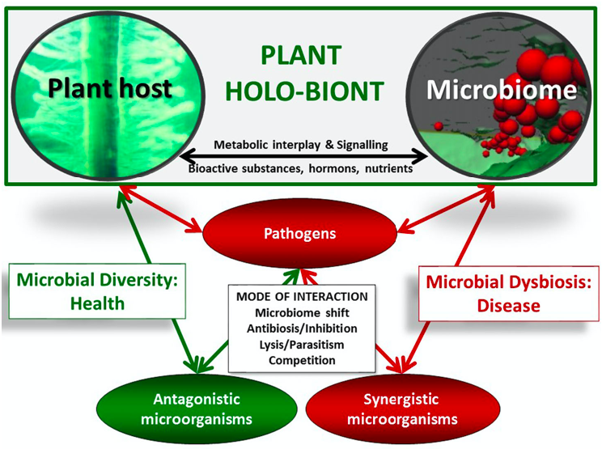
```

]

---

.pull-left[
.m0p[
.h25o[
1. .opacity10[ Plant microbiota change spatially and temporally]

1. .opacity10[ Plant compartment is a major selective force that shapes the composition of plant-associated microbiota]

1. .opacity10[ Plants and their associated microorganisms form a holobiont]

1. Several techniques can be employed to decipher the microbiota composition and functions

1. .opacity10[ System biology is the discipline that integrates the -omics techniques to formulate models that describe the structure of the system]
]
]
]

.pull-right[
<br><br>
```{r echo=FALSE, out.width="500px"}
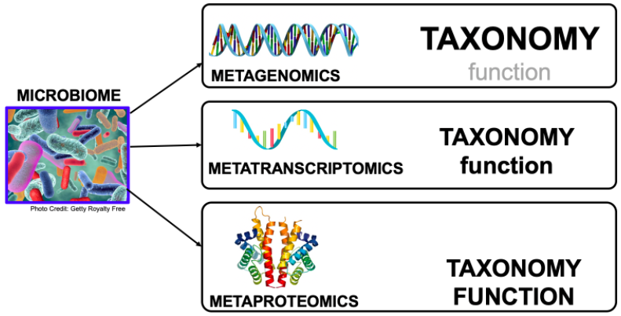
```

]


---

.pull-left[
.m0p[
.h25o[
1. .opacity10[ Plant microbiota change spatially and temporally]

1. .opacity10[ Plant compartment is a major selective force that shapes the composition of plant-associated microbiota]

1. .opacity10[ Plants and their associated microorganisms form a holobiont]

1. .opacity10[ Several techniques can be employed to decipher the microbiota composition and functions]

1. System biology is the discipline that integrates the -omics techniques to formulate models that describe the structure of the system
]
]
]

.pull-right[
<br><br>
```{r echo=FALSE, out.width="300px"}
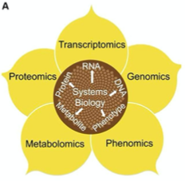
```

]

---
layout: false
class: clear 

.pull-left-wide[
.font180[.bold[Agenda]]


- .font140[Functions of plant-associated microbiomes]

- .font140[Can the plant modify the composition of the associated microbiota?]

- .font140[Can we exploit the microbiota?]
]


---
layout: true
# Functions of plant-associated microbiomes

---

class: inverse, middle, center 

----

---

.pull-left[
.m0p[
```{r echo=FALSE, out.width="530px"}
knitr::include_graphics("images/fuctionOverview.png")
```
]]

.pull-right[

.h25up[
<br>
The plant-associated microbiome can provide benefits to the plant through various direct or indirect mechanisms

- nutrient acquisition (blue)
  
- stress control (green)
  
- defence against pathogens and pests (red)


]
]

---
class: clear, middle, center

# .black[Nutrient acquisition]

----

---
layout: true

# Nutrient acquisition

---

.pull-left[
<br>
```{r echo=FALSE, out.width="530px"}
knitr::include_graphics("images/nutrientUptake.png")
```
]

.pull-right[

.h25up[

**Plant microbiota has essential functions in improving plant nutrition**

- .font90[The molecular mechanisms driving nutrient acquisition have been thoroughly studied for plant symbioses with arbuscular mycorrhizal fungi (AMF) and Rhizobium bacteria]
  
- .font90[Non-symbiotic plant-growth-promoting bacteria can either enhance the bioavailability of insoluble minerals or improve the root system architecture of host plants, thus increasing the exploratory capacity of the root for water and minerals]

]
]


---

```{r echo=FALSE, out.width="830px"}

```

---

## Introduction

.pull-left[
.h25up[
.m0p[

- .font70[Nitrogen (N) is a limiting nutrient in many natural and managed ecosystems]

- `r fontawesome::fa("seedling", fill = "green")` .font70[Arbuscular mycorrhizal (AM) fungi can substantially enhance plant N acquisition from soil, thereby potentially alleviating plant N limitation and playing an important role in plant productivity and soil nutrient cycling] 

- `r fontawesome::fa("seedling", fill = "green")` .font70[Other soil biota with decomposer capabilities are key players in AM fungal N acquisition and transfer to plants]

- `r fontawesome::fa("bullseye", fill = "grey")` .font70[Authors show that multipartite synergies between AM fungi and soil microbial communities substantially enhance plant and fungal N acquisition from organic matter and microbial acquisition of plant photosynthates]
]
]
]

.pull-right[
.m0p[
```{r echo=FALSE, out.width="400px"}
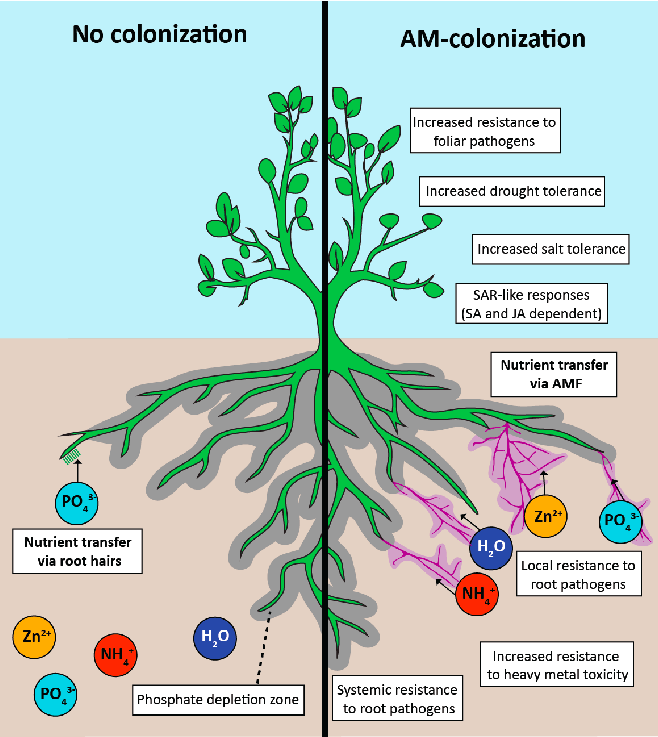
```
.right[.font50[`r Cite(bib, key = "Jacott_2017")`]]

]]

???

- Azoto

---

## Experimental design

.pull-left[
.h25up[
.m0tbp[

- `r fontawesome::fa("flask", fill = "grey")` .font70[The experimental design allowed to assess the individual and combined contributions of AM fungi and the rest of the soil microbial community to plant N acquisition from organic matter]

- .font70[The 6 mesocosm treatments included]


.tt[
|Plot|Fungi|soil inocula| soil inocula fertilization |
|---|:---:|:---:|:---:|
|control|`r fontawesome::fa("minus-circle", fill = "red")` | `r fontawesome::fa("minus-circle", fill = "red")`| none |
|microbes (N0)| `r fontawesome::fa("minus-circle", fill = "red")`| `r fontawesome::fa("plus-circle", fill = "green")`| 0 kg N ha−1 per year|
|AM fungi| `r fontawesome::fa("plus-circle", fill = "green")`| `r fontawesome::fa("minus-circle", fill = "red")`| none |
|AM fungi + microbes (N196)| `r fontawesome::fa("plus-circle", fill = "green")`| `r fontawesome::fa("plus-circle", fill = "green")`| 196 kg N ha−1 per year|
|AM fungi + microbes (N28)| `r fontawesome::fa("plus-circle", fill = "green")`| `r fontawesome::fa("plus-circle", fill = "green")`| 28 kg N ha−1 per year|
|AM fungi + microbes (N0)| `r fontawesome::fa("plus-circle", fill = "green")`| `r fontawesome::fa("plus-circle", fill = "green")`| 0 kg N ha_1 per year|


]
]
]
]


.pull-right[
.m0p[

.center[.font80[Mesocosm design]]

```{r echo=FALSE, out.width="200px"}
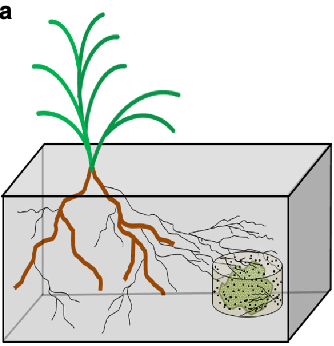
```

.h20[
.m0tbp[
- Terrestrial ecosystems experience substantial N enrichment due to atmospheric deposition and fertilizer applications

- Long-term N enrichment of grassland soils results in substantial changes in microbial community structure and functional gene representation

- The particular mechanisms through which long-term N enrichment influences plant-biotic interactions and plant productivity are not fully understood
]

]]]


???
Un mesocosmo ( meso o 'media' e -cosm 'mondo' ) è un qualsiasi sistema sperimentale all'aperto che esamina l'ambiente naturale in condizioni controllate. In questo modo gli studi mesocosmo forniscono un legame tra indagini sul campo e gli esperimenti di laboratorio altamente controllate.

---

## Plant N acquisition from organic matter

.pull-left[
.h25up[
.m0tbp[

- `r fontawesome::fa("sync", fill = "grey")` .font70[Synergies emerging from these interactions far exceeded an additive effect on plant N acquisition]

- .font70[Plants grown with either soil microbes or AM fungi acquired twofold and threefold more N from the organic matter than control plants, respectively]

- .font70[Plants grown with both soil microbes and AM fungi acquired ten to twelvefold more N from the organic matter than control plants]

- `r fontawesome::fa("exclamation-circle", fill = "green")` .font70[This ten to twelvefold increase in plant N acquisition is more than double the expected increase in plant N acquisition based on the sum of N taken up by plants grown with free-living soil microbes or AM fungi alone]
]
]
]


.pull-right[
.m0p[
<br>
```{r echo=FALSE, out.width="450px"}
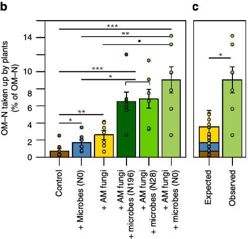
```

]]

---

<br>
```{r echo=FALSE, out.width="1030px"}
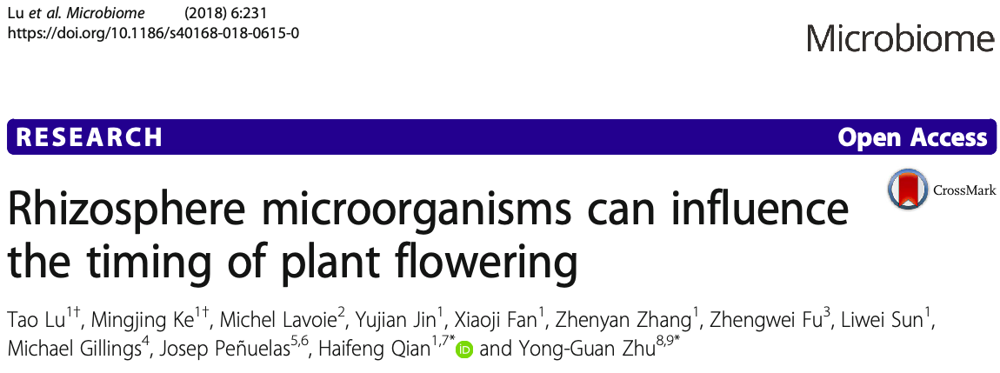
```
---

## Introduction

.pull-left[
.h25up[
.m0tbp[

- .font70[Climate change has altered plant phenology]

- .font70[Recent studies also suggest that root microbiota can contribute to phenotypic plasticity, which has important implications for our understanding of plant phenology in a changing climate]

- .font70[Flowering can be triggered by low nitrate levels]
  
- .font70[Auxins can be synthesized by rhizosphere microorganisms, raising the intriguing possibility that root microbiota may regulate plant growth and development through phytohormone production]

- `r fontawesome::fa("bullseye", fill = "grey")` .font70[Authors identified a novel network of molecular interactions linking the nitrogen cycle, the phytohormone IAA produced from Tryptophan (Trp), and the timing of flowering]
]
]
]


.pull-right[
.m0p[
```{r echo=FALSE, out.width="400px"}
knitr::include_graphics("images/nutr5.png")
```

]]


???

.n30[

- This has crucial biological, physical, and chemical effects on the biosphere and the earth system
]

---

## Experimenta design

```{r echo=FALSE, out.width="800px"}
knitr::include_graphics("images/nutr6.png")
```

.pull-left[
.h20[
.m0ul[

- Plants growing in soil for three generations (G1, G2, or G3) inoculated with different soil microbiomes

- The *pgr5* mutant is deficient in antimycin A-sensitive cyclic flow from ferredoxin to plastoquinone, which is one of the most crucial physiological processes for efficient photosynthesis

]
]
]

.pull-right[
.h20[

- The pgr5 mutant produces different exudates from the Wt *Arabidopsis*

]]

---

## The richness and diversity of the rhizosphere 

.pull-left[
.h26[
.m0ul[

- .font80[Species richness and diversity significantly decreased after the two and three generations ]

- .font80[The relative abundances of Proteobacteria and Acidobacteria, the dominant bacterial phyla in the rhizosphere, decreased by generations 2 and 3 relative to generation 1]

- .font80[In contrast, Bacteroidetes and cyanobacterial abundances increased by generation 3]

]
]
]


.pull-right[
.m0p[
```{r echo=FALSE, out.width="400px"}
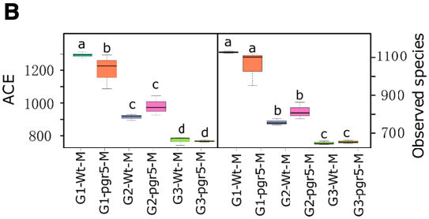
```
```{r echo=FALSE, out.width="400px"}
knitr::include_graphics("images/nutr8.png")
```

]]


???

.n30[

- abundance-based coverage (ACE)
]

---

## Flowering time is directly associated with the rhizosphere microbiota

.pull-left[
.h20[
.h26v2[
.m10bp[
- .font120[`r fontawesome::fa("seedling", fill = "green")` Microbiota from the third-generation pgr5 (PM) or Wt cultures (WM) was used to inoculate cultures of three *Arabidopsis* lines ]
  
  - Wt  

  - *pgr5*

  - *pns84*: deficient in cyclic electron flow from NADPH to plastoquinone


- .font120[`r fontawesome::fa("atom", fill = "pink")` The addition of Wt microbiota delayed flowering by 3.3, 5.5, and 5.7 days in Wt, the pnsB4 mutant, and the pgr5 mutant, respectively  ]

- .font120[The shoot fresh weight of the plants treated with Wt microbiota also increased significantly in the three lines compared to the treatments with the addition of pgr5 microbiota]

- .font120[`r fontawesome::fa("exclamation-circle", fill = "green")` These results clearly indicate that flowering time and shoot fresh weight are affected by the rhizosphere microbiota]

- .font120[`r fontawesome::fa("fire-alt", fill = "red")` This effect disappeared when the soil slurry was sterilized before inoculation, indicating that heat-stable exudates alone were not modulating *Arabidopsis* flowering time]

]]
]
]

.pull-right[
.m0p[
<br>
```{r echo=FALSE, out.width="600px"}
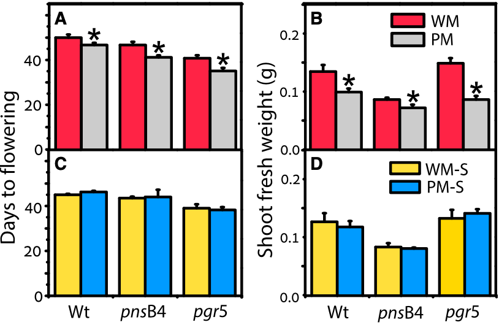
```

]]

---

## Linking N availability to flowering time

.pull-left[
.h202[
.m10bp[

- The enriched microbes in the WM treatment mostly have key roles in rhizosphere N regeneration

- Flowering can be triggered by low nitrate levels

- The authors tested whether WM treatment affects the abundance of genes involved in N cycling in soil

- The *nif* genes are genes encoding enzymes involved in the fixation of atmospheric nitrogen into a form of nitrogen available to living organisms

- The *amo*A gene is a gene involved in nitrification

- *nir*K and *nos*Z genes are involved in denitrification (spep2 and step4 of the nitrate reduction pathway)

]
]
]


.pull-right[
.m0p[
```{r echo=FALSE, out.width="550px"}
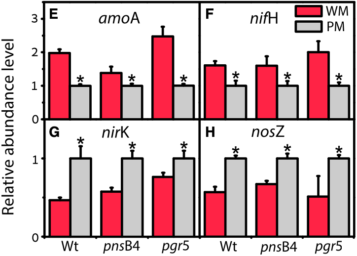
```

]]

???

.n30[
- La fissazione dell'azoto atmosferico o azotofissazione consiste nella riduzione, tramite la nitrogenasi, dell'azoto molecolare (N2) in azoto ammonico (NH3)

- La nitrificazione e' la trasformazione dell'ammoniaca (NH3) e ioni ammonio (NH4+) in ioni nitrito (NO2-) e successivamente ioni nitrato (NO3-).

- La denitrificazione e'  un processo nell'ambito del ciclo dell'azoto nel terreno, che comporta la riduzione dell'azoto nitrico con formazione di gas che si liberano nell'atmosfera
]

---
class: clear, middle, center

# .black[Stress control]

----

---
layout: true

# Stress control

---

.pull-left[

**Plant-associated microorganisms could modify plant evolutionary responses to environmental stress** in at least three non-mutually-exclusive pathways

.h202[
.m0ul[

- by altering the fitness of individual plant genotypes

- by altering the expression of plant traits related to fitness 
  
- by altering the strength or direction of natural selection occurring within populations that experience environmental stress

]
]
]

.pull-right[
.m0p[
<br>
```{r echo=FALSE, out.width="500px"}
knitr::include_graphics("images/stress1.png")
```
.right[.font50[`r Cite(bib, key = "balestrini2017")`]]

]]

---

.pull-left[

**Responses to drought**

.h203[
.m0tbp[

- `r fontawesome::fa("flask", fill = "grey")` Experiment examines plant adaptation to drought stress in a multigeneration experiment that manipulated aboveground-belowground feedbacks between plants and soil microbial communitie

- Plant fitness in both drought and nondrought environments was linked strongly to the rapid responses of soil microbial community structure to moisture manipulations

- `r fontawesome::fa("arrow-circle-right", fill = "green")` Plants were most fit when their contemporary environmental conditions (wet vs. dry soil) matched the historical environmental conditions (wet vs. dry soil) of their associated microbial community

- Plants may not be limited to "adapt or migrate" strategies
  
- `r fontawesome::fa("exclamation-circle", fill = "green")` Plants may benefit from association with interacting species, especially diverse soil microbial communities, that respond rapidly to environmental change
]
]
]


.pull-right[
.m0p[
```{r echo=FALSE, out.width="400px"}
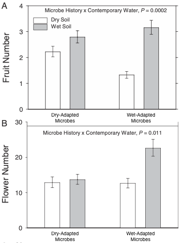
```
.right[.font50[`r Cite(bib, key = "Lau_2012")`]]

]]

---

.pull-left[

**Responses to drought**

.h203[
.m0tbp[

- **How belowground microbial communities do affect plant fitness responses to drought stress?**

- `r fontawesome::fa("exclamation-circle", fill = "green")` Shifts in microbial community composition and bacterial diversity could be linked to changes in biogeochemical processes that influence the availability of resources, such as nitrogen (N), that commonly limit plant growth and fitness.

- `r fontawesome::fa("exclamation-circle", fill = "green")` Given that drought stress altered the composition of both bacterial and fungal communities, drought stress may have changed the relative abundances of mutualists and pathogens and also may have affected the fitness benefits of associating with mutualists and susceptibility to pathogens
]
]
]


.pull-right[
.m0p[
```{r echo=FALSE, out.width="400px"}

```
.right[.font50[`r Cite(bib, key = "Lau_2012")`]]

]]


---


.pull-left[

**Responses to salinity**

.h203[
.m0tbp[

- `r fontawesome::fa("bullseye", fill = "red")` Experiments aim to assess whether soil salinity changes the microbial community in the rhizosphere of *Hibiscus hamabo*, and whether these changes in the microbiome feedback on the growth of the plant

- `r fontawesome::fa("flask", fill = "grey")` *H. hamabo* was grown in pots with a sand-soil mixture at different salt concentrations (0, 15, 40 and 90 mM NaCl). **Authors tested the effects of the salinity on the plants**
  
- `r fontawesome::fa("exclamation-circle", fill = "green")` The salinity treatment  significantly affected the total biomass of *H. hamabo*. While root weight ratio was slightly affected

  
]
]
]


.pull-right[
.m0p[
```{r echo=FALSE, out.width="330px"}
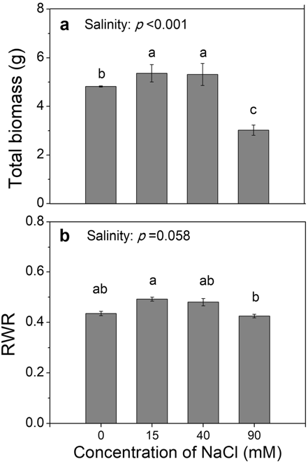
```
.right[.font20px[`r Cite(bib, key = "Yuan2019aa")`]]
]
]

---


.pull-left[

**Responses to salinity**

.h203[
.m0tbp[

- `r fontawesome::fa("bullseye", fill = "red")` Experiments aim to assess whether soil salinity changes the microbial community in the rhizosphere of *Hibiscus hamabo*, and whether these changes in the microbiome feedback on the growth of the plant

- `r fontawesome::fa("flask", fill = "grey")` *H. hamabo* was grown in pots with a sand-soil mixture at different salt concentrations (0, 15, 40 and 90 mM NaCl).  **Authors tested the effects of the salinity on the microbiotas**
  
- `r fontawesome::fa("exclamation-circle", fill = "green")` There was a slight trend that **bacterial** (a-b) OTU richness and the Shannon indice decreased with increasing salinity (these effects were not significant) 

- `r fontawesome::fa("exclamation-circle", fill = "green")` The overall effects of the salinity treatments on **fungal** (d-e) OTU richness and the Shannon indice were not significant, but Least Significant Difference revealed significant differences between the 0 mM and 90 mM NaCl treatments

]
]
]


.pull-right[
```{r echo=FALSE, out.width="530px"}
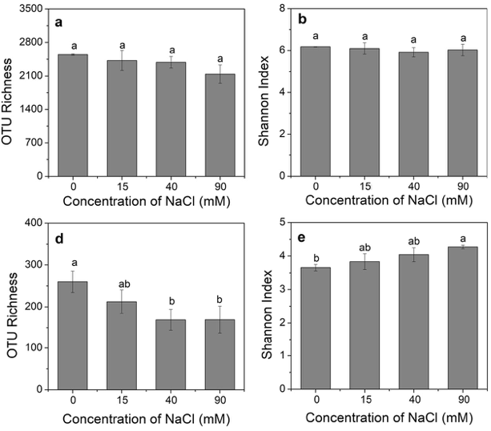
```
.right[.font20px[`r Cite(bib, key = "Yuan2019aa")`]]
]

---

.pull-left[

**Responses to salinity**

.h203[
.m0tbp[

- `r fontawesome::fa("bullseye", fill = "red")` Experiments aim to assess whether soil salinity changes the microbial community in the rhizosphere of *Hibiscus hamabo*, and whether these changes in the microbiome feedback on the growth of the plant

- `r fontawesome::fa("flask", fill = "grey")` *H. hamabo* was grown in pots with root-inoculum addition from previously treated soils (i.e. control with sterilized root inoculum vs the treatments with root inoculum)
  
- `r fontawesome::fa("exclamation-circle", fill = "green")` The addition of a live inoculum significantly increased **germination rate**

- `r fontawesome::fa("exclamation-circle", fill = "green")` The addition of a live inoculum significantly **increased biomass**, effect was stronger at salinities of 0 and 40 mM than at a salinity of 90 mM
]
]
]


.pull-right[
```{r echo=FALSE, out.width="330px"}
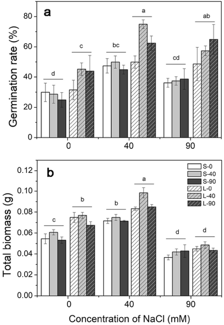
```
.right[.font20px[`r Cite(bib, key = "Yuan2019aa")`]]
]

---
class: clear, middle, center

# .black[Disease resistance]

----

---
layout: true

# Disease resistance

---


- **Disease-suppressive soils** are exceptional ecosystems in which crop plants suffer less from specific soil-borne pathogens than expected owing to the activities of other soil microorganisms

  


```{r echo=FALSE, out.width="650px"}
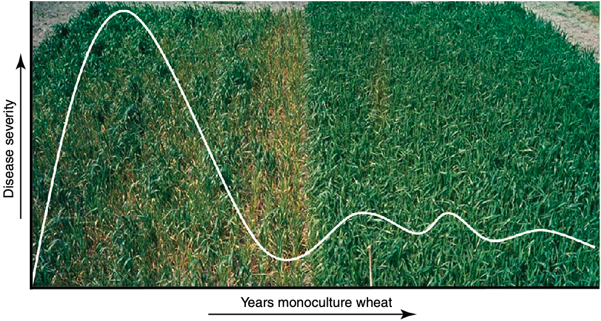
```
.right[.font20px[`r Cite(bib, key = "BERENDSEN2012478")`]]


---

.pull-left[

**Disease resistence**

.h202[
.m0tp[

- `r fontawesome::fa("bullseye", fill = "red")` The aim of the study was to decipher the rhizosphere microbiome to identify such disease-suppressive microbes and to unravel the mechanisms by which they protect plants against root diseases.

- `r fontawesome::fa("flask", fill = "grey")` The investigated soil is suppressive to *Rhizoctonia solani*, an economically important fungal pathogen of many crops 
]
]

.h20[
.m0tbp[

- suppressive soil (S)
  
- conducive soil (C)
  
- conducive soil amended with 10% (w/w) of suppressive soil (CS)

- suppressive soil heat-treated at 50C (S50)

- suppressive soil heat-treated at 80C (S80)
  
]
]
]


.pull-right[
<br>
.m0p[
```{r echo=FALSE, out.width="530px"}
knitr::include_graphics("images/disease2.png")
```
.right[.font20px[`r Cite(bib, key = "Mendes_2011")`]]

]
]


---

.pull-left[

**Disease resistence**

.h202[
.m0tp[

- A total of 33,346 bacterial and archaeal OTUs were detected in the rhizosphere microbiome 

- `r fontawesome::fa("minus-circle", fill = "red")` When comparing the six soil treatments with different levels of disease suppressiveness, no significant differences were found in the number of detected bacterial taxa

- `r fontawesome::fa("plus-circle", fill = "green")` When the abundance of the detected taxa was taken into account, six clusters of samples that corresponded to the six soil treatments were found

.content-box-grey[
.m0tbp[.font20px[These results suggest that <br>**the relative abundance of several bacterial taxa**<br> is a **more important** indicator of disease suppression<br> than the exclusive **presence of specific bacterial taxa**
]]]
  
]
]
]


.pull-right[
```{r echo=FALSE, out.width="340px"}
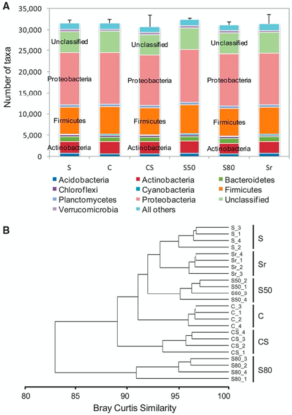
```
.right[.font20px[`r Cite(bib, key = "Mendes_2011")`]]

]

???

.n30[

- Paragone con ricetta di cucina in cui si ha la lista degli ingredienti MA soprattutto e' importante la quantita'
]

---

<br><br><br>
.center[.font150[How soil-born microbes control the plant disease?]]

----

---

.pull-left[
.h25[
.m0ul[
<br>
- (a) **Antibiosis**: The bacterium colonizes the growing root system and delivers antibiotic molecules around the root, thereby harming pathogens that approach the root

- (b) **Induced systemic resistance** (ISR): many bacterial products induce systemic signaling, which can result in protection of the whole plant against diseases caused by different organisms
  
- (c) **Competition for nutrients and niches**: Biocontrol bacteria acting through this mechanism excel in fast chemotactic movement along the growing root in their efficient hunt for root exudate components, thereby outcompeting the pathogen in scavenging nutrients and in occupying niches on the root

]
]
]

.pull-right[
<br>
```{r echo=FALSE, out.width="400px"}
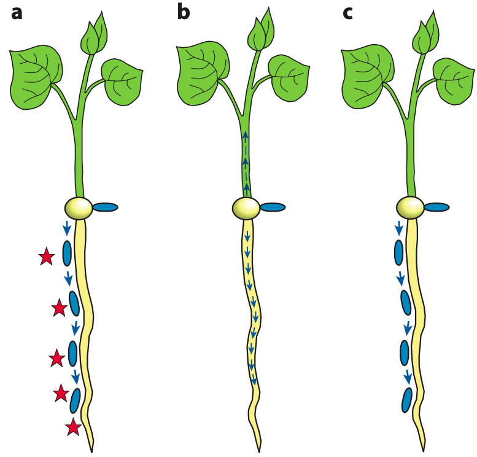
```
.right[.font50[`r Cite(bib, key = "Lugtenberg_2009")`]]

]

---

.pull-left[

**Antibiosis**

.h202[
.m0ul[

- *Dematophora necatrix* is the cause of avocado Dematophora root rot (also called white root rot)

- `r fontawesome::fa("flask", fill = "grey")` A set of eight bacterial strains was selected on the basis of growth inhibitory activity against *D. necatrix*. Upon testing the biocontrol ability of these strains in a newly developed avocado test system and in a tomato test system, it became apparent that PCL1606 exhibited the highest biocontrol ability

- This compound was purified and subsequently identified as 2-hexyl 5-propyl resorcinol (HPR).

]
]
]

.pull-right[
<br>
```{r echo=FALSE, out.width="500px"}
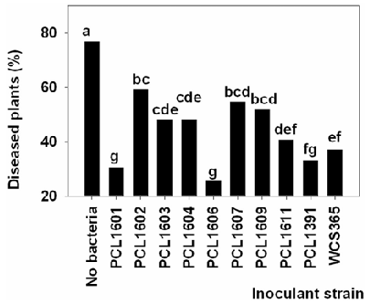
```
.right[.font50[`r Cite(bib, key = "Cazorla_2006")`]]

]

---

.pull-left[

**Antibiosis**

.h202[
.m0ul[

- *Dematophora necatrix* is the cause of avocado Dematophora root rot (also called white root rot)

- `r fontawesome::fa("flask", fill = "grey")` A set of eight bacterial strains was selected on the basis of growth inhibitory activity against *D. necatrix*. Upon testing the biocontrol ability of these strains in a newly developed avocado test system and in a tomato test system, it became apparent that PCL1606 exhibited the highest biocontrol ability

- This compound was purified and subsequently identified as 2-hexyl 5-propyl resorcinol (HPR).

- `r fontawesome::fa("flask", fill = "grey")` To study the role of HPR in biocontrol activity, two mutants of PCL1606 impaired in antagonistic activity were selected

- `r fontawesome::fa("plus-circle", fill = "green")` These mutants were shown to impair HRP production and showed a decrease in biocontrol activity

]
]
]

.pull-right[
```{r echo=FALSE, out.width="350px"}
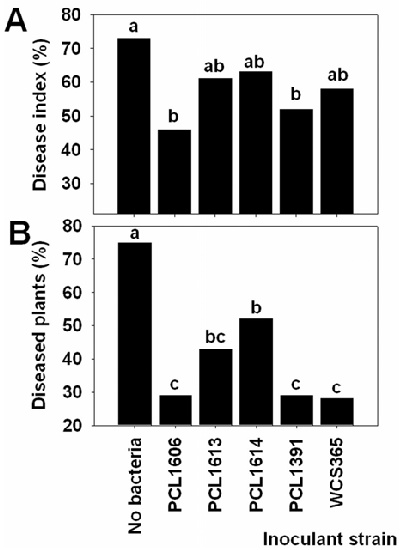
```
.right[.font50[`r Cite(bib, key = "Cazorla_2006")`]]

]

???

.n30[

- Biocontrol strains Pseudomonas fluorescens WCS365 and P. chlororaphis PCL1391 were tested as controls

]

---

.pull-left[

**Induced systemic resistance**

.h27[
- `r fontawesome::fa("project-diagram", fill = "#99C6E8")` **Sistemic Acquired Resistance** (SAR) corresponds to a plant "vaccination" against a broad range of pathogens. Induced by local contact with MAMPs, PAMPs or effectors. SAR is mainly mediated and dependent on Salicylic Acid


- `r fontawesome::fa("undo-alt", fill = "#F2AD85")` **Induced Systemic Resistance** (ISR) is initiated in roots by plant-growth- promoting microbes (PGPM) and leads to resistance priming in distant parts of the plant ISR is mainly mediated and dependent by Jasmonic Acid (JA) and Ethylene (ET).

]
]

.pull-right[
<br>
```{r echo=FALSE, out.width="400px"}
knitr::include_graphics("images/disease1.png")
```
.right[.font50[`r Cite(bib, key = "BURKETOVA2015994")`]]

]

???

.n30[

- Microbe-Associated Molecular Patterns (MAMPs)

- Pathogen-Associated Molecular Patterns (PAMPs)
  
- Their presence is detected by members of a large family of pattern recognition receptors (PRRs)

- Damage-Associated Molecular Patterns (DAMPs)

- Plant Growth-Promoting Rhizobacteria (PGPR) and Fungi (PGPF)

- Many individual bacterial components induce ISR, such as LPS, flagella, salicylic acid, and siderophores
G
]

---

.pull-left[

**Induced systemic resistance**

.h202[
- `r fontawesome::fa("bullseye", fill = "red")` Determine whether root colonisation by *Trichoderma asperellum* isolate T34 (T34) can enhance resistance in *Arabidopsis* against foliar pathogens


- `r fontawesome::fa("flask", fill = "grey")` The severity of bacterial speck disease inflicted by *Pseudomonas syringae*  was quantified for control, T34-treated plants and *Pseudomonas fluorescens* WCS417r bacteria (non-pathogenic)

]
]

.pull-right[
<br>
```{r echo=FALSE, out.width="350px"}
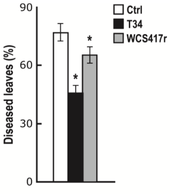
```
.right[.font20px[`r Cite(bib, key = "Segarra_2009")`]]

]


---

.pull-left[

**Induced systemic resistance**

.h202[
- WCS417r is known to be effective against a broad range of pathogens, including obligate biotrophs and necrotrophic fungi 

- `r fontawesome::fa("bullseye", fill = "red")` To investigate whether T34-ISR is similarly effective against these types of pathogens 

- `r fontawesome::fa("flask", fill = "grey")` The level of T34-induced protection against the biotrophic oomycete *Hyaloperonospora parasitica* and the necrotrophic fungus *Plectosphaerella cucumerina* was assessed.

.content-box-grey[
.font20px[These results demonstrate that colonisation 
<br>of *Arabidopsis* roots by T34
<br>**triggers a systemic resistance response**
<br>that is effective against different types of foliar pathogens]
]
]
]

.pull-right[
<br>
```{r echo=FALSE, out.width="350px"}
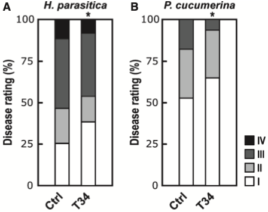
```
.pull-left[
.h12[
.m0tbp[
.m0tbul[
- *Class I*: no sporulation

- *Class II*: trailing necrosis

- *Class III*: <50% of the leaf area covered with sporangia

- *Class IV*: >50% of the leaf area covered with sporangia, with additional chlorosis and leaf collapse
]
]
]
]

.pull-right[
.h12[
.m0tbp[
.m0tbul[
- *Class I*: no symptom

- *Class II*: lesion diameter <2 mm

- *Class III*: lesion diameter >2 mm

]
]
]
]
.whole[
.right[.font20px[`r Cite(bib, key = "Segarra_2009")`]]

]
]


---

.pull-left[

**Induced systemic resistance**

.h202[

- `r fontawesome::fa("bullseye", fill = "red")` How T34 activates ISR response in *Arabidopsis*?

- `r fontawesome::fa("flask", fill = "grey")` Assessed T34-induced resistance in:
  - *sid2-1*: salicylic acid impaired mutant (**SAR**)    
  - *npr1-1*: disrupted both **SAR** and **ISR** response
  - *myb72-1*: specifically affected in early steps of **ISR** signalling, but not in component required for general ET or JA signalling    

.m0tbp[
- `r fontawesome::fa("plus-circle", fill = "green")` *sid2-1* developed a similar level of resistance as wildtype indicating that T34-ISR functions independently of SA

- `r fontawesome::fa("plus-circle", fill = "green")` *npr1-1* is blocked in its ability to mount ISR, indicating that the regulatory protein NPR1 is required for expression of this type of Trichoderma-induced resistance

- `r fontawesome::fa("plus-circle", fill = "green")` the root-specific transcription factor MYB72 plays an important role in early signalling steps of ISR and is required for T34-ISR
]
]
]

.pull-right[
<br>
```{r echo=FALSE, out.width="400px"}
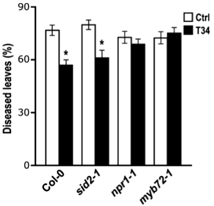
```

.right[.font20px[`r Cite(bib, key = "Segarra_2009")`]]

]


---


.lh18[
**Priming:** .font60[`r fontawesome::fa("search", fill = "grey")` sensitization of the whole plant for enhanced defense; characterized by a faster and stronger activation of cellular defenses upon invasion]
]

.m0tbp[
```{r echo=FALSE, out.width="420px"}
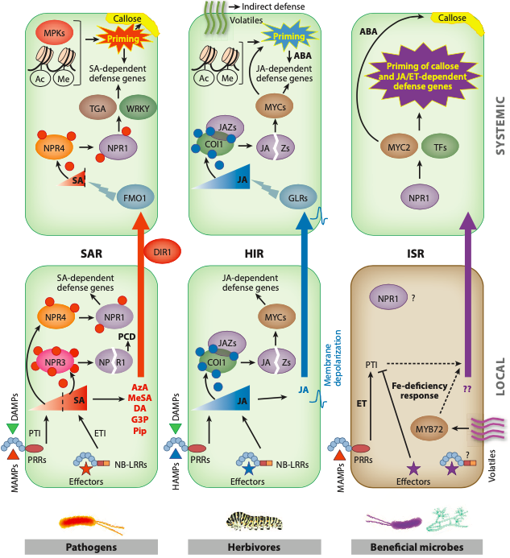
```
]
.right[.font80[`r Cite(bib, key = "Pieterse_2014")`]]

---

.pull-left[

**Competition for nutrients and niches**

.h20[
.m0ul[

- `r fontawesome::fa("bullseye", fill = "red")` To study tomato foot and root rot, a plant disease caused by the fungus *Fusarium oxysporum f.sp. radicis-lycopersici*, and the disease control through the mechanism "competition for nutrients and niches"

- `r fontawesome::fa("flask", fill = "grey")` Microbes were isolated from the rhizospheres of tomato plants. Grown briefly in liquid and used to inoculate sterile germinated seedlings. After those microbes had reached the 1-cm-long root tip were shaken off the root tip, plated on KB agar, judged for colony diversity, and the cells from the combined colonies were used for another enrichment cycle. After a total of three cycles the bacteria were selected for competitive root colonization experiments.
  
-  `r fontawesome::fa("plus-circle", fill = "green")` The observation that bacteria selected by the enrichment method grow much better on exudate than random rhizobacteria shows that these strains utilize exudates components more efficiently for growth. It suggests that competition for nutrients plays a major role in the biocontrol activity of the enhanced colonizers
]
]
]

.pull-right[
<br><br>
```{r echo=FALSE, out.width="500px"}
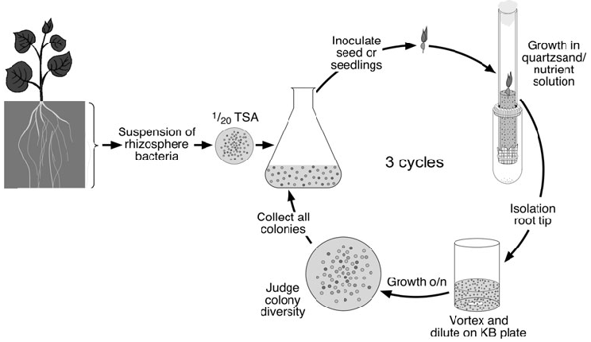
```
.right[.font50[`r Cite(bib, key = "Kamilova_2005")`]]

]

???

.n30[
- TSA: tryptic soy agar
]


---
layout: true
# Can the plant modify the composition of the associated microbiota?

---

class: inverse, middle, center 

----

---
layout: true
# Plants modify the composition of microbiota

---

```{r echo=FALSE, out.width="900px"}
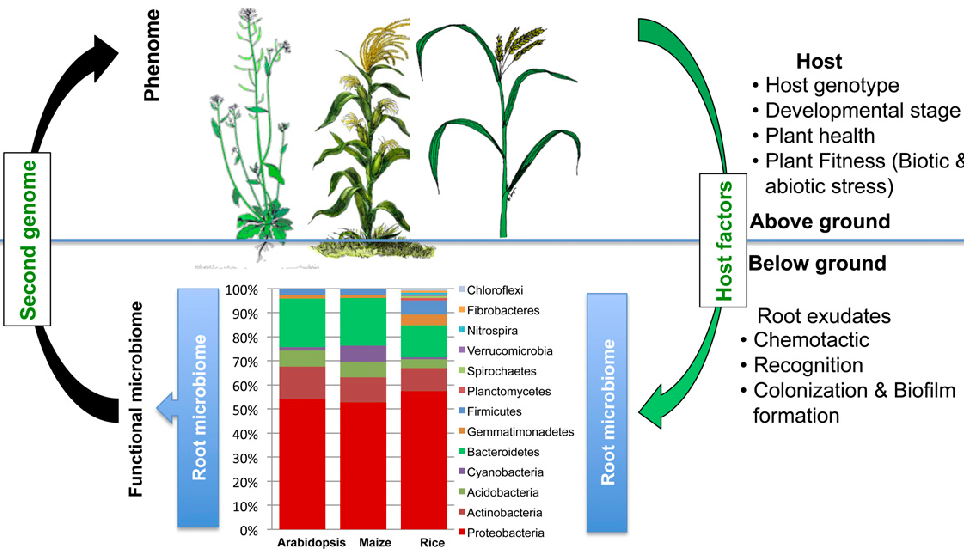
```
.right[.font50[`r Cite(bib, key = "Lakshmanan_2014")`]]

---

.pull-left[

**Plant sensing and the initiation of colonization**

.h202o[
.m0ul[

1. Plants reliese exudates

  - **Plant exudates**: complex mixtures of soluble organic substances that are secreted by living plants

1. Plant-associated microorganisms use **chemotaxis** to sense and respond to plant-derived signals

1. Once a signal is perceived, **microorganisms move towards the plant** with the use of flagella

1. Microorganisms attach to the root surface and form a **biofilm**

1. Genes that encode proteins involved in bacterial chemotaxis, flagella assembly, bacterial motility and biofilm formation are **highly abundant in the rhizosphere compared with the bulk soil**

]
]
]

.pull-right[
<br>
```{r echo=FALSE, out.width="700px"}
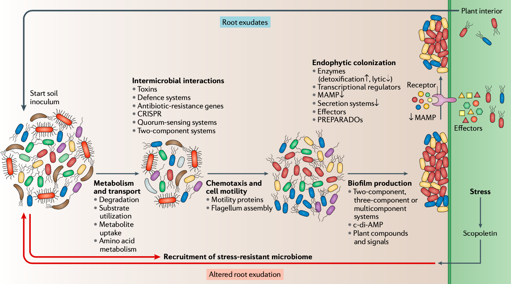
```
.right[.font50[`r Cite(bib, key = "Trivedi:2020aa")`]]

]
---

Un esempio di microbiota modificato dalla pianta => malic acid

---

Poi aggiungere che non solo la pianta modifica il microbiota

the plant-associated microbiome is shaped by complex interactions among the host, microorganisms and the environment

---

RODRIGUEZ2019804 => figura phiylogenesi pathogens/growth promoting

---
