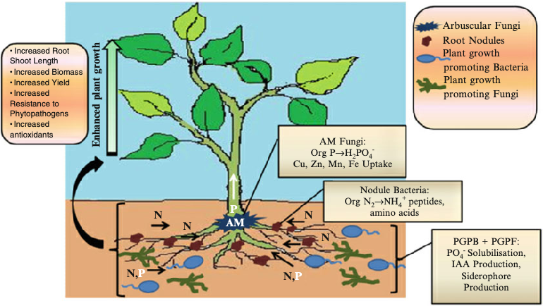
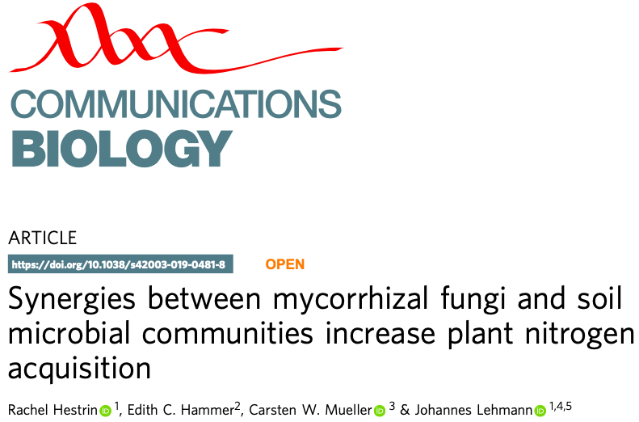

```{r setup, include=FALSE, cache=FALSE}
# TO render: rmarkdown::render('Lesson1.Rmd', 'xaringan::moon_reader')

# set working directory to docs folder
setwd(here::here("docs"))

# Set global R options
options(htmltools.dir.version = FALSE, servr.daemon = TRUE)

# Set global knitr chunk options
knitr::opts_chunk$set(
  fig.align = "center", 
  cache = TRUE,
  error = FALSE,
  message = FALSE, 
  warning = FALSE, 
  collapse = TRUE 
)

# This is good for getting the ggplot background consistent with
# the html background color
library(ggplot2)
thm <- theme_bw()
theme_set(thm)

library(RefManageR)
BibOptions(check.entries = FALSE,
           bib.style = "authoryear",
           cite.style = "authoryear",
           style = "markdown",
           hyperlink = FALSE,
           dashed = FALSE)
bib <- ReadBib("biblio/bib.bib", check = FALSE)
```

class: title-slide


# .font170[MICROBIOMA E MICROBIOTA]


<br><br><br><br>
.marco[
Marco Chiapello
<br>
`r Sys.Date()`
]


.marco[
.font90[[`r fontawesome::fa("twitter", fill = "steelblue")`](https://twitter.com/marpello1980) @marpello1980 - [`r fontawesome::fa("envelope", fill = "steelblue")`](mailto:chiapello.m@gmail.com) chiapello.m@gmail.com - `r fontawesome::fa("skype", fill = "steelblue")` marpello]
]

???

.n30[

- Sarò uno dei vostri docenti per il corso "Interazioni tra piante, microrganismi e ambiente"
]
---
layout: true

# Last lesson recap

---

.pull-left[
.m0p[
.h25o[
1. Plant microbiota change spatially and temporally

1. Plant compartment is a major selective force that shapes the composition of plant-associated microbiota

1. Plants and their associated microorganisms form a holobiont

1. Several techniques can be employed to decipher the microbiota composition and functions

1. System biology is the discipline that integrates the -omics techniques to formulate models that describe the structure of the system
]
]
]

---
.pull-left[
.m0p[
.h25o[
1. Plant microbiota change spatially and temporally

1. .opacity10[ Plant compartment is a major selective force that shapes the composition of plant-associated microbiota]

1. .opacity10[ Plants and their associated microorganisms form a holobiont]

1. .opacity10[ Several techniques can be employed to decipher the microbiota composition and functions]

1. .opacity10[ System biology is the discipline that integrates the -omics techniques to formulate models that describe the structure of the system]
]
]
]

.pull-right[

.m0p[
```{r echo = FALSE, out.height="230px", out.width="230px"}
knitr::include_graphics("images/PlantMicrobiomeComposition.png")
```

```{r echo = FALSE, out.height="270px", out.width="300px"}
knitr::include_graphics("images/plantMicrobiotaTemporal.png")
```
]
]

---

.pull-left[
.m0p[
.h25o[
1. .opacity10[ Plant microbiota change spatially and temporally]

1. Plant compartment is a major selective force that shapes the composition of plant-associated microbiota

1. .opacity10[ Plants and their associated microorganisms form a holobiont]

1. .opacity10[ Several techniques can be employed to decipher the microbiota composition and functions]

1. .opacity10[ System biology is the discipline that integrates the -omics techniques to formulate models that describe the structure of the system]
]
]
]

.pull-right[

```{r echo=FALSE, out.width="350px"}
knitr::include_graphics("images/bacterialDiv.png")
```

```{r echo=FALSE, out.width="350px"}
knitr::include_graphics("images/fungalDiv.png")
```
]

---

.pull-left[
.m0p[
.h25o[
1. .opacity10[ Plant microbiota change spatially and temporally]

1. .opacity10[ Plant compartment is a major selective force that shapes the composition of plant-associated microbiota]

1. Plants and their associated microorganisms form a holobiont

1. .opacity10[ Several techniques can be employed to decipher the microbiota composition and functions]

1. .opacity10[ System biology is the discipline that integrates the -omics techniques to formulate models that describe the structure of the system]
]
]
]

.pull-right[
<br>
```{r echo=FALSE, out.width="800px"}

```

]

---

.pull-left[
.m0p[
.h25o[
1. .opacity10[ Plant microbiota change spatially and temporally]

1. .opacity10[ Plant compartment is a major selective force that shapes the composition of plant-associated microbiota]

1. .opacity10[ Plants and their associated microorganisms form a holobiont]

1. Several techniques can be employed to decipher the microbiota composition and functions

1. .opacity10[ System biology is the discipline that integrates the -omics techniques to formulate models that describe the structure of the system]
]
]
]

.pull-right[
<br><br>
```{r echo=FALSE, out.width="500px"}
knitr::include_graphics("images/recap1.png")
```

]


---

.pull-left[
.m0p[
.h25o[
1. .opacity10[ Plant microbiota change spatially and temporally]

1. .opacity10[ Plant compartment is a major selective force that shapes the composition of plant-associated microbiota]

1. .opacity10[ Plants and their associated microorganisms form a holobiont]

1. .opacity10[ Several techniques can be employed to decipher the microbiota composition and functions]

1. System biology is the discipline that integrates the -omics techniques to formulate models that describe the structure of the system
]
]
]

.pull-right[
<br><br>
```{r echo=FALSE, out.width="300px"}

```

]

---
layout: false
class: clear 

.pull-left-wide[
.font180[.bold[Agenda]]


- .font140[Functions of plant-associated microbiomes]

- .font140[Can the plant modify the composition of the associated microbiota?]

- .font140[Can we exploit the microbiota?]
]


---
layout: true
# Functions of plant-associated microbiomes

---

class: inverse, middle, center 

----

---

.pull-left[
.m0p[
```{r echo=FALSE, out.width="530px"}
knitr::include_graphics("images/fuctionOverview.png")
```
]]

.pull-right[

.h25up[
<br>
The plant-associated microbiome can provide benefits to the plant through various direct or indirect mechanisms

- nutrient acquisition (blue)
  
- stress control (green)
  
- defence against pathogens and pests (red)


]
]

---
layout: true

# Nutrient acquisition

---

.pull-left[
<br>
```{r echo=FALSE, out.width="530px"}

```
]

.pull-right[

.h25up[

**Plant microbiota has essential functions in improving plant nutrition**

- .font90[The molecular mechanisms driving nutrient acquisition have been thoroughly studied for plant symbioses with arbuscular mycorrhizal fungi (AMF) and Rhizobium bacteria]
  
- .font90[Non-symbiotic plant-growth-promoting bacteria can either enhance the bioavailability of insoluble minerals or improve the root system architecture of host plants, thus increasing the exploratory capacity of the root for water and minerals]

]
]


---

```{r echo=FALSE, out.width="830px"}

```

---

## Introduction

.pull-left[
.h25up[
.m0p[

- .font70[Nitrogen (N) is a limiting nutrient in many natural and managed ecosystems]

- `r fontawesome::fa("seedling", fill = "green")` .font70[Arbuscular mycorrhizal (AM) fungi can substantially enhance plant N acquisition from soil, thereby potentially alleviating plant N limitation and playing an important role in plant productivity and soil nutrient cycling] 

- `r fontawesome::fa("seedling", fill = "green")` .font70[Other soil biota with decomposer capabilities are key players in AM fungal N acquisition and transfer to plants]

- `r fontawesome::fa("bullseye", fill = "grey")` .font70[Authors show that multipartite synergies between AM fungi and soil microbial communities substantially enhance plant and fungal N acquisition from organic matter and microbial acquisition of plant photosynthates]
]
]
]

.pull-right[
.m0p[
```{r echo=FALSE, out.width="400px"}

```
.right[.font50[`r Cite(bib, key = "Jacott_2017")`]]

]]

???

- Azoto

---

## Experimental design

.pull-left[
.h25up[
.m0tbp[

- `r fontawesome::fa("flask", fill = "greey")` .font70[The experimental design allowed to assess the individual and combined contributions of AM fungi and the rest of the soil microbial community to plant N acquisition from organic matter]

- .font70[The 6 mesocosm treatments included]


.tt[
|Plot|Fungi|soil inocula| soil inocula fertilization |
|---|:---:|:---:|:---:|
|control|`r fontawesome::fa("minus-circle", fill = "red")` | `r fontawesome::fa("minus-circle", fill = "red")`| none |
|microbes (N0)| `r fontawesome::fa("minus-circle", fill = "red")`| `r fontawesome::fa("plus-circle", fill = "green")`| 0 kg N ha−1 per year|
|AM fungi| `r fontawesome::fa("plus-circle", fill = "green")`| `r fontawesome::fa("minus-circle", fill = "red")`| none |
|AM fungi + microbes (N196)| `r fontawesome::fa("plus-circle", fill = "green")`| `r fontawesome::fa("plus-circle", fill = "green")`| 196 kg N ha−1 per year|
|AM fungi + microbes (N28)| `r fontawesome::fa("plus-circle", fill = "green")`| `r fontawesome::fa("plus-circle", fill = "green")`| 28 kg N ha−1 per year|
|AM fungi + microbes (N0)| `r fontawesome::fa("plus-circle", fill = "green")`| `r fontawesome::fa("plus-circle", fill = "green")`| 0 kg N ha_1 per year|


]
]
]
]


.pull-right[
.m0p[

.center[.font80[Mesocosm design]]

```{r echo=FALSE, out.width="200px"}

```

.h20[
.m0tbp[
- Terrestrial ecosystems experience substantial N enrichment due to atmospheric deposition and fertilizer applications

- Long-term N enrichment of grassland soils results in substantial changes in microbial community structure and functional gene representation

- The particular mechanisms through which long-term N enrichment influences plant-biotic interactions and plant productivity are not fully understood
]

]]]


???
Un mesocosmo ( meso o 'media' e -cosm 'mondo' ) è un qualsiasi sistema sperimentale all'aperto che esamina l'ambiente naturale in condizioni controllate. In questo modo gli studi mesocosmo forniscono un legame tra indagini sul campo e gli esperimenti di laboratorio altamente controllate.

---

## Plant N acquisition from organic matter

.pull-left[
.h25up[
.m0tbp[

- `r fontawesome::fa("sync", fill = "grey")` .font70[Synergies emerging from these interactions far exceeded an additive effect on plant N acquisition]

- .font70[Plants grown with either soil microbes or AM fungi acquired twofold and threefold more N from the organic matter than control plants, respectively]

- .font70[Plants grown with both soil microbes and AM fungi acquired ten to twelvefold more N from the organic matter than control plants]

- `r fontawesome::fa("exclamation-circle", fill = "green")` .font70[This ten to twelvefold increase in plant N acquisition is more than double the expected increase in plant N acquisition based on the sum of N taken up by plants grown with free-living soil microbes or AM fungi alone]
]
]
]


.pull-right[
.m0p[
<br>
```{r echo=FALSE, out.width="450px"}

```

]]

