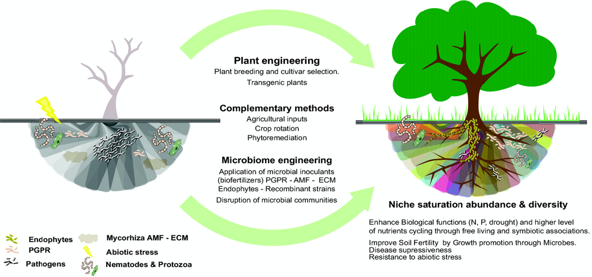

```{r setup, include=FALSE, cache=FALSE}
# TO render: rmarkdown::render('Lesson2.Rmd', 'xaringan::moon_reader')

# set working directory to docs folder
setwd(here::here("docs"))

# Set global R options
options(htmltools.dir.version = FALSE, servr.daemon = TRUE)

# Set global knitr chunk options
knitr::opts_chunk$set(
  fig.align = "center", 
  cache = TRUE,
  error = FALSE,
  message = FALSE, 
  warning = FALSE, 
  collapse = TRUE 
)

# This is good for getting the ggplot background consistent with
# the html background color
library(ggplot2)
thm <- theme_bw()
theme_set(thm)

library(RefManageR)
BibOptions(check.entries = FALSE,
           bib.style = "authoryear",
           cite.style = "authoryear",
           style = "markdown",
           hyperlink = FALSE,
           max.names = 2,
           dashed = FALSE)
bib <- ReadBib("biblio/bib.bib", check = FALSE)
```

```{r xaringanExtra, echo=FALSE}
library(xaringanExtra)
use_tile_view() 
```

class: title-slide


# .font170[MICROBIOMA E MICROBIOTA]


<br><br><br><br>
.marco[
.tada[Marco Chiapello]
<br>
2020-11-24 
]


.marco[
.center[.font90[[[`r fontawesome::fa("slack", fill = "steelblue")`](https://join.slack.com/t/ipma-2020/shared_invite/zt-j9o8ig7k-LN1~U3d6QJztquYbC6iW7w) Slack - `r fontawesome::fa("envelope", fill = "steelblue")`](mailto:marco.chiapello@unito.it) marco.chiapello@unito.it]
]
]

???

.n30[

- Sarò uno dei vostri docenti per il corso "Interazioni tra piante, microrganismi e ambiente"
]

---

class: center, middle, clear

```{r echo=FALSE, out.width="400px"}
knitr::include_graphics("images/lesson2quiz.png")
```
.font50[https://bit.ly/39coIbU]

---
layout: true

# Last lesson recap

---

.pull-left[
<br>
.m0p[
.h25o[
1. DNA Metabarcoding 

1. Several techniques can be employed to decipher the microbiota functions

1. System biology is the discipline that integrates the -omics techniques to formulate models that describe the structure of the system
]
]
]

---
.pull-left[
<br>
.m0p[
.h25o[
1. DNA Metabarcoding 

1. .opacity10[Several techniques can be employed to decipher the microbiota functions]

1. .opacity10[ System biology is the discipline that integrates the -omics techniques to formulate models that describe the structure of the system]
]
]
]

.pull-right[

.m0p[
```{r echo = FALSE, out.width="230px"}
knitr::include_graphics("images/DNAbarcoding2.png")
```
]
]

---

.pull-left[
<br>
.m0p[
.h25o[
1. .opacity10[DNA Metabarcoding] 

1. Several techniques can be employed to decipher the microbiota functions

1. .opacity10[ System biology is the discipline that integrates the -omics techniques to formulate models that describe the structure of the system]
]
]
]

.pull-right[

<br><br>
```{r echo=FALSE, out.width="500px"}
knitr::include_graphics("images/recap1.png")
```
]

---

.pull-left[
<br>
.m0p[
.h25o[
1. .opacity10[DNA Metabarcoding] 

1. .opacity10[Several techniques can be employed to decipher the microbiota functions]

1. System biology is the discipline that integrates the -omics techniques to formulate models that describe the structure of the system
]
]
]

.pull-right[
<br><br>
```{r echo=FALSE, out.width="300px"}
knitr::include_graphics("images/recap2.png")
```

]

---
layout: false
class: clear 

.pull-left-wide[
.font180[.bold[Agenda]]


- .font140[Functions of plant-associated microbiomes]

- .font140[Can the plant modify the composition of the associated microbiota?]

- .font140[Can we exploit the microbiota?]
]


---
layout: true
# Functions of plant-associated microbiomes

---

class: inverse, middle, center 

----

---

.pull-left[
.m0p[
```{r echo=FALSE, out.width="530px"}
knitr::include_graphics("images/fuctionOverview.png")
```
]]

.pull-right[

.h25up[
<br>
The plant-associated microbiome can provide benefits to the plant through various direct or indirect mechanisms

- nutrient acquisition (blue)
  
- stress control (green)
  
- defence against pathogens and pests (red)


]
]

---
class: clear, middle, center

# .black[Nutrient acquisition]

----

---
layout: true

# Nutrient acquisition

---

.pull-left[
<br>
```{r echo=FALSE, out.width="530px"}
knitr::include_graphics("images/nutrientUptake.png")
```
]

.pull-right[

.h25up[

**Plant microbiota has essential functions in improving plant nutrition**

- .font90[The molecular mechanisms driving nutrient acquisition have been thoroughly studied for plant symbioses with arbuscular mycorrhizal fungi (AMF) and Rhizobium bacteria]
  
- .font90[Non-symbiotic plant-growth-promoting bacteria can either enhance the bioavailability of insoluble minerals or improve the root system architecture of host plants, thus increasing the exploratory capacity of the root for water and minerals]

]
]


---

```{r echo=FALSE, out.width="830px"}
knitr::include_graphics("images/nutrientPaper.png")
```

---

## Introduction

.pull-left[
.h202[
.m0p[

- .font70[Nitrogen (N) is a limiting nutrient in many natural and managed ecosystems]

- `r fontawesome::fa("seedling", fill = "green")` .font70[Arbuscular mycorrhizal (AM) fungi can substantially enhance plant N acquisition from soil, thereby potentially alleviating plant N limitation and playing an important role in plant productivity and soil nutrient cycling] 

- `r fontawesome::fa("seedling", fill = "green")` .font70[Other soil biota with decomposer capabilities are key players in AM fungal N acquisition and transfer to plants]

- `r fontawesome::fa("bullseye", fill = "grey")` .font70[Authors show that multipartite synergies between AM fungi and soil microbial communities substantially enhance plant and fungal N acquisition from organic matter and microbial acquisition of plant photosynthates]
]
]
]

.pull-right[
.m0p[
```{r echo=FALSE, out.width="400px"}
knitr::include_graphics("images/nutr1.png")
```
.right[.font50[`r Cite(bib, key = "Jacott_2017")`]]

]]

???

.h201[

- Azoto

- La fissazione dell'azoto atmosferico o azotofissazione consiste nella riduzione, tramite la nitrogenasi, dell'azoto molecolare (N2) in azoto ammonico (NH3)

- La nitrificazione e' la trasformazione dell'ammoniaca (NH3) e ioni ammonio (NH4+) in ioni nitrito (NO2-) e successivamente ioni nitrato (NO3-).

- La denitrificazione e'  un processo nell'ambito del ciclo dell'azoto nel terreno, che comporta la riduzione dell'azoto nitrico con formazione di gas che si liberano nell'atmosfera

]
---

## Experimental design

.pull-left[
.h25up[
.m0tbp[

- `r fontawesome::fa("flask", fill = "grey")` .font70[The experimental design allowed to assess the individual and combined contributions of AM fungi and the rest of the soil microbial community to plant N acquisition from organic matter]

- .font70[The 6 mesocosm treatments included]


.tt[
|Plot|Fungi|soil inocula| soil fertilization |
|---|:---:|:---:|:---:|
|control|`r fontawesome::fa("minus-circle", fill = "red")` | `r fontawesome::fa("minus-circle", fill = "red")`| none |
|microbes (N0)| `r fontawesome::fa("minus-circle", fill = "red")`| `r fontawesome::fa("plus-circle", fill = "green")`| 0 kg N / ha per year|
|AM fungi| `r fontawesome::fa("plus-circle", fill = "green")`| `r fontawesome::fa("minus-circle", fill = "red")`| none |
|AM fungi + microbes (N196)| `r fontawesome::fa("plus-circle", fill = "green")`| `r fontawesome::fa("plus-circle", fill = "green")`| 196 kg N / ha per year|
|AM fungi + microbes (N28)| `r fontawesome::fa("plus-circle", fill = "green")`| `r fontawesome::fa("plus-circle", fill = "green")`| 28 kg N / ha per year|
|AM fungi + microbes (N0)| `r fontawesome::fa("plus-circle", fill = "green")`| `r fontawesome::fa("plus-circle", fill = "green")`| 0 kg N / ha per year|


]
]
]
]


.pull-right[
.m0p[

.center[.font80[Mesocosm design]]

```{r echo=FALSE, out.width="200px"}
knitr::include_graphics("images/nutr2.png")
```

.h20[
.m0tbp[
- Terrestrial ecosystems experience substantial N enrichment due to atmospheric deposition and fertilizer applications

- Long-term N enrichment of grassland soils results in substantial changes in microbial community structure and functional gene representation

- The particular mechanisms through which long-term N enrichment influences plant-biotic interactions and plant productivity are not fully understood
]

]]]


???

.h201[
- model grass Brachypodium distachyon

- inoculum of fresh grassland soil containing whole soil microbial communities that had been exposed to an N enrichment gradient for eight years

- Un mesocosmo ( meso o 'media' e -cosm 'mondo' ) è un qualsiasi sistema sperimentale all'aperto che esamina l'ambiente naturale in condizioni controllate. In questo modo gli studi mesocosmo forniscono un legame tra indagini sul campo e gli esperimenti di laboratorio altamente controllate.

- La fissazione dell'azoto atmosferico o azotofissazione consiste nella riduzione, tramite la nitrogenasi, dell'azoto molecolare (N2) in azoto ammonico (NH3)

- La nitrificazione e' la trasformazione dell'ammoniaca (NH3) e ioni ammonio (NH4+) in ioni nitrito (NO2-) e successivamente ioni nitrato (NO3-).

- La denitrificazione e'  un processo nell'ambito del ciclo dell'azoto nel terreno, che comporta la riduzione dell'azoto nitrico con formazione di gas che si liberano nell'atmosfera
]

---

## Plant N acquisition from organic matter

.pull-left[
.h25up[
.m0tbp[

- `r fontawesome::fa("sync", fill = "grey")` .font70[Synergies emerging from these interactions far exceeded an additive effect on plant N acquisition]

- .font70[Plants grown with either soil microbes or AM fungi acquired twofold and threefold more N from the organic matter than control plants, respectively]

- .font70[Plants grown with both soil microbes and AM fungi acquired ten to twelvefold more N from the organic matter than control plants]

- `r fontawesome::fa("exclamation-circle", fill = "green")` .font70[This ten to twelvefold increase in plant N acquisition is more than double the expected increase in plant N acquisition based on the sum of N taken up by plants grown with free-living soil microbes or AM fungi alone]
]
]
]


.pull-right[
.m0p[
<br>
```{r echo=FALSE, out.width="450px"}
knitr::include_graphics("images/nutr3.png")
```

]]

???

.h201[
- OM = organis matter
]

---
class: clear, middle, center

# .black[Stress control]

----

---
layout: true

# Stress control

---

.pull-left[

**Plant-associated microorganisms could modify plant evolutionary responses to environmental stress** in at least three non-mutually-exclusive pathways

.h202[
.m0ul[

- by altering the fitness of individual plant genotypes

- by altering the expression of plant traits related to fitness 
  
- by altering the strength or direction of natural selection occurring within populations that experience environmental stress

]
]
]

.pull-right[
.m0p[
<br>
```{r echo=FALSE, out.width="500px"}
knitr::include_graphics("images/stress1.png")
```
.right[.font50[`r Cite(bib, key = "balestrini2017")`]]

]]

???

.h201[

- MIcrobiota puo' modificare le risposte delle piante agli stress ambientali in almeno **3 modi che non sono mutualmente esclusivi**

- Alterando la fitness di specifici genotipi

- Alterndo l'espressione di specifiche caratteristiche della pianta legate alla fitness

- Alterando direzione e forza della selezione all'interno delle popolazioni sotto stress
]

---

.pull-left[

**Responses to drought**

.h201[
.m0tp[

- `r fontawesome::fa("flask", fill = "grey")` Experiment examines plant adaptation to drought stress in a multigeneration experiment that manipulated aboveground-belowground feedbacks between plants and soil microbial communitie

- Plant fitness in both drought and nondrought environments was linked strongly to the rapid responses of soil microbial community structure to moisture manipulations

- `r fontawesome::fa("arrow-circle-right", fill = "green")` Plants were most fit when their contemporary environmental conditions (wet vs. dry soil) matched the historical environmental conditions (wet vs. dry soil) of their associated microbial community

- Plants may not be limited to "adapt or migrate" strategies
  
- `r fontawesome::fa("exclamation-circle", fill = "green")` Plants may benefit from association with interacting species, especially diverse soil microbial communities, that respond rapidly to environmental change
]
]
]


.pull-right[
.m0p[
```{r echo=FALSE, out.width="400px"}

```
.right[.font50[`r Cite(bib, key = "Lau_2012")`]]

]]

???

- Brassica rapa

---

.pull-left[

**Responses to drought**

.h203[
.m0tp[

- **How belowground microbial communities do affect plant fitness responses to drought stress?**

- `r fontawesome::fa("exclamation-circle", fill = "green")` Shifts in microbial community composition and bacterial diversity could be linked to changes in biogeochemical processes that influence the availability of resources, such as nitrogen (N), that commonly limit plant growth and fitness.

- `r fontawesome::fa("exclamation-circle", fill = "green")` Given that drought stress altered the composition of both bacterial and fungal communities, drought stress may have changed the relative abundances of mutualists and pathogens and also may have affected the fitness benefits of associating with mutualists and susceptibility to pathogens
]
]
]


.pull-right[
.m0p[
```{r echo=FALSE, out.width="400px"}

```
.right[.font50[`r Cite(bib, key = "Lau_2012")`]]

]]

???

.h202[

- I cambiamenti della comunitù microbica possono essere legati a cambiamenti nei processi che influenzano la **biodisponibilitù** delle risorse

- Questi cambiamenti della comunità microbica possono anche cambiare gli equilibri tra l'abbondanza di microorganismi mutualistici e patogeni, favorendo i primi e sfavorendo i secondi
]


---


.pull-left[

**Responses to salinity**

.h203[
.m0tp[

- `r fontawesome::fa("bullseye", fill = "red")` Experiments aim to assess whether soil salinity changes the microbial community in the rhizosphere of *Hibiscus hamabo*, and whether these changes in the microbiome feedback on the growth of the plant

- `r fontawesome::fa("flask", fill = "grey")` *H. hamabo* was grown in pots with a sand-soil mixture at different salt concentrations (0, 15, 40 and 90 mM NaCl). **Authors tested the effects of the salinity on the plants**
  
- `r fontawesome::fa("exclamation-circle", fill = "green")` The salinity treatment  significantly affected the total biomass of *H. hamabo*. While root weight ratio was slightly affected

  
]
]
]


.pull-right[
.m0p[
```{r echo=FALSE, out.width="330px"}

```
.right[.font20px[`r Cite(bib, key = "Yuan2019aa")`]]
]
]

???

- The root weight ratio (RWR) was calculated as root biomass/total biomass

---


.pull-left[

**Responses to salinity**

.h203[
.m0tp[

- `r fontawesome::fa("bullseye", fill = "red")` Experiments aim to assess whether soil salinity changes the microbial community in the rhizosphere of *Hibiscus hamabo*, and whether these changes in the microbiome feedback on the growth of the plant

- `r fontawesome::fa("flask", fill = "grey")` *H. hamabo* was grown in pots with a sand-soil mixture at different salt concentrations (0, 15, 40 and 90 mM NaCl).  **Authors tested the effects of the salinity on the microbiotas**
  
- `r fontawesome::fa("exclamation-circle", fill = "green")` There was a slight trend that **bacterial** (a-b) OTU richness and the Shannon indice decreased with increasing salinity (these effects were not significant) 

- `r fontawesome::fa("exclamation-circle", fill = "green")` The overall effects of the salinity treatments on **fungal** (d-e) OTU richness and the Shannon indice were not significant, but Least Significant Difference revealed significant differences between the 0 mM and 90 mM NaCl treatments

]
]
]


.pull-right[
```{r echo=FALSE, out.width="530px"}

```
.right[.font20px[`r Cite(bib, key = "Yuan2019aa")`]]
]

---

.pull-left[

**Responses to salinity**

.h203[
.m0tp[

- `r fontawesome::fa("bullseye", fill = "red")` Experiments aim to assess whether soil salinity changes the microbial community in the rhizosphere of *Hibiscus hamabo*, and whether these changes in the microbiome feedback on the growth of the plant

- `r fontawesome::fa("flask", fill = "grey")` *H. hamabo* was grown in pots with root-inoculum addition from previously treated soils (i.e. control with sterilized root inoculum vs the treatments with root inoculum)
  
- `r fontawesome::fa("exclamation-circle", fill = "green")` The addition of a live inoculum significantly increased **germination rate**

- `r fontawesome::fa("exclamation-circle", fill = "green")` The addition of a live inoculum significantly **increased biomass**, effect was stronger at salinities of 0 and 40 mM than at a salinity of 90 mM
]
]
]


.pull-right[
```{r echo=FALSE, out.width="330px"}

```
.right[.font20px[`r Cite(bib, key = "Yuan2019aa")`]]
]

---
class: clear, middle, center

# .black[Disease resistance]

----

---
layout: true

# Disease resistance

---


- **Disease-suppressive soils** are exceptional ecosystems in which crop plants suffer less from specific soil-borne pathogens than expected owing to the activities of other soil microorganisms

  


```{r echo=FALSE, out.width="650px"}

```
.right[.font20px[`r Cite(bib, key = "BERENDSEN2012478")`]]

???

.h201[
- Esistono ecosistemi eccezionali in cui le piante soffrono meno del previsto l'attacco di specifici patogeni del suolo grazie all'attività di altri organismi del suolo. Questi ecosistemi si chiamano: **suoli soppressivi** 
]


---

.pull-left[

**Disease resistence**

.h202[
.m0tp[

- `r fontawesome::fa("bullseye", fill = "red")` The aim of the study was to decipher the rhizosphere microbiome to identify such disease-suppressive microbes and to unravel the mechanisms by which they protect plants against root diseases.

- `r fontawesome::fa("flask", fill = "grey")` The investigated soil is suppressive to *Rhizoctonia solani*, an economically important fungal pathogen of many crops 
]
]

.h20[
.m0tbp[

- suppressive soil (S)
  
- conducive soil (C)
  
- conducive soil amended with 10% (w/w) of suppressive soil (CS)

- suppressive soil heat-treated at 50C (S50)

- suppressive soil heat-treated at 80C (S80)
  
]
]
]


.pull-right[
<br>
.m0p[
```{r echo=FALSE, out.width="530px"}
knitr::include_graphics("images/disease2.png")
```
.right[.font20px[`r Cite(bib, key = "Mendes_2011")`]]

]
]

???

.h201[
- Vediamo ora un esempio 

- L'obiettivo di questo studio era duplice:
  1. Identificare i microorganismi che permettevano alla pianta di resistere
  1. Capire il meccanismo con cui avveniva la protezione

- Patogeno: _Rhizoctonia solani_, fungo che colpisce moltissime coltivazioni

- Descrivere la figura
]

---

.pull-left[

**Disease resistence**

.h202[
.m0tp[

- A total of 33,346 bacterial and archaeal OTUs were detected in the rhizosphere microbiome 

- `r fontawesome::fa("minus-circle", fill = "red")` When comparing the six soil treatments with different levels of disease suppressiveness, no significant differences were found in the number of detected bacterial taxa

- `r fontawesome::fa("plus-circle", fill = "green")` When the abundance of the detected taxa was taken into account, six clusters of samples that corresponded to the six soil treatments were found

.content-box-grey[
.m0tbp[.font20px[These results suggest that <br>**the relative abundance of several bacterial taxa**<br> is a **more important** indicator of disease suppression<br> than the exclusive **presence of specific bacterial taxa**
]]]
  
]
]
]


.pull-right[
```{r echo=FALSE, out.width="340px"}

```
.right[.font20px[`r Cite(bib, key = "Mendes_2011")`]]

]

???

.h201[
- Esperimento di metagenomica

- Conclusione shock: quando paragoniamo i risultati delle 6 diverse condizioni non troviamo nessuna differenza statistica nel numero di taxa batterici identificati!

- Ma quando paragoniamo l'abbondanza dei diversi taxa identificati è possibile individuare 6 cluster che corrispondono ai 6 diversi terreni

- Non è quindi importante chi c'è ma quanto è presente chi c'è

- Paragone con ricetta di cucina in cui si ha la lista degli ingredienti MA soprattutto e' importante la quantita': uova, latte, farina: Omelettes, pancakes
]

---

<br><br><br>
.center[.font150[How soil-born microbes control the plant disease?]]

----

---

.pull-left[
.h25[
.m0ul[
<br>
- (a) **Antibiosis**: The bacterium colonizes the growing root system and delivers antibiotic molecules around the root, thereby harming pathogens that approach the root

- (b) **Induced systemic resistance** (ISR): many bacterial products induce systemic signaling, which can result in protection of the whole plant against diseases caused by different organisms
  
- (c) **Competition for nutrients and niches**: Biocontrol bacteria acting through this mechanism excel in fast chemotactic movement along the growing root in their efficient hunt for root exudate components, thereby outcompeting the pathogen in scavenging nutrients and in occupying niches on the root

]
]
]

.pull-right[
<br>
```{r echo=FALSE, out.width="400px"}

```
.right[.font50[`r Cite(bib, key = "Lugtenberg_2009")`]]

]

???

.h201[
- **Antibiosi**: il batterio colonizza le radici della pianta ospite e impedisce ai patogeni di avvicinarsi alla pianta producendo delle molecole antibiotiche che andranno a localizzarsi attorno alla radice

- **Resistenza sistemi indotta**: alcune molecole possono attivare una risposta sistemica nella poanta che focia nella protezione dell'intera pianta contro le malattie causate da organismi patogeni

- **Competizione per i nutrienti**: alcuni microorganismi sono in grado di vincere nella competizione ai nutrienti e quindi occupare più velocemente la nicchia occupata dagli essudati radicali estromettendo dalla corsa peossibili patogeni.
]

---

.pull-left[

**Antibiosis**

.h202[
.m0ul[

- *Dematophora necatrix* is the cause of avocado Dematophora root rot (also called white root rot)

- `r fontawesome::fa("flask", fill = "grey")` A set of eight bacterial strains was selected on the basis of growth inhibitory activity against *D. necatrix*. Upon testing the biocontrol ability of these strains in a newly developed avocado test system and in a tomato test system, it became apparent that PCL1606 exhibited the highest biocontrol ability

- This compound was purified and subsequently identified as 2-hexyl 5-propyl resorcinol (HPR).

]
]
]

.pull-right[
<br>
```{r echo=FALSE, out.width="500px"}

```
.right[.font50[`r Cite(bib, key = "Cazorla_2006")`]]

]

???

.h201[

- Fungo Dematofora necatrix agente del marciume bianco radicale dell'avocado

- 8 Strain batterici sono stati testate in un primo esperimento di controllo dell'attività di biocontrollo

- PCL1606 mostrava l'inibizione più alta e il composto individuato essere responsabile dell'antibiosi era il 2-hexyl-5propil resorcinol (HPR)
]

---

.pull-left[

**Antibiosis**

.h202[
.m0ul[

- *Dematophora necatrix* is the cause of avocado Dematophora root rot (also called white root rot)

- `r fontawesome::fa("flask", fill = "grey")` A set of eight bacterial strains was selected on the basis of growth inhibitory activity against *D. necatrix*. Upon testing the biocontrol ability of these strains in a newly developed avocado test system and in a tomato test system, it became apparent that PCL1606 exhibited the highest biocontrol ability

- This compound was purified and subsequently identified as 2-hexyl 5-propyl resorcinol (HPR).

- `r fontawesome::fa("flask", fill = "grey")` To study the role of HPR in biocontrol activity, two mutants of PCL1606 impaired in antagonistic activity were selected

- `r fontawesome::fa("plus-circle", fill = "green")` These mutants were shown to impair HRP production and showed a decrease in biocontrol activity

]
]
]

.pull-right[
```{r echo=FALSE, out.width="350px"}

```
.right[.font50[`r Cite(bib, key = "Cazorla_2006")`]]

]

???

.h201[

- Due mutanti icapaci di produrre HPR  e due strain di controllo:
  1. Pseudomonas fluorescens WCS365
  1. Pseudomonas chlororaphis PCL1391

- Descrizione del grafico

- Effettivamente la mancanza di produzione di HPR si traduce in una mancanza di biocontrollo
]

---

.pull-left[

**Induced systemic resistance**

.h27[
- `r fontawesome::fa("project-diagram", fill = "#99C6E8")` **Sistemic Acquired Resistance** (SAR) corresponds to a plant "vaccination" against a broad range of pathogens. Induced by local contact with MAMPs, PAMPs or effectors. SAR is mainly mediated and dependent on Salicylic Acid


- `r fontawesome::fa("undo-alt", fill = "#F2AD85")` **Induced Systemic Resistance** (ISR) is initiated in roots by plant-growth- promoting microbes (PGPM) and leads to resistance priming in distant parts of the plant ISR is mainly mediated and dependent by Jasmonic Acid (JA) and Ethylene (ET).

]
]

.pull-right[
<br>
```{r echo=FALSE, out.width="400px"}
knitr::include_graphics("images/disease1.png")
```
.right[.font50[`r Cite(bib, key = "BURKETOVA2015994")`]]

]

???

.n30[

- Microbe-Associated Molecular Patterns (MAMPs)

- Pathogen-Associated Molecular Patterns (PAMPs)
  
- Their presence is detected by members of a large family of pattern recognition receptors (PRRs)

- Damage-Associated Molecular Patterns (DAMPs)

- Plant Growth-Promoting Rhizobacteria (PGPR) and Fungi (PGPF)

- Many individual bacterial components induce ISR, such as LPS, flagella, salicylic acid, and siderophores
G
]

---

.pull-left[

**Induced systemic resistance**

.h202[
- `r fontawesome::fa("bullseye", fill = "red")` Determine whether root colonisation by *Trichoderma asperellum* isolate T34 (T34) can enhance resistance in *Arabidopsis* against foliar pathogens


- `r fontawesome::fa("flask", fill = "grey")` The severity of bacterial speck disease inflicted by *Pseudomonas syringae*  was quantified for control, T34-treated plants and *Pseudomonas fluorescens* WCS417r bacteria (non-pathogenic)

]
]

.pull-right[
<br>
```{r echo=FALSE, out.width="350px"}

```
.right[.font20px[`r Cite(bib, key = "Segarra_2009")`]]

]

???

.h202[
- Obiettivo: studiare se la colonizzazione radicale da parte di T34 può aumentare la resistenza contro patogeni fogliari

- Patogeno: Pseudomonas syringae

- WCS417r non patogenic bacteria
- WCS417r è conosciuto per avere effetti su un ampio spettro di patogeni
]


---

.pull-left[

**Induced systemic resistance**

.h202[
- WCS417r is known to be effective against a broad range of pathogens, including obligate biotrophs and necrotrophic fungi 

- `r fontawesome::fa("bullseye", fill = "red")` To investigate whether T34-ISR is similarly effective against these types of pathogens 

- `r fontawesome::fa("flask", fill = "grey")` The level of T34-induced protection against the biotrophic oomycete *Hyaloperonospora parasitica* and the necrotrophic fungus *Plectosphaerella cucumerina* was assessed.

.content-box-grey[
.font20px[These results demonstrate that colonisation 
<br>of *Arabidopsis* roots by T34
<br>**triggers a systemic resistance response**
<br>that is effective against different types of foliar pathogens]
]
]
]

.pull-right[
<br>
```{r echo=FALSE, out.width="350px"}

```
.pull-left[
.h12[
.m0tbp[
.m0tbul[
- *Class I*: no sporulation

- *Class II*: trailing necrosis

- *Class III*: <50% of the leaf area covered with sporangia

- *Class IV*: >50% of the leaf area covered with sporangia, with additional chlorosis and leaf collapse
]
]
]
]

.pull-right[
.h12[
.m0tbp[
.m0tbul[
- *Class I*: no symptom

- *Class II*: lesion diameter <2 mm

- *Class III*: lesion diameter >2 mm

]
]
]
]
.whole[
.right[.font20px[`r Cite(bib, key = "Segarra_2009")`]]

]
]

???

.h202[
- Obiettivo: sapere se T34 ha un effetto simile a WCS417r

- L'induzione di ISR da parte di T34 è stata studiata contro un oomycete e un fungo necrotrofo

- I risultati simostrano che T34 induce una risposta di resistenza sistemica contro patogeni fogliari
]

---

.pull-left[

**Induced systemic resistance**

.h202[

- `r fontawesome::fa("bullseye", fill = "red")` How T34 activates ISR response in *Arabidopsis*?

- `r fontawesome::fa("flask", fill = "grey")` Assessed T34-induced resistance in:
  - *sid2-1*: salicylic acid impaired mutant (**SAR**)    
  - *npr1-1*: disrupted both **SAR** and **ISR** response
  - *myb72-1*: specifically affected in early steps of **ISR** signalling, but not in component required for general ET or JA signalling    

.m0tbp[
- `r fontawesome::fa("plus-circle", fill = "green")` *sid2-1* developed a similar level of resistance as wildtype indicating that T34-ISR functions independently of SA

- `r fontawesome::fa("plus-circle", fill = "green")` *npr1-1* is blocked in its ability to mount ISR, indicating that the regulatory protein NPR1 is required for expression of this type of Trichoderma-induced resistance

- `r fontawesome::fa("plus-circle", fill = "green")` the root-specific transcription factor MYB72 plays an important role in early signalling steps of ISR and is required for T34-ISR
]
]
]

.pull-right[
<br>
```{r echo=FALSE, out.width="400px"}

```

.right[.font20px[`r Cite(bib, key = "Segarra_2009")`]]

]

???

.h202[

- COME T34 attiva la risposta sistemica in Arabidopsis?

- Utilizzati 3 mutanti:
  1. sid2-1 => mutante difettivo per l'acido salicilico (Utilizzato nella risposta sistemica acquisita)
  1. npr1-1 => mutate difettivo sia per la risposta sistemica acquisita sia per la resistenza sistemica indotta
  1. myb72-1 => mutate difettivo per le fasi precoci della resistenza sistemica indotta

- sid2-1 è uguale al T34 => indipendente da acido salicilico

- np1-1 => perde l'effetto protettivo, implicando che la preoina NPR1 è richiesta per l'induzione della resistenza

- myb72-1 => perde l'effetto protettivo. Questa proteina è richiesta per l'induzione di ISR
]


---


.lh18[
**Priming:** .font60[`r fontawesome::fa("search", fill = "grey")` sensitization of the whole plant for enhanced defense; characterized by a faster and stronger activation of cellular defenses upon invasion]
]

.m0tbp[
```{r echo=FALSE, out.width="420px"}

```
]
.right[.font80[`r Cite(bib, key = "Pieterse_2014")`]]

---

.pull-left[

**Competition for nutrients and niches**

.h20[
.m0ul[

- `r fontawesome::fa("bullseye", fill = "red")` To study tomato foot and root rot, a plant disease caused by the fungus *Fusarium oxysporum f.sp. radicis-lycopersici*, and the disease control through the mechanism "competition for nutrients and niches"

- `r fontawesome::fa("flask", fill = "grey")` Microbes were isolated from the rhizospheres of tomato plants. Grown briefly in liquid and used to inoculate sterile germinated seedlings. After those microbes had reached the 1-cm-long root tip were shaken off the root tip, plated on KB agar, judged for colony diversity, and the cells from the combined colonies were used for another enrichment cycle. After a total of three cycles the bacteria were selected for competitive root colonization experiments.
  
-  `r fontawesome::fa("plus-circle", fill = "green")` The observation that bacteria selected by the enrichment method grow much better on exudate than random rhizobacteria shows that these strains utilize exudates components more efficiently for growth. It suggests that competition for nutrients plays a major role in the biocontrol activity of the enhanced colonizers
]
]
]

.pull-right[
<br><br>
```{r echo=FALSE, out.width="500px"}

```
.right[.font50[`r Cite(bib, key = "Kamilova_2005")`]]

]

???

.h202[

- Vediamo ora uno studio sul controllo au una malattia del pomodoro controlla con il meccanismo di "competizione per i nutrienti"

- Esperimento: 
  1. Microorganismi isolati da rizospera con piante di pomodoro
  1. Cresciuti in liquido ed utilizzati per inoculare nuove piantine
  1. Isolamento degli apici radicali
  1. Raccolta dei microorganismi presenti
  1. Introdotti in un altro ciclo

- 3 cicli in totale => selezione dei batteri per l'esperimento di competizione

- I batteri selezionati tramite il precedente esperimento crescevano molto meglio di una selezione di batteri random dalla rizosfera.

- TSA: tryptic soy agar
]


---
layout: true
# Can the plant modify the composition of the associated microbiota?

---

class: inverse, middle, center 

----

---
layout: true
# Plants modify the composition of microbiota

---

```{r echo=FALSE, out.width="900px"}

```
.right[.font50[`r Cite(bib, key = "Lakshmanan_2014")`]]

---

.pull-left[

**Plant sensing and the initiation of colonization**

.h202o[
.m0ul[

1. Plants reliese exudates

  - **Plant exudates**: complex mixtures of soluble organic substances that are secreted by living plants

1. Plant-associated microorganisms use **chemotaxis** to sense and respond to plant-derived signals

1. Once a signal is perceived, **microorganisms move towards the plant** with the use of flagella

1. Microorganisms attach to the root surface and form a **biofilm**

1. Genes that encode proteins involved in bacterial chemotaxis, flagella assembly, bacterial motility and biofilm formation are **highly abundant in the rhizosphere compared with the bulk soil**

]
]
]

.pull-right[
<br>
```{r echo=FALSE, out.width="700px"}

```
.right[.font50[`r Cite(bib, key = "Trivedi:2020aa")`]]

]

???

.h202[
- Vediamo come le piante attirano i microorganismi che formeranno il loro microbiota

  1. Le piante rilasciano essudati (ovvero un complesso mix di sostanze organiche)
  1. I microorganismi percepiscono queste sostanze e rispondono ai segnali della pianta muovendosi verso la radice
  1. Una volta raggiunta la pianta costituiscono un biofilm sulla superficie della radice

- Molto interessante è l'elevata concetrazione di protein batteriche presenti nel suolo legare alla chemotassi, ai flagelli alla mobilità e alla formazione del biofilm nella rizosfera in confronto a quelle che è possibile trovare nel bulk soil
]


---

.pull-left[
**How plant can recruit beneficial microbes** 
.m0tp[
.h202[

- `r fontawesome::fa("lightbulb", fill = "#FAAD18")` The plant-associated **microbiota is shaped** by complex interactions among the plant, microorganisms and the environment

- `r fontawesome::fa("exclamation-circle", fill = "green")` Metabolic diversification of root exudates within the plant kingdom may provide a basis for communication and recognition that directs the **assembly and maintenance** of a distinct microbiota tailored to the needs of the host

- Plant in response to local environments can **recruit distinct plant-associated microbial communities**

]
]
]

.pull-right[
<br>
```{r echo=FALSE, out.width="500px"}
knitr::include_graphics("images/shape3.png")
```
.right[.font50[`r Cite(bib, key = "Berendsen")`]]
]

???

.h202[
- Come avrete capito il microbiata è formato e si forma tramite complesse interazioni tra pianta e microorganismi e microorganismi stessi

- Ma ci siamo detti più volte che la forza che da forma al microbiota è la pianta

- Si ritiene infatti che gli essudati radicali di diverse piante siano alla base della cominucazione tra la pianta e i microorganismi che formeranno il suo microbiota. Microbiota che la pianta cerca di cucirsi su misura in modo che risponda alle sue esigenze

- Le esigenze della pianta possono cambiare a seconda delle condizioni in cui si trova (stress salino, attacco di patogeni) e una modificazione degli essudati potrebbe essere alla base di un reclutamento specifico

- VEDIAMO UN ESEMPIO
]

---

.pull-left[
**How plant can recruit beneficial microbes** 
.m0tp[
.h202[


- `r fontawesome::fa("bullseye", fill = "red")` Demonstration that roots selectively secrete Malic acid and effectively signal beneficial rhizobacteria establishes a regulatory role of root metabolites in recruitment of beneficial microbes

- `r fontawesome::fa("flask", fill = "grey")` Aerial infection with *Pseudomonas syringae* strains Pst DC3000 **correlate with changes in root symbiont colonization** (*Bacillus subtilis* strain FB17) implicated root exudate involvement in the beneficial microbe recruitment
]
]
]

.pull-right[
<br>
```{r echo=FALSE, out.width="500px"}

```
.right[.font50[`r Cite(bib, key = "Rudrappa_2008")`]]
]

???

.h202[
- Vediamo come la secrezione di acido malico serva per il reclutamento di uno specifico batterio che della rizospera che aiuta la pianta a proteggersi da un'infezione area di Pseudomonas syrigae

- Il grafico e l'immagine mostrano la presenza di FB17 a livello radicale quando è in atto un'infezione di P. syrigae a livello fogliare

- (NPS3121) nonpathogenic *Pseudomonas syringae* 

- L'infezione fogliare CORRELA con l'aumento della colonizzazione dei FB17
]

---

.pull-left[
**How plant can recruit beneficial microbes** 
.m0tp[
.h202[


- `r fontawesome::fa("question-circle", fill = "red")` Can leaf infection trigger changes in the composition of root metabolites?

]
]
]

.pull-right[
<br>
```{r echo=FALSE, out.width="500px"}
knitr::include_graphics("images/shape5.png")
```

.font70[[Spurious correlation](https://www.tylervigen.com/spurious-correlations)]
]

???

.h202[
- L'infezione fogliare causa il cambiamento nella composizione degli essudati radicali?
]

---

.pull-left[
**How plant can recruit beneficial microbes** 
.m0tp[
.h202[


- `r fontawesome::fa("question-circle", fill = "red")` Can leaf infection trigger changes in the composition of root metabolites?

- `r fontawesome::fa("flask", fill = "grey")` Root secretions from plants subjected to different aerial bacterial infection treatments were collected and chemically analyzed by HPLC

- `r fontawesome::fa("flask", fill = "grey")` The peak was characterized by liquid chromatography-mass spectrometry and determined to be **malic acid**

<br><br>
.right[.font50[`r Cite(bib, key = "Rudrappa_2008")`]]
]
]
]

.pull-right[
```{r echo=FALSE, out.width="280px"}
knitr::include_graphics("images/shape6.png")
```
]

.h202[
- La risposta è SI

- Guardiamo la figura per capire come abbiamo fatto i ricercatori per capire quale fosse il composto che variava
]

---

.pull-left[
**How plant can recruit beneficial microbes** 
.m0tp[
.h202[


- `r fontawesome::fa("question-circle", fill = "red")` Is the malic acid able to selectively recruit the symbiont colonization (*Bacillus subtilis* strain FB17)?

- *B. subtilis*  exhibits positive chemotaxis towards Malic Acid

- L-MA specifically chemoattracts FB17

- None of the tested bacteria shows any significant motility toward L-MA compared to *B. subtilis* 

<br><br>
.right[.font50[`r Cite(bib, key = "Rudrappa_2008")`]]
]
]
]

.pull-right[
```{r echo=FALSE, out.width="300px"}
knitr::include_graphics("images/shape7.png")
```
]


???

.h202[
- È l'acido malico il composto reposnsabile del reclutamento di B. subtilis FB17?

- La risposta è nuovamente SI

- Descrizione della figura
]

---

.pull-left[
**How plant can recruit beneficial microbes** 
.m0tp[
.h202[


- `r fontawesome::fa("question-circle", fill = "red")` Does MA transporter mutant fails to recruit *B. subtilis* onto the root surface?

- `r fontawesome::fa("flask", fill = "grey")` Arabidopsis knockout mutant *Atalmt1*  **deficient in root MA secretion** was assayed to confirm the role of MA secretions in recruiting FB17

- `r fontawesome::fa("flask", fill = "grey")` *Atalmt1* x *Ler*-0 line **restored wild-type Col-0 phenotype** under Pst DC3000 infection

<br><br>
.right[.font50[`r Cite(bib, key = "Rudrappa_2008")`]]
]
]
]

.pull-right[
```{r echo=FALSE, out.width="600px"}

```
]

???

.h202[
- Cosa succede se impediamo la secrezione di acodi malico da parte della pianta?

- Creato un mutante deficiente per la secrezione di acido malico (Atalmt1)

- FB17 non viene più attirato
]

---

.pull-left[
**Dynamics of the plant-associated microbiome** 
.m0tp[
.h202[

- `r fontawesome::fa("bullseye", fill = "red")` The assembly of a plant-associated microbiome is a **successional, multistep process** that is determined by dispersal, species interactions, the environment and the host

- **Early colonizers** could be **transmitted vertically** `r fontawesome::fa("arrows-alt-v", fill = "#2F4659")` , via the parents, through seed transmission pathways

- Once **seeds germinate**, microbiome assembly is likely to be driven by **horizontal transfer** `r fontawesome::fa("arrows-alt-h", fill = "#2F4659")`:
  - seed-borne microorganisms preferentially become associated with aboveground plant tissues
  - soil-derived microorganisms are mainly associated with the rhizosphere and roots

]
]
]

.pull-right[
<br>
```{r echo=FALSE, out.width="480px"}
knitr::include_graphics("images/ecoevo2.png")
```
]

---

.pull-left[
**Dynamics of the plant-associated microbiome** 
.m0tp[
.h202[

- Microbiomes is **highly dynamic** in the early vegetative phase `r fontawesome::fa("seedling", fill = "#25403B")`, begins to **converge** throughout vegetative growth `r fontawesome::fa("pagelines", fill = "#25403B")` and **stabilizes** during the reproductive phase `r fontawesome::fa("fan", fill = "#F23D4C")` 

- A small fraction of microbial taxa belonging to the **core microbiota** are consistently maintained throughout plant development

- Specific traits (drought tolerance, disease resistance) that are conferred by associations with a particular microbial group can be **passed from mother plants to offspring** `r fontawesome::fa("arrows-alt-v", fill = "#2F4659")`
]
]
]

.pull-right[
<br>
```{r echo=FALSE, out.width="480px"}
knitr::include_graphics("images/ecoevo2.png")
```
]

---

.center[**Evolutionary Relationship of PGPB and Pathogenic Bacteria**]
```{r echo=FALSE, out.width="480px"}

```
.right[.font50[`r Cite(bib, key = "BERENDSEN2012478")`]]

---

layout: true
# Can we exploit the microbiota?

---

class: inverse, middle, center 

----

---

.center[**Inoculation of microbial consortium**]

.pull-left[
.m0tbp[
.h24[

- Microorganisms have long been applied as inoculants for biocontrol or biostimulation

.center[BUT]

- their field efficacy varies with the climate, soil type and other environmental factors
]
]
]

.pull-right[
<br>
```{r echo=FALSE, out.width="600px"}

```
.right[.font50[`r Cite(bib, key = "Quiza_2015")`]]
]   

---

.center[**Outcomes of inoculation with a microbial consortium**]

.pull-left[
.m0tbp[
.h20[

- **Outcomes of inoculating** with a five-member consortium in the presence of a diverse environmental microbial pool 

- Three cultivars are depicted growing in **three different regimes**: a normal year, a drought year, and low-input management

- **Genotype effects**:
  - In a normal year, Cultivar A is colonized by all five members of the inoculant consortium
  - Cultivar B is colonized only by yellow spheres
  - Cultivar C is colonized only by teal stars

- **Environment/ management effects**:
  - The drought year shows higher colonization by blue ovals 
  - Under low-input management all cultivars show increased colonization by the green spiky ovals

- **Temporal dynamics** of two communities after a disturbance event:
  - The more resilient community recovers to its initial state after perturbation
  - The less resilient community does not recovers to its initial state after perturbation
]
]
]

.pull-right[
```{r echo=FALSE, out.width="490px"}

```
.right[.font50[`r Cite(bib, key = "Posy2017", .opts = list(max.names=2))`]]
]
---

.center[**Microbiome engineering using synthetic microbial communities**]

.pull-left[
.m0tp[
.h204[

- `r fontawesome::fa("exclamation-triangle", fill = "red")` There is NOT  a "one size fits all" microorganism community"

- `r fontawesome::fa("lightbulb", fill = "#F2B544")` Synthetic microbial communities (synComs) of varied complexity have been constructed using bottom-up combinations 

- To build a synCom selection of core functions are more important than taxonomical selection 

- synComs with different complexities can be designed through predictive modelling that evaluates trait redundancy, dominance, modularity, interactions and assembly
]
]
]

.pull-rigth[
<br>
```{r echo=FALSE, out.width="500px"}
knitr::include_graphics("images/exploit2.png")
```
.right[.font50[`r Cite(bib, key = "C4CS00114A")`]]
]

---
class: clear, middle, center

# .black[Companies Examples]

----

---

.center[
```{r echo=FALSE, out.width="500px"}
knitr::include_graphics("images/bioc1.png")
```
<br>
BioConsortia Inc. is devoted to developing solutions through **enhanced crop productivity** and
is aware that **microbial products have a major role** to play in future mainstream agricultural crops

<br>
.marco[.tada[https://bioconsortia.com/]]
]

---


background-image: url(images/bioc2.png)
background-size: cover

.content-box-grey2[
.p20[
**Founded in New Zeland in 1994**

The company specializes in the discovery and development of natural microbial products
]
]
<br>
.content-box-grey2[
.p20[
**Breakthrough in Advanced Microbial Selection (AMS) process in 2009**

Focused on perfecting the innovative R&D platform for AMS
]
]
<br>
.content-box-grey2[
.p20[**In 2014, the decision was made to globalize**

BioConsortia raised $15 million from Khosla Ventures and Otter Capital, and establishing the headquarters and labs in Davis, CA
]
]
<br>
.content-box-grey2[
.p20[**Strong R&D Experise**

30 highly experienced experts from industry and academia, including 12 PhDs
]
]
<br>
.content-box-grey2[
.p20[**Highest level of competency in ultra-high-throughput biological screening**

They now hold one of the world’s largest collections of pre-screened and characterized microorganisms, comprising over 45,000 microbes, including 9,000 endophytes
]]

---

```{r echo=FALSE, out.width="850px"}
knitr::include_graphics("images/bioc3.png")
```

---

```{r echo=FALSE, out.width="850px"}
knitr::include_graphics("images/bioc4.png")
```

???

.n30[
- Genetics x Envirinment x Microbiome = Phenotype
]

---

```{r echo=FALSE, out.width="850px"}
knitr::include_graphics("images/bioc5.png")
```

---

```{r echo=FALSE, out.width="850px"}
knitr::include_graphics("images/bioc6.png")
```

---

```{r echo=FALSE, out.width="850px"}
knitr::include_graphics("images/bioc8.png")
```
---

```{r echo=FALSE, out.width="850px"}

```

---

.center[
```{r echo=FALSE, out.width="400px"}
knitr::include_graphics("images/ma1.png")
```

<br>
At Mycorrhizal Applications, we harness the power and wisdom of natural systems to promote living soils and increase quality, productivity, and health in all industries involving soils, plants, and people


.marco[.tada[https://mycorrhizae.com/]]
]

---

background-image: url(images/ma2.png)
background-size: cover

.content-box-grey3[
.p201[
**Founded in  USA**<br>
Mycorrhizal Applications was established in the Dr. Amaranthuses’ garage,
with a focus on producing ectomycorrhizal slurries for use in forest restoration
]
]
<br>
.content-box-grey3[
.p201[
**Large-scale production in 2002**<br>
The company moved to its first large-scale production and office building 
]
]
<br>
.content-box-grey3[
.p201[
**Entered into the agriculture industry in 2004**<br>
Its MycoApply® Micronized Endo product being utilized as a seed coat, kick starting the next growth phase for the company
]
]
<br>
.content-box-grey3[
.p201[
**Products for international markets in 2016**<br>
New highly-concentrated MycoApply® products for the Agriculture markets and non-Agriculture sectors like Horticulture, Nurseries and Turf Management
]
]
<br>
.content-box-grey3[
.p201[
**Development and launch of new formulations in 2020**<br>
New advanced carrier technology for agriculture and for horticulture and turf
]
]
<br>

---

.pull-left[
```{r echo=FALSE, out.width="450px"}

```
]

.pull-right[
```{r echo=FALSE, out.width="450px"}

```
]

---

.center[
```{r echo=FALSE, out.width="900px"}

```
<br>
.marco[.tada[https://biomemakers.com]]
]

???

.h202[
- Our technological platform helps farmers and agronomists to discover the whole microbial community impacting your crop. From there, we can help to determine how to improve production and maintain soil sustainability for many future harvests to come.
]

---

background-image: url(images/bm2.jpg)
background-size: cover

.content-box-grey2[
.p20[
**2015**<br>
Biome Markers is born in San Francisco, taking action to recover soil health through technology
]
]
<br>
.content-box-grey2[
.p20[
**2016**<br>
Tails and market validation for advance soil analysis in vineyard
]
]
<br>
.content-box-grey2[
.p20[
**2017**<br>
Lauched the operational portal with all the features to be an easy and friendly platform
]
]
<br>
.content-box-grey2[
.p20[
**Community recognition**<br>
Many awards for providing the best technology for any crop and soil analysis
]
]
<br>
.content-box-grey2[
.p20[
**2018**<br>
Launch BeCrop and Gheom platforms (even on mobile) 
]
]
<br>


---

```{r echo=FALSE, out.width="800px"}
knitr::include_graphics("images/bm14.png")
```

---

```{r echo=FALSE, out.width="1200px"}
knitr::include_graphics("images/bm4.png")
```

---

```{r echo=FALSE, out.width="1200px"}
knitr::include_graphics("images/bm5.png")
```

---

```{r echo=FALSE, out.width="1200px"}

```

---

```{r echo=FALSE, out.width="800px"}

```
---

layout: true

# Questions about the lesson


---


.m0tbp[
.center[.font50px[`r fontawesome::fa("question-circle", fill = "black")`]]
]

.marco[
.center[.font90[[[`r fontawesome::fa("slack", fill = "steelblue")`](https://join.slack.com/t/ipma-2020/shared_invite/zt-j9o8ig7k-LN1~U3d6QJztquYbC6iW7w) Slack - `r fontawesome::fa("envelope", fill = "steelblue")`](mailto:marco.chiapello@unito.it) marco.chiapello@unito.it]
]
]


