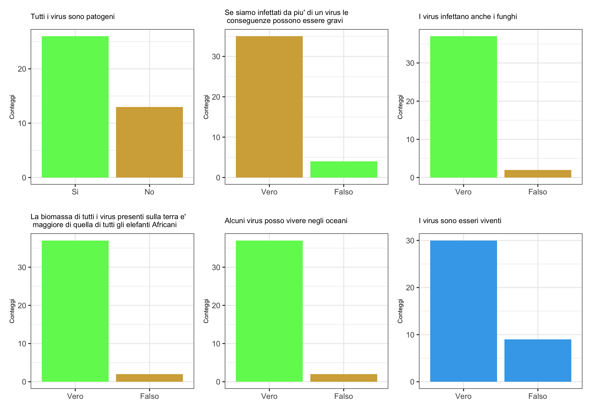

```{r setup, include=FALSE, cache=FALSE}
# TO render: rmarkdown::render('Lesson3.Rmd', 'xaringan::moon_reader')

# set working directory to docs folder
setwd(here::here("docs"))

# Set global R options
options(htmltools.dir.version = FALSE, servr.daemon = TRUE)

# Set global knitr chunk options
knitr::opts_chunk$set(
  fig.align = "center", 
  cache = TRUE,
  error = FALSE,
  message = FALSE, 
  warning = FALSE, 
  collapse = TRUE 
)

# This is good for getting the ggplot background consistent with
# the html background color
# library(ggplot2)
# thm <- theme_bw()
# theme_set(thm)

library(RefManageR)
BibOptions(check.entries = FALSE,
           bib.style = "authoryear",
           cite.style = "authoryear",
           style = "markdown",
           hyperlink = FALSE,
           max.names = 2,
           dashed = FALSE)
bib <- ReadBib("biblio/bib.bib", check = FALSE)
```

```{r xaringanExtra, echo=FALSE}
library(xaringanExtra)
use_tile_view() 
```

class: title-slide


# .font170[Ecological Significance of Viruses]


<br><br>
.marco[
.tada[Marco Chiapello]
<br>
`r Sys.Date()`
]


.marco[
.font90[[[`r fontawesome::fa("envelope", fill = "steelblue")`](mailto:chiapello.m@gmail.com) chiapello.m@gmail.com - `r fontawesome::fa("skype", fill = "steelblue")` marpello - `r fontawesome::fa("twitter", fill = "steelblue")`](https://twitter.com/marpello1980) @marpello1980 ]
]

???

.n30[

- Sarò uno dei vostri docenti per il corso "Interazioni tra piante, microrganismi e ambiente"
]
---

class: clear, middle, center

.f50[.red[DISCLAIM]]
# .black[This is **NOT** a lesson about Sars-Cov-2]

.s150[`r anicon::cia("images/coronavirus-3908.svg", animate="pulse", speed="fasta")`]

---

layout: true

# Last lesson recap

---

.pull-left[
.summaryL3[
1. The plant-associated microbiome can provide benefits to the plant through various direct or indirect mechanisms

1. Disease-suppressive soils are exceptional ecosystems in which crop plants suffer less from specific soil-borne pathogens than expected owing to the activities of other soil microorganisms

1. Induced Systemic Resistance (ISR) is initiated in roots by plant-growth- promoting microbes (PGPM) and leads to resistance priming in distant parts of the plant

1. Correlation is not causation

1. Microorganisms have a role in cooperative or competitive interactions with other members of the microbiome

1. Eco-evolutionary processes can influence the assembly of plant-associated microbiomes

1. How the microniota can be exploited
]
]

---

.pull-left[
.summaryL3[
1. The plant-associated microbiome can provide benefits to the plant through various direct or indirect mechanisms

1. .opacity10[Disease-suppressive soils are exceptional ecosystems in which crop plants suffer less from specific soil-borne pathogens than expected owing to the activities of other soil microorganisms]

1. .opacity10[Induced Systemic Resistance (ISR) is initiated in roots by plant-growth- promoting microbes (PGPM) and leads to resistance priming in distant parts of the plant]

1. .opacity10[Correlation is not causation]

1. .opacity10[Microorganisms have a role in cooperative or competitive interactions with other members of the microbiome]

1. .opacity10[Eco-evolutionary processes can influence the assembly of plant-associated microbiomes]

1. .opacity10[How the microniota can be exploited]
]
]

.pull-right[

.m0p[
```{r echo = FALSE, out.width="530px"}
knitr::include_graphics("images/fuctionOverview.png")
```
]
]

---

.pull-left[
.summaryL3[
1. .opacity10[The plant-associated microbiome can provide benefits to the plant through various direct or indirect mechanisms]

1. Disease-suppressive soils are exceptional ecosystems in which crop plants suffer less from specific soil-borne pathogens than expected owing to the activities of other soil microorganisms

1. .opacity10[Induced Systemic Resistance (ISR) is initiated in roots by plant-growth- promoting microbes (PGPM) and leads to resistance priming in distant parts of the plant]

1. .opacity10[Correlation is not causation]

1. .opacity10[Microorganisms have a role in cooperative or competitive interactions with other members of the microbiome]

1. .opacity10[Eco-evolutionary processes can influence the assembly of plant-associated microbiomes]

1. .opacity10[How the microniota can be exploited]
]
]

.pull-right[
<br>
.m0p[
```{r echo = FALSE, out.width="530px"}

```
]
]

---

.pull-left[
.summaryL3[
1. .opacity10[The plant-associated microbiome can provide benefits to the plant through various direct or indirect mechanisms]

1. .opacity10[Disease-suppressive soils are exceptional ecosystems in which crop plants suffer less from specific soil-borne pathogens than expected owing to the activities of other soil microorganisms]

1. Induced Systemic Resistance (ISR) is initiated in roots by plant-growth- promoting microbes (PGPM) and leads to resistance priming in distant parts of the plant

1. .opacity10[Correlation is not causation]

1. .opacity10[Microorganisms have a role in cooperative or competitive interactions with other members of the microbiome]

1. .opacity10[Eco-evolutionary processes can influence the assembly of plant-associated microbiomes]

1. .opacity10[How the microniota can be exploited]
]
]

.pull-right[
.m0p[
```{r echo = FALSE, out.width="530px"}
knitr::include_graphics("images/disease1.png")
```
]
]

---

.pull-left[
.summaryL3[
1. .opacity10[The plant-associated microbiome can provide benefits to the plant through various direct or indirect mechanisms]

1. .opacity10[Disease-suppressive soils are exceptional ecosystems in which crop plants suffer less from specific soil-borne pathogens than expected owing to the activities of other soil microorganisms]

1. .opacity10[Induced Systemic Resistance (ISR) is initiated in roots by plant-growth- promoting microbes (PGPM) and leads to resistance priming in distant parts of the plant]

1. Correlation is not causation

1. .opacity10[Microorganisms have a role in cooperative or competitive interactions with other members of the microbiome]

1. .opacity10[Eco-evolutionary processes can influence the assembly of plant-associated microbiomes]

1. .opacity10[How the microniota can be exploited]
]
]

.pull-right[
<br>
.m0p[
```{r echo = FALSE, out.width="530px"}

```
]
]

---

.pull-left[
.summaryL3[
1. .opacity10[The plant-associated microbiome can provide benefits to the plant through various direct or indirect mechanisms]

1. .opacity10[Disease-suppressive soils are exceptional ecosystems in which crop plants suffer less from specific soil-borne pathogens than expected owing to the activities of other soil microorganisms]

1. .opacity10[Induced Systemic Resistance (ISR) is initiated in roots by plant-growth- promoting microbes (PGPM) and leads to resistance priming in distant parts of the plant]

1. .opacity10[Correlation is not causation]

1. Microorganisms have a role in cooperative or competitive interactions with other members of the microbiome

1. .opacity10[Eco-evolutionary processes can influence the assembly of plant-associated microbiomes]

1. .opacity10[How the microniota can be exploited]
]
]

.pull-right[
<br>
.m0p[
```{r echo = FALSE, out.width="530px"}

```
]
]

---

.pull-left[
.summaryL3[
1. .opacity10[The plant-associated microbiome can provide benefits to the plant through various direct or indirect mechanisms]

1. .opacity10[Disease-suppressive soils are exceptional ecosystems in which crop plants suffer less from specific soil-borne pathogens than expected owing to the activities of other soil microorganisms]

1. .opacity10[Induced Systemic Resistance (ISR) is initiated in roots by plant-growth- promoting microbes (PGPM) and leads to resistance priming in distant parts of the plant]

1. .opacity10[Correlation is not causation]

1. .opacity10[Microorganisms have a role in cooperative or competitive interactions with other members of the microbiome]

1. Eco-evolutionary processes can influence the assembly of plant-associated microbiomes

1. .opacity10[How the microniota can be exploited]
]
]

.pull-right[
<br>
.m0p[
```{r echo = FALSE, out.width="280px"}
knitr::include_graphics("images/ecoevo1.png")
```
]
]

---

.pull-left[
.summaryL3[
1. .opacity10[The plant-associated microbiome can provide benefits to the plant through various direct or indirect mechanisms]

1. .opacity10[Disease-suppressive soils are exceptional ecosystems in which crop plants suffer less from specific soil-borne pathogens than expected owing to the activities of other soil microorganisms]

1. .opacity10[Induced Systemic Resistance (ISR) is initiated in roots by plant-growth- promoting microbes (PGPM) and leads to resistance priming in distant parts of the plant]

1. .opacity10[Correlation is not causation]

1. .opacity10[Microorganisms have a role in cooperative or competitive interactions with other members of the microbiome]

1. .opacity10[Eco-evolutionary processes can influence the assembly of plant-associated microbiomes]

1. How the microniota can be exploited
]
]

.pull-right[
<br>
.m0p[
```{r echo = FALSE, out.width="580px"}
knitr::include_graphics("images/bioc3.png")
```
]
]

---

layout: false

# Virus short surveys

```{r echo=FALSE, out.width="500px"}
knitr::include_graphics("images/qr-code.png")
```

.center[https://bit.ly/3iIidhV]
---

class: clear, middle, center


.m0tbp[
```{r echo=FALSE, out.width="950px"}
# source("extra/virusPoll_auth.R")
source("extra/virusPoll_plot.R")

```
]

---

layout: true

# What is a Virus?

---

class: inverse, middle, center 

----

---

.center[
.f504[.red[Who has] <br>right now, among us<br> .red[a viral infection?]]

.s200[`r anicon::cia("images/biohazard-sign.png", animate="flash", speed="slow", anitype = "hover")`]
]

???

.n30[

- In base a studi sierologici la maggior parte di noi è infetta da herpes

- Dell'herpes non puoi liberarti

- A differenza dell'amore, un herpes virus e per sempre
]

---

.center[.f50[**We live and prosper in a cloud of viruses**]]

.pull-left[
.par30[
- Viruses infect all living things

- We regularly eat and breathe billions of viral particles

- We carry viral genomes as part of our own genetic material
]
]

.pull-right[
.m0tbp[
```{r echo=FALSE, out.width="400px"}

```
]
]

---

.center[.f50[**How many viruses are out there?**]]

.pull-left[
.m0tp[
.par23[

- In the world's waters (salt water) there are 10<sup>30</sup> bacteriophage (viruses that infect bacteria) particles

- 10'000'000'000'000'000'000'000'000'000'000
<br>
- A bacteriophage particle weight about a femtogram (10<sup>-15</sup> grams)

- `r fontawesome::fa("exclamation", fill = "red")` 10<sup>30</sup> X 10<sup>-15</sup> = biomass on the oceans of the bacteriophages. This exceeds the biomass of elephants by more than 1000-fold! 

- The length of a head to tail line of 10<sup>30</sup> phages is 100 millions light years!
]
]
]

.pull-right[
```{r echo=FALSE, out.width="400px"}

```
]

---

.center[.f50[**VIROME**]]

.pull-left[
.m0tp[
.par30[

- The human virome is the total collection of viruses in and on the human body

- Some viruses cause disease, while others may be asymptomatic or just pass by

- There are roughly 40 trillion bacteria in a typical human microbiome, and generally virions outnumber bacteria 10:1 in nature
]
]
]

.pull-right[
.m0tp[
```{r echo=FALSE, out.width="400px"}
knitr::include_graphics("images/vir5.png")
```
]]

---

```{r echo=FALSE, out.width="1050px"}

```

???

.n30[
- Abbiamo pazzi dei genomi virali come parte del nostro genoma

- 1.5% rappresenta i coding genes

- Osservate i LTR retrotransposons (possiedono alle estremità sequenze ripetute dalle 100 alle 5000 bp). Una buona parte di loro derivano da infezzioni da retrovirus che sono successe molto prima che noi fossimo *homo sapiens*

- Alcuni di quei geni sono ad oggi utilizzati dagli esseri umani
]

---

```{r echo=FALSE, out.width="1000px"}

```

???

.n30[

- Virus coinvolti in molte malatti e cause di morte => studiati

- Ma sempre più stiamo capendo e studiando il ruolo che i virus hanno negli ecosistemi e i loro ruoli benefici
]

---

.center[.f50[**Most viruses just pass through us**]]

.pull-left[
.m0tp[
.par23[

- We ingest many non-animal viruses regularly with foods
  - Cabbage from 5 different supermarkets in Washington D.C.
  - Each serving (~100 cm<sup>2</sup> of leaf material) would contain up to 10<sup>8</sup> particles of virus pathogenic for the cabbage looper (caterpiller)

- Study on human feces:
  - Most RNA virus sequences (91%) were similar to plant virus
  - Most abundant human fecal virus: pepper mild mottle virus (10<sup>9</sup> virions per gram of dry feces)

]
]
]

.pull-right[
.limg[
```{r echo=FALSE, out.width="300px"}

```
```{r echo=FALSE, out.width="120px"}
knitr::include_graphics("images/vir9.png")
```
]
```{r echo=FALSE, out.width="130px"}
knitr::include_graphics("images/vir10.png")
```
]

???

.n30[
- Molti dei virus con cui veniamo a contatto non possono riprodursi dentro di noi

- Se siete interessati ci sono aziende che studiano la composizione virale delle vostre feci
]

---

```{r echo=FALSE, out.width="1001px"}

```

???

.n30[
- Polyomavirus infetta chiunque, lo si prende nei primi mesi di vita dai famigliari e lo si ha per tutta la vita

- Di solito non causa sintomi a meno che il soggetto non sia immunodepresso

- Puo' essere usato, vista la loro diffusione, per tracciare gli spostamenti delle popolazioni (migrazioni)

- Linea tratteggiata e' la migrazione dell'h. sapiens studiata grazie al sequenziamento dei genomi umani

- Linea nera e' la migrazione dell'h. sapiens studiata grazie al Polyomavirus (differenti lineages hanno diversi polyomavirus)

- Polyomavirus da maggiori dettagli che lo studio del genoma


- Polyomavirus
]

---

.pull-left[
.f400[**What is a VIRUS?**] 
.m0tp[
.par25[

- A virus is a submicroscopic **infectious** agent that replicates its **genetic material** (DNA or **RNA**) only inside the living cells of an organism (**obligate intracellular parasites**)

- Viruses are often surrounded by a protein coat, somethime a membrane

- Viruses **use the host's cells to replicate** by forcing it to rapidly produce thousands of identical copies of the original virus

- When not inside the host, viruses **exist in the form of independent particles** (virions)


]
]]

.pull-right[
```{r echo=FALSE, out.width="500px"}

```
]

???

.n30[
- non hanno metabolismo energetico proprio ne ribosomi per traduzione proteine

- Se non hanno un ospite non possono replicarsi

- i virus non si riproducono per fissazione, ma per assemblaggio di parti
]
---

.pull-left[
.f400[**Are virus a life form?**]

.m0tp[
.par23[

- Viruses **can't capture or store any energy**, so they **rely on the cells of other organisms** to survive and reproduce

- They can not function outside a host organism! Owing on that they are often **regarded as non-living** 
<br>
- On the other hand they **carry genetic material**, **reproduce**, and **evolve** through natural selection

- Viruses are considered by some biologists to be a life form

- Vviruses have been described as "**organisms at the edge of life**"

]
]
]

.pull-right[
.m0tbp[
```{r echo=FALSE, out.width="250px"}
knitr::include_graphics("images/vir12.png")
```
```{r echo=FALSE, out.width="250px"}
knitr::include_graphics("images/vir13.png")
```
]]

---
layout: false

background-image: url(images/vir14.png)
background-size: contain
class: clear

.content-box-grey4[
Viruses do NOT think<br>
They do not achieve their goal in a human-centered manner<br>
**Viruses are passive agents**
]


---

layout: false
class: clear 

.pull-left-wide[
.magenda[
.font180[.bold[Agenda]]
]

.agenda1[
- Ecological Significance of Viruses `r anicon::cia("images/virus-3128.png", animate="pulse", speed="slow", anitype="hover")` 
  - Ecological Importance of Viruses in the Oceans
  - Endogenous Virus Elements and Beneficial Infection in Vertebrates
  - Mycovirus involved in mutualistic symbiosis
  - Viruses invoved in Arm’s race (killer yeast)
  - Insect viruses involved in mutualistic symbiosis


- Mycovirus for the control of plant diseases `r anicon::cia("images/plant-pot.png", animate="pulse", speed="slow", anitype="hover")`     
  - The VIROPLANT H2020 project
  - Definitions and general biological features
  - Mycovirus biodiversity
  - Natural biocontrol through mycovirus: the forest pathogen Cryphonectria parasitica and Cryphonectria hypovirus 1
  - A new approach: mycocidal virus
  - Recent technological progress: a super-donor, Zn chloride, transgenic approach
  - VIGS and the regulatory bottleneck

]
]

---

layout: true

# Ecological Significance of Viruses

---

class: inverse, middle, center 

----

---


class: clear, middle, center 

# .black[Ecological Importance of Viruses in the Oceans]


----

---
layout: true

# Ecological Importance of Viruses in the Oceans

---

.pull-left[
.m0tp[
.par25[

- The oceans cover **more than 70%** of the Earth’s surface

- They control the **climate**, provide a significant amount of the **protein** that is consumed globally and produce approximately **half of the Earth’s oxygen**

- Microorganisms are a major force behind the **nutrient and energy cycles** in the world’s oceans

- It is estimated that **viruses kill approximately 20% of this biomass per day**

- As well as being agents of mortality, viruses are one of the **largest reservoirs of unexplored genetic diversity** on the Earth.
]
]
]

.pull-right[
.m0tp[
```{r echo=FALSE, out.width="400px"}
knitr::include_graphics("images/vir18.png")
```
]
]

---

.pull-left[
.m0tp[
.par23b[

- **Virosphere** is the portion of the Earth in which viruses occur or which is affected by viruses

- The virosphere is inclusive of **every environment on the Earth**, from the atmosphere to the deep biosphere

- Nowhere is the importance of viruses more evident than in the world’s oceans

- Viruses are substantial **agents of mortality** in heterotrophic and autotrophic plankton

- Viruses are major players in the mortality of marine microorganisms and, consequently, **affect nutrient and energy cycles** as well as the structure of microbial communities

- Need to incorporate viruses and virus-mediated processes into our understanding of **ocean biology** and biogeochemistry
]
]
]

.pull-right[
<br>
```{r echo=FALSE, out.width="500px"}

```
]

---

.pull-left[
**The abundance of marine viruses**
.m0tp[
.par25[

- The abundance of viruses in oceans exceeds that of bacteria and archaea by approximately 15-fold and comprising approximately **94% of the nucleic-acid-containing particles**

- However, because of their extremely small size, viruses represent only approximately **5% of the biomass**

- In the oceans, viral abundance decreases further offshore and deeper in the water column because it generally **varies along with the prokaryotic abundance**
]
]
]

.pull-right[
<br><br>
```{r echo=FALSE, out.width="540px"}

```
.right[.font50[`r Cite(bib, key = "Suttle_2007")`]]
]

---

.pull-left[
**The abundance of marine viruses**
.par20m[

- Five methods are used to estimate the abundance of viruses in aquatic samples
  - plaque assays (PAs) and most-probable-number assays (MPNs): are used to quantify the abundance of infectious units that cause the lysis of a particular host.
  - ransmission electron microscopy (TEM): TEM is the only method that provides data on both the abundance and morphology of virus-like particles (fig a)
  - **epifluorescence microscopy** (EfM): the viruses are concentrated on a membrane filter, their nucleic acids are stained with a brightly fluorescent dye and the abundance of viruses is estimated (fig b)
  - flow cytometry (FC): accurate high-throughput method also allows the quantification of subpopulations of viruses
  - **Next generation sequencing**
]
]

.pull-right[
```{r echo=FALSE, out.width="300px"}

```
.right[.font50[`r Cite(bib, key = "Suttle_2007")`]]
]

---

.pull-left[
**Viruses, mortality and elemental cycling**
.m0tp[
.par23[

- As agents of mortality, viruses have a range of effects on the world’s oceans, from altering geochemical cycles to structuring populations and communities.

- 20-40% of prokaryotes in surface water are removed by viruses every day (similar to the amount killed by grazing)
  
- Increase in the rate of viral reproduction in response to an increase in the growth rate of host cells is a strong feedback mechanism that would probably prevent dominance by the fastest growing taxa

.rigth[.right[.font50[`r Cite(bib, key = "Middelboe_2017")`]]]
]
]
]

.pull-right[
```{r echo=FALSE, out.width="370px"}

```

]

---

.pull-left[
**Viral shunt**
.m0tp[
.par20[

- **Viral shunt**: the viral-mediated movement of nutrients from organisms to pools of dissolved and non-living particulate organic matter

- The viral shunt moves material from living organisms into **particulate organic matter** (POM) and **dissolved organic matter** (DOM) 

- However, the effects can also be more profound and potentially include:
  - the **release of dimethyl sulphide**, a gas that affects the Earth’s climate
  - the **remobilization of the organically complexed iron** that limits primary production in much of the world’s oceans (for example, the viral lysis of prokaryotes liberates sufficient amounts of biologically available iron to support the needs of phytoplankton)
]
]
]

.pull-right[
<br>
```{r echo=FALSE, out.width="500px"}

```
.right[.font50[`r Cite(bib, key = "Suttle_2007")`]]
]

---

.pull-left[
**Viral shunt in recycling DoM**
.m0tp[
.par20m[

- DOM, the **largest reservoir of carbon in the oceans**, is only available for uptake by bacteria

- There are **two main forms of bacterial mortality**: predation by unicellular eukaryotic grazers or lysis by phages
  - **Grazing** moves carbon up through the trophic levels from bacteria to protozoa to zooplankton to fish and larger organisms
  - When bacteria are **lysed by phages**, carbon and nutrients flow through the viral shunt and are remineralized by bacteria within the microbial loop, making the viral shunt function as the ocean’s recycling system
]
]
]

.pull-rigth[
<br>
```{r echo=FALSE, out.width="550px"}
knitr::include_graphics("images/vir23.png")
```
.right[.font50[`r Cite(bib, key = "Breitbart:2018aa")`]]
]
